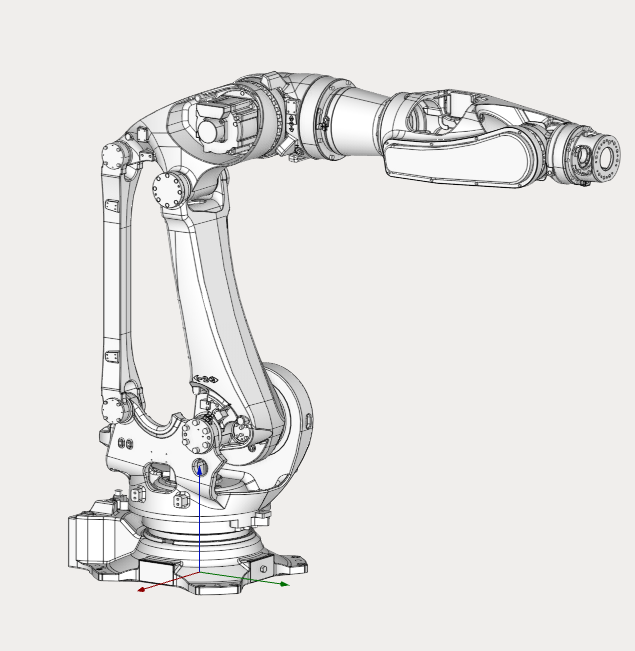

---
title: "Flexible Heavy-Duty Robot"
---

<link rel="stylesheet" href="assets/manual.css">

<h1 id="src-129933030">Flexible Heavy-Duty Robot</h1>

Download Project here: <strong class=""><a href="https://github.com/EncySoftware/public-docs/releases/download/machinemaker-examples-2026-09-22/Kawasaki_BX300L-473f64a135.zip">Kawasaki BX300L.zip</a></strong>

You can see the tutorial video at the <a class="external-link" href="https://www.youtube.com/watch?v=HP1lFXwK6_M&amp;list=PLnaHZJpWJMKPN2hSDvR1DnxmAuFH4tP42&amp;index=4">link</a>.

