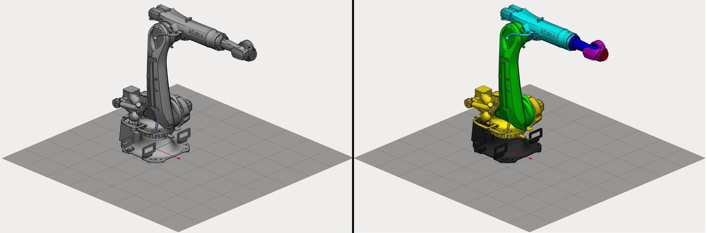
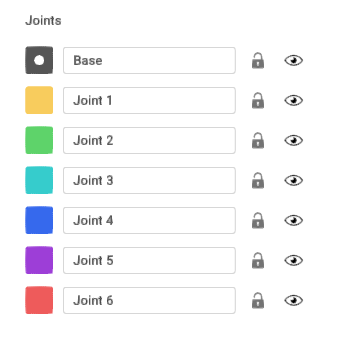
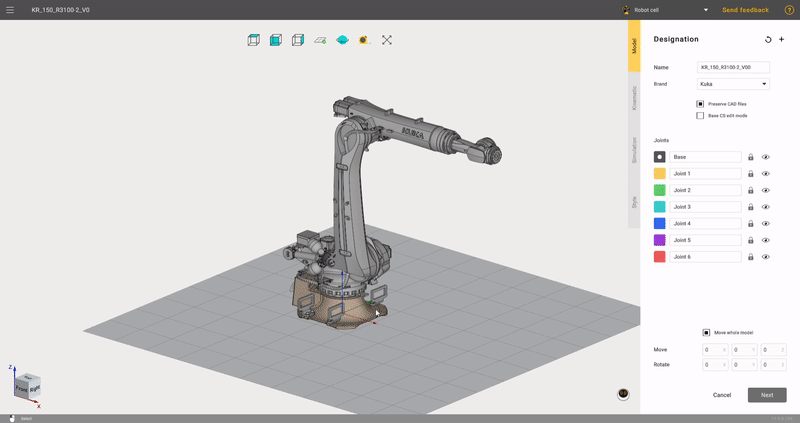
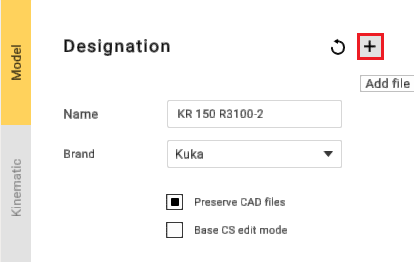
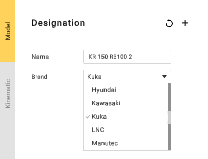

---
title: "Grouping elements"
---

<link rel="stylesheet" href="assets/manual.css">

<h1 id="src-131903382">Grouping elements</h1>

Equipment elements need to be grouped into nodes. Mark 3D model elements with specific colors to group them.

Select a node color from the right panel and mark desired elements on the 3D model. Each element marked with the same color will be added to the same group.

 
I    
t is not necessary to mark each and every element. You can keep unnecessary elements unmarked to exclude them from the mechanism. Also, MachineMaker saves data to the source CAD file so it is possible to change groups of elements anytime    
.    

Click marked element again to clear the color. It is also possible to unmark elements right-clicking on them with your mouse button.

Use <i class=""><strong class="">Tab, </strong></i><strong class=""> 
↑,     

↓     
</strong> 
keys to switch current color.    

It is possible to delete unnecessary elements from the 3D model using <strong class=""><i class="">Del</i> </strong>key. Use <i class=""><strong class="">Ctrl+Z</strong></i><strong class=""> </strong>to undo element deletion.

MachineMaker stores all imported 3D models in the <i class=""><strong class="">CAD Files</strong></i> folder. You can always reimport the 3D model using <i class=""><strong class="">Reimport </strong></i>button. Turn off<i class=""> <strong class="">Copy imported CAD files</strong></i> checkbox to disable saving original CAD models.

<strong class="">Add file</strong> - function for adding additional files.

 
MachineMaker automatically groups all elements to Base node in jointless mechanisms such as Fixed Tables, Fixed Objects and End Effectors.    

 
If MachineMaker can't group elements     

correctly     

- see how to     
<a class="external-link" href="https://kb.sprutcam.com/display/MMUMAU15/Prepare+and+import+3D+objects">fix your CAD models</a> 
.    

 
Mechanism name and type    

It is necessary to enter Mechanism name and select mechanism type. MachineMaker uses 3D model filename as default name. It also automatically selects the brand for the robot. But if you need to replace it, you can easily do so using the drop-down list.

 
MachineMaker will use the Mechanism name as the Project name by default.    

