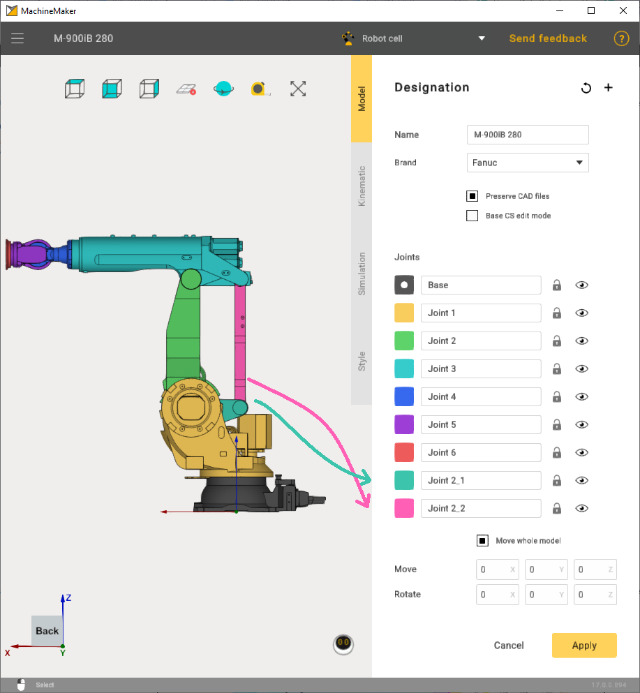
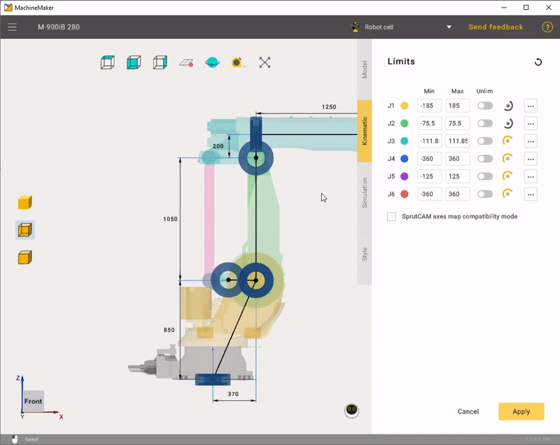

---
title: "Heavy-Duty Robots"
---

<link rel="stylesheet" href="assets/manual.css">

<h1 id="src-131903674">Heavy-Duty Robots</h1>

Building heavy-duty robots in MachineMaker is very similar to building industrial robots, but heavy-duty robots have 2 additional joints connected by a connector.

As a rule, robot manufacturers do not provide any information about the position of the additional joints connector. The easiest way to place the connector in the correct position is to hold down the <i class=""><strong class="">Left Ctrl</strong></i><strong class=""> </strong>button and drag&amp;drop the connector to a snap point.

