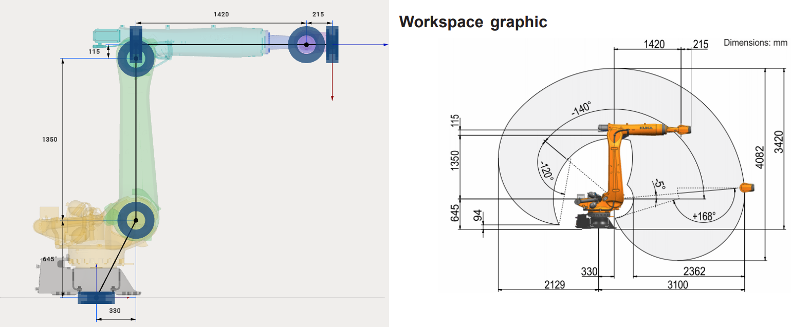
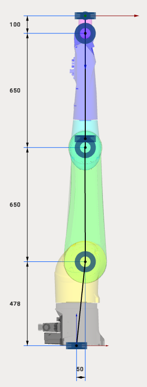

---
title: "Industrial Robots"
---

<link rel="stylesheet" href="assets/manual.css">

<h1 id="src-131903654">Industrial Robots</h1>

The easiest way to set the kinematics of a 6-axes industrial robot is to use the robot's DataSheet and specify the 6 dimensions in MachineMaker.

 
Drag&amp;Drop mode is restricted for Robot kinematics to prevent the impairment of the kinematic scheme.    

<h1 class="heading">Special cases</h1>

Some robot manufacturers, like Staubli, provide 3D models and DataSheets with robots set at zero positions. MachineMaker automatically assumes the kinematic linkage of the selected type of robot.

