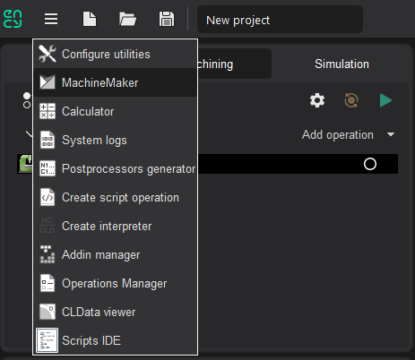
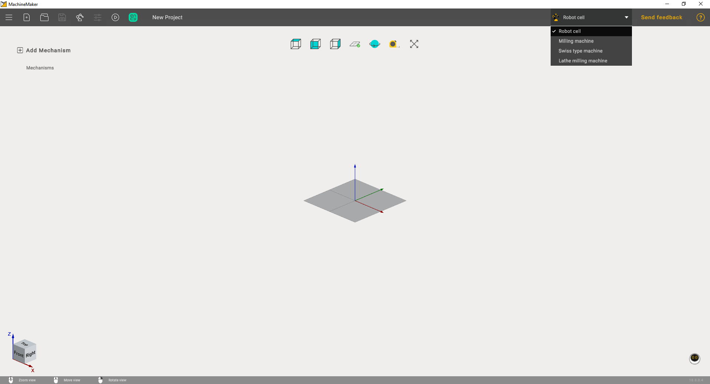

---
title: "Introduction to MachineMaker"
---

<link rel="stylesheet" href="assets/manual.css">

<h1 id="src-129926359">Introduction to MachineMaker</h1>

MachineMaker is a standalone application which allows you to create robot cells and CNC machines for CAM system.

Latest version of MachineMaker carries robots from the following OEMs: ABB, Annin, AUBO, Borunte, Comau, Dobot, Doosan, Efort, Eidos, Epson, EVS, Fanuc, Han's, Hyundai, IIMT, Jaka, Kuka, Kawasaki, LNC, Mitsubishi, Motoman, Nachi, Newker, Regal, Siasun, Staubli, STEP, Tormach, uFactory, Universal, Simple.

You can launch MachineMaker d    
irectly from the CAM system utilities menu.    

Next, it is necessary to select the correct application context using <i class=""><strong class="">Application Mode</strong></i><strong class=""> Selector.</strong>

