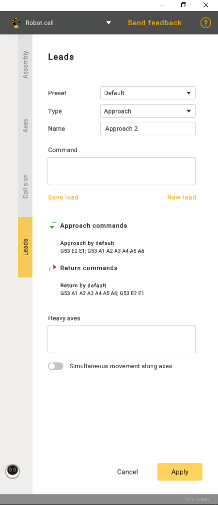
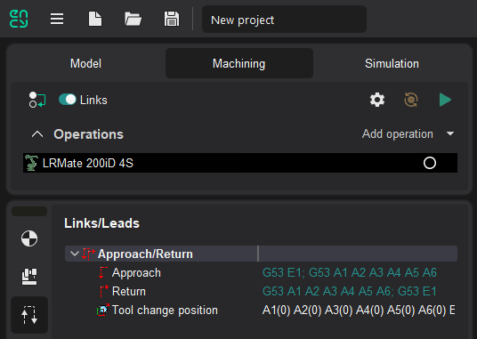

---
title: "Links/Leads"
---

<link rel="stylesheet" href="assets/manual.css">

<h1 id="src-129936705">Links/Leads</h1>

<i class=""><strong class="">Leads</strong></i><strong class=""> </strong>tab allows to specify any count of Approach and Return commands.

Check CAM system <i class=""><strong class="">Links/Lead</strong></i><strong class=""> </strong>parameters to verify syntax.

