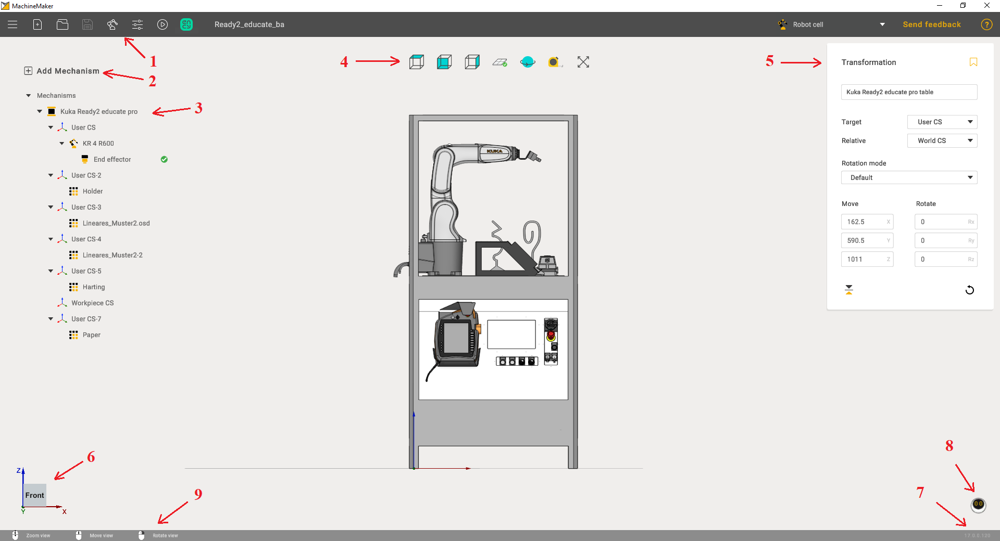
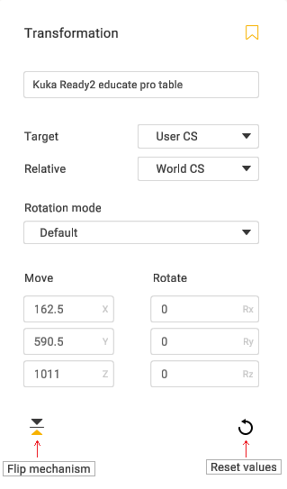

---
title: "Main window"
---

<link rel="stylesheet" href="assets/manual.css">

<h1 id="src-129926379">Main window</h1>

Main window contains following areas:

<ol class=""><li class="">
Toolbar

</li><li class="">
Add mechanism button

</li><li class="">
Assembly tree

</li><li class="">
View controls

</li><li class="">
Transformation panel

</li><li class="">
Interactive View CS

</li><li class="">
Version info

</li><li class="">
AI Assistant

</li><li class="">
Interface help

</li></ol>

Select any mechanism to show <i class=""><strong class="">Transformation Panel</strong>.</i><strong class=""> </strong>Use transformation panel to change the object's position.

It is possible to change selected mechanism name and save it to the local Mechanisms Library using <i class=""><strong class="">Save to library</strong></i><strong class=""> </strong>button.

This panel is also useful for table calibration.

Use 
button to flip mechanism position and <i class=""><strong class="">Reset</strong></i><strong class=""> </strong>button to zero all fields.<i class=""><strong class=""> </strong></i>The <strong class="">Transformation panel</strong> has 3 main functions:

<ol class=""><li class="">
Flip mechanism

</li><li class="">
Reset velues

</li></ol>
<i class=""><strong class="">
   </strong></i>

Double click on mechanism to enter Mechanism Edit mode.

