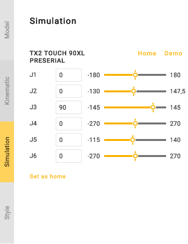
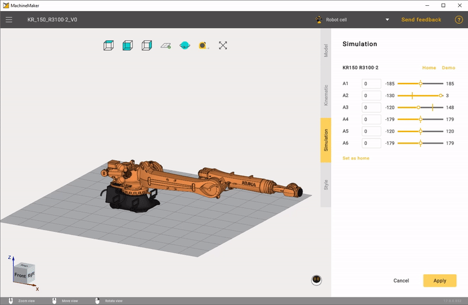

---
title: "Mechanism Simulation and Validation"
---

<link rel="stylesheet" href="assets/manual.css">

<h1 id="src-131903767">Mechanism Simulation and Validation</h1>

Select <i class="">Simulation </i>tab to validate the mechanism's kinematics. Use the trackbar to change the axis coordinates or enter values in the input box manually.

    Click <i class=""><strong class="">Demo</strong></i><strong class=""> </strong>button to check all nodes.

Click <i class=""><strong class="">Home</strong></i><strong class=""> </strong>button to return the mechanism to the Home position. Use <i class=""><strong class="">Set As Home</strong></i><strong class=""> </strong>button to save the current mechanism position as Home position.

<strong class="">
</strong>

 
If something looks wrong in the simulation, please check the    
 "Building a kinematic scheme".

 
If you see nodes collisions, please check the "Grouping elements into nodes".    

Use 
button on the "Toolbar" to validate whole assembly.

