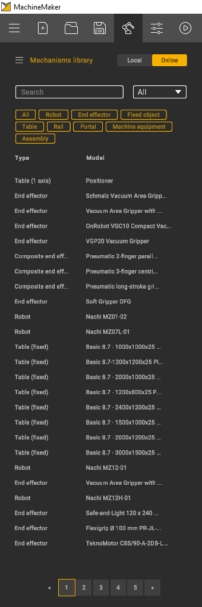
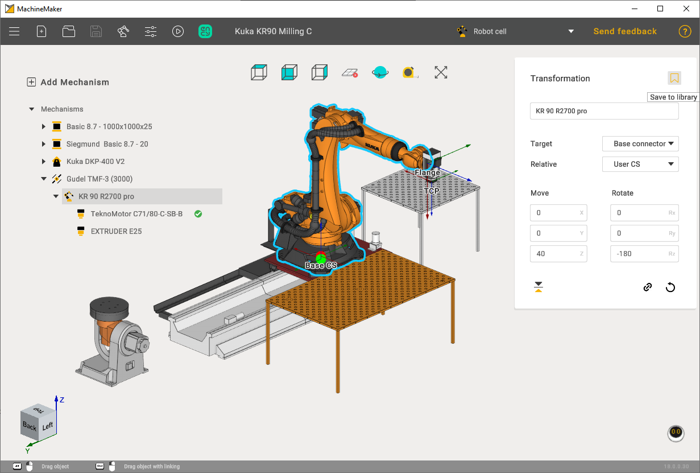
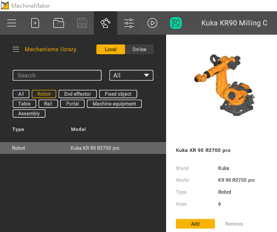
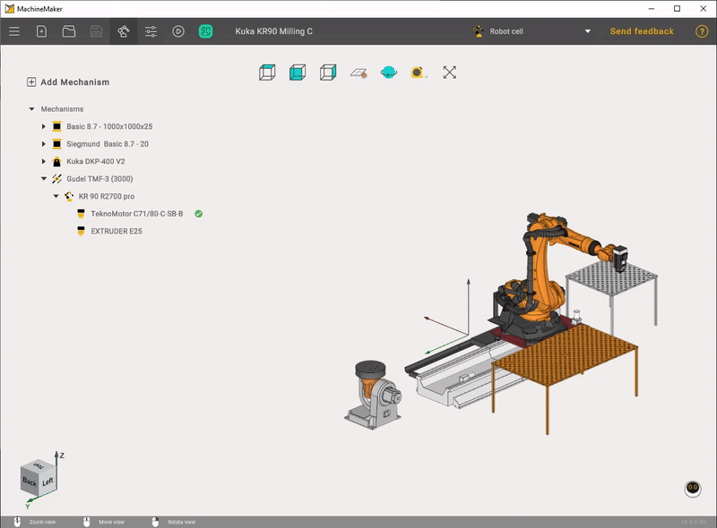
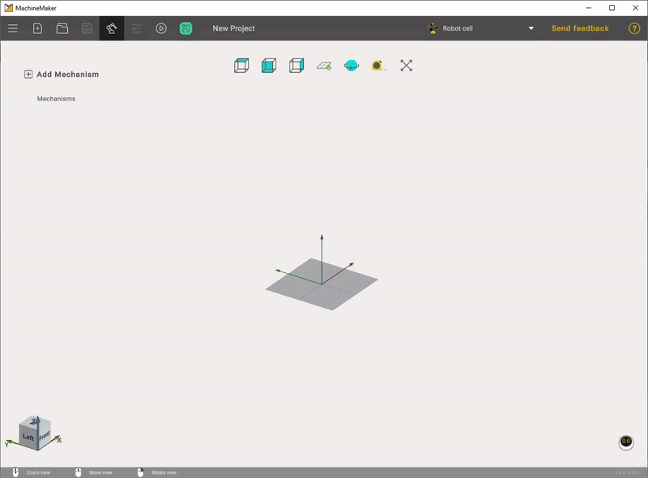
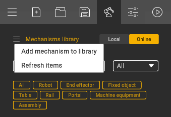

---
title: "Mechanisms Library"
---

<link rel="stylesheet" href="assets/manual.css">

<h1 id="src-129932035">Mechanisms Library</h1>

Use 
 button to open Mechanisms library.

It is possible to switch between a <i class=""><strong class="">Local</strong></i><strong class=""> </strong>and <i class=""><strong class="">Online</strong></i><strong class=""> </strong>libraries. Any mechanism can be saved to your local library. Select mechanism in assembly and click <i class=""><strong class="">Save to </strong></i><strong class=""><i class="">library</i> </strong>button.

Use <i class=""><strong class="">Search</strong></i><strong class=""> </strong>field and OEM field to find a desired machine/robot.

It is also possible to specify the mechanism type.

Finally, click the <i class=""><strong class="">Add</strong></i><strong class=""> </strong>button to add selected the mechanism to your assembly.

<strong class="">
  </strong>

It is possible to add MachineMaker mechanism file (.mmm) to your local library manually using 
 menu.

