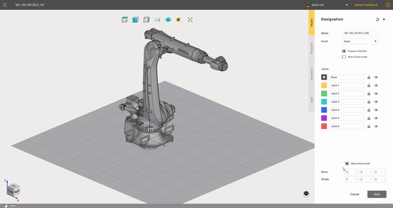
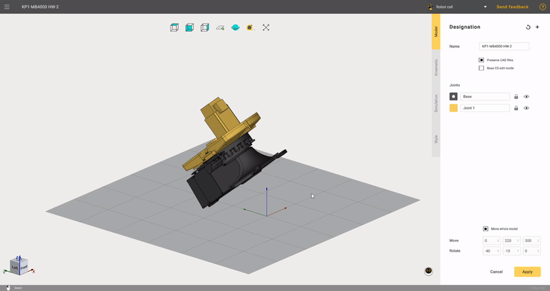
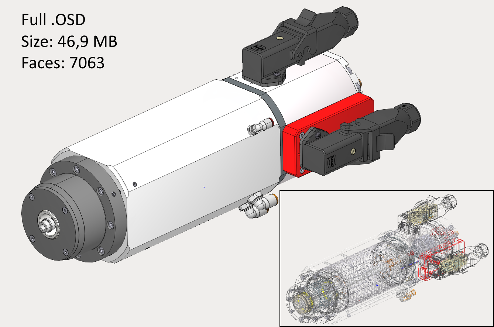
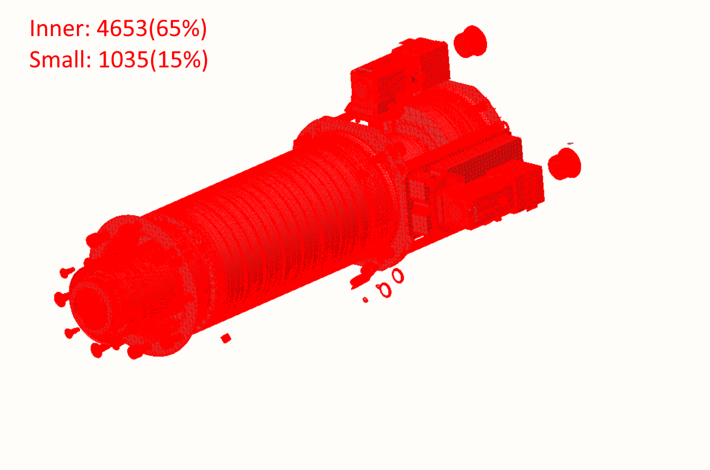
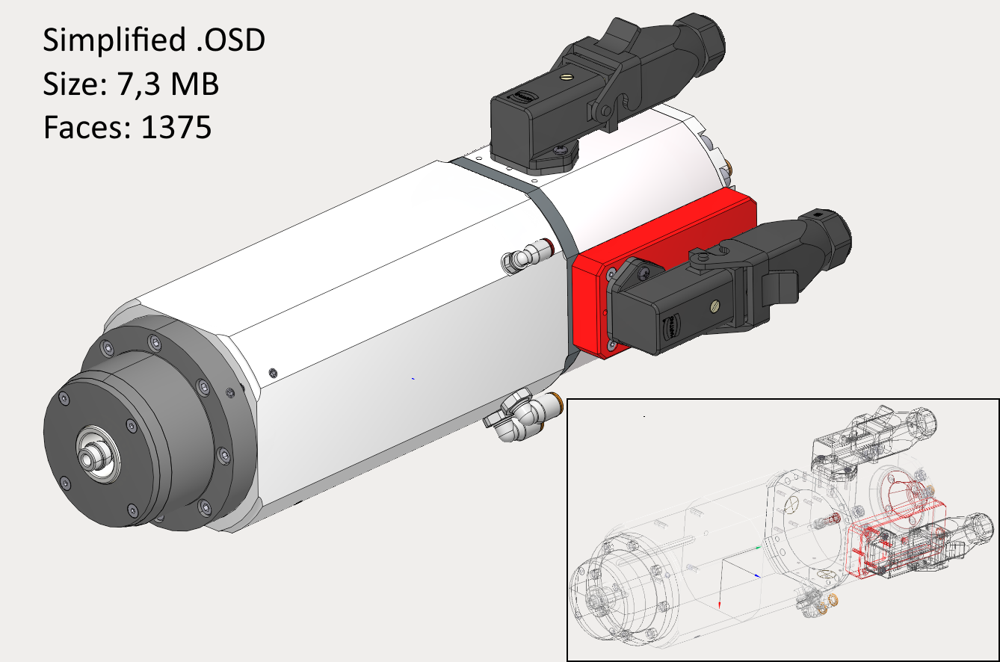
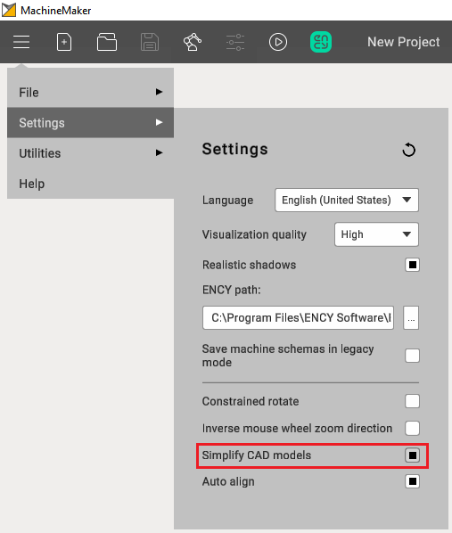

---
title: "Prepare and import 3D objects"
---

<link rel="stylesheet" href="assets/manual.css">

<h1 id="src-129930751">Prepare and import 3D objects</h1>

<h1 class="heading">Supported 3D model formats</h1>
<ul class=""><li class="">
<strong class="">3dm:</strong> Rhinoceros 3D

</li><li class="">
<strong class="">sldprt, sldasm:</strong> SоlidWorks

</li><li class="">
<strong class="">par, psm, pwr, asm:</strong> Solid Edge

</li><li class="">
<strong class="">stp, step</strong>

</li><li class="">
<strong class="">x_t, x_b</strong> : Parasolid

</li><li class="">
<strong class="">igs, iges</strong>

</li><li class="">
<strong class="">jt</strong>

</li><li class="">
<strong class="">OSD</strong>

</li><li class="">
<strong class="">STL</strong><strong class=""> </strong><strong class=""> </strong>

</li></ul> 

 

It is     

also     

possible to select several files at once. This may be useful if you had split your mechanism and saved each node in a separate file    
.    

 
Preparing models    

Many robot manufacturers (such as KUKA, Abb, Fanuc etc.) provide 3D models of their robots which can be used in MachineMaker without any adaptation.

MachineMaker allows you to make some basic operations with imported 3D models like moving and rotating. Use transformation panel in the lower right corner to transform your 3D models.

 

It is possible to move and rotate only the entire 3D model. Please use an external CAD system to make more complex operations with the 3D model    
.    

<h1 class="heading">Base CS transformation</h1>

 

It is possible to specify the mechanism's Base Coordinate System using the mouse. Turn on     
<strong class=""><i class="">Base CS editing mode</i></strong> 
 then hold down the     
<i class=""><strong class="">Left Ctrl</strong></i><strong class=""> </strong> 
key and drag you Base CS into the correct position.    

 

  

3D models simplifier    

MachineMaker automatically simplifies imported files. All unnecessary inner faces and small objects will be deleted.

You can disable the simplifier in the application settings. Or use the integrated <a class="external-link" href="https://docs.encycam.com/MachineMaker/1/robots/en/90.html">simplifier</a> manually.

