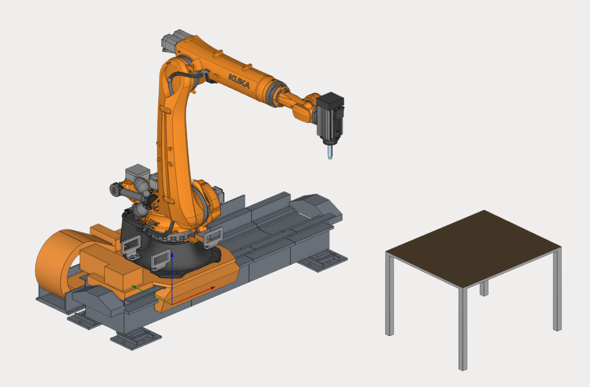

---
title: "Rail"
---

<link rel="stylesheet" href="assets/manual.css">

<h1 id="src-129937034">Rail</h1>

Download Project here: <strong class=""><a href="https://github.com/EncySoftware/public-docs/releases/download/machinemaker-examples-2026-09-22/Rail-63c4bece77.zip">Rail.zip</a></strong>

<strong class=""></strong>

You can see the tutorial video at the <a class="external-link" href="https://www.youtube.com/watch?v=kWY08cTzzOA&amp;list=PLnaHZJpWJMKPN2hSDvR1DnxmAuFH4tP42&amp;index=12">link</a>

