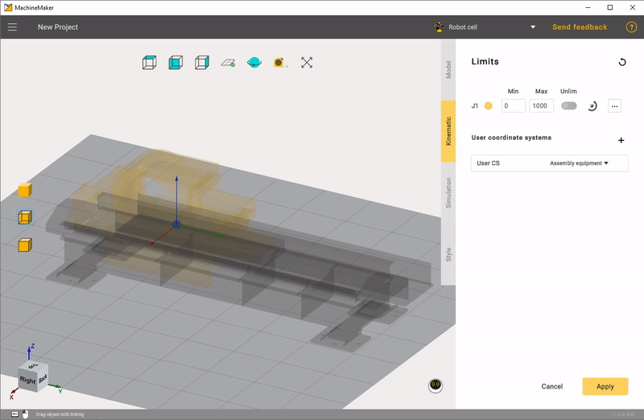
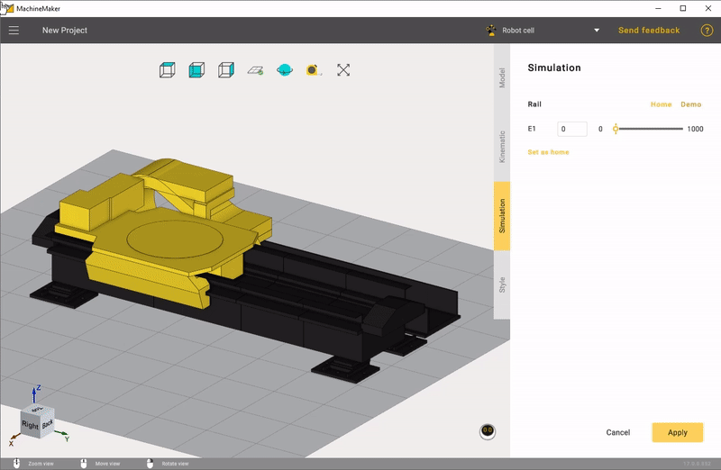

---
title: "Rails and Portals"
---

<link rel="stylesheet" href="assets/manual.css">

<h1 id="src-131903688">Rails and Portals</h1>

MachineMaker allows you to add linear rails, 2-axes portals and 3-axes portals.

It is possible to add any number of connectors to the table using<strong class=""> 
</strong>button in the <i class=""><strong class="">User</strong></i> <i class=""><strong class="">Coordinate Systems</strong></i><strong class=""> </strong>panel. Use 
 button to delete the connector. Use double click to rename the coordinate system.

MachineMaker will use connectors to connect mechanisms with each other when building "Assemblies".

Click on <i class=""><strong class="">Limits</strong></i><strong class=""> </strong>to specify Min and Max values. MachineMaker will show minimal and maximal positions of the 3D model.

It is possible to change linear axis direction using transformation panel in the right bottom corner.

