---
title: "Receiving assemblies from CAM system"
---

<link rel="stylesheet" href="assets/manual.css">

<h1 id="src-129933049">Receiving assemblies from CAM system</h1>

The cell can be supplied as a whole 3D model. From which you need to extract the geometry of each mechanism separately and load them into MachineMaker. To simplify this operation, you can use CAM system.

Consider the process of transferring assemblies using the example of building a robot cell according to such a 3D model.

<a class="doc-image-link" href="images/download/attachments/129933049/image2024-8-16_12-22-53.png" rel="noopener" target="_blank" title="Open full-size image">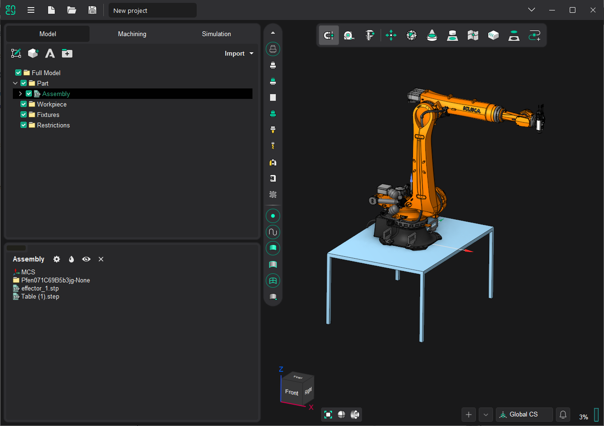</a>

In our case, the cell will consist of 3 mechanisms:

<ul class=""><li class="">
Table;

</li><li class="">
Robot;

</li><li class="">
Spindle.

</li></ul>
Therefore, first the 3D model must be divided into these parts. Let's create groups under the same name and move the surfaces that belong to these mechanisms there.

<a class="doc-image-link" href="images/download/attachments/129933049/perekidkafailov.webp" rel="noopener" target="_blank" title="Open full-size image">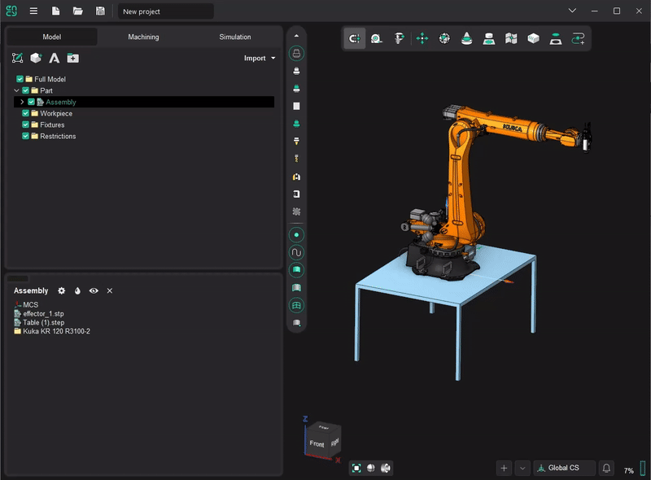</a>

<h1 class="heading">Simplify geometry</h1>

The geometry of some mechanisms may be overly detailed which affects the file size, loading and rendering speed. To solve this problem you can use the simplification tool. By simplification we mean the removal (with a certain tolerance) of small faces or faces located inside the shell. A similar function works when importing geometry into MachineMaker (the function is described here: <a href="prepare-and-import-3d-objects.md">3D Models Simplifier</a>).

The function can be called using the context menu with the <i class=""><strong class="">"Simplify GeomModel..."</strong></i> command.

<a class="doc-image-link" href="images/download/attachments/129933049/image2024-8-16_12-36-21.png" rel="noopener" target="_blank" title="Open full-size image">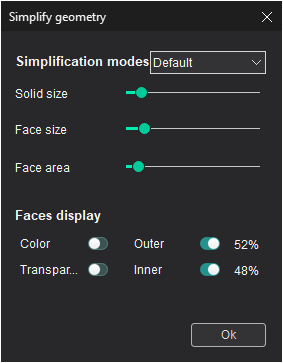</a>

In this window, you can set the simplification parameters by choosing from ready-made options or by setting them manually.

<i class=""><strong class="">Solid size</strong></i> - specifies the maximum size of solids to be excluded.

<i class=""><strong class="">Face size</strong></i> - defines the maximum size of faces to be excluded.

<i class=""><strong class="">Face area</strong></i> - defines the minimum internal face area at which the face will be excluded.

The <i class=""><strong class="">Faces display</strong></i> parameters are responsible for the display modes of internal and external faces and help to visually control which faces will be excluded from the model.

<a class="doc-image-link" href="images/download/attachments/129933049/Transparent.webp" rel="noopener" target="_blank" title="Open full-size image">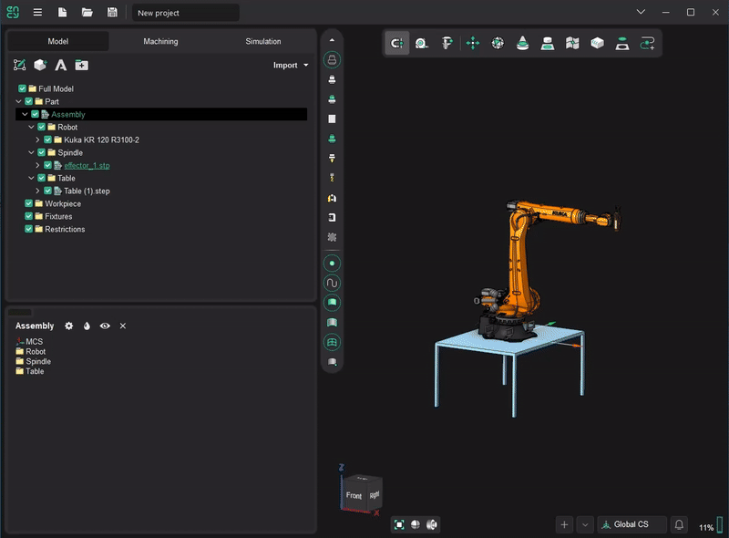</a>

<h1 class="heading">Sending to MachineMaker</h1>

At this stage we begin to transfer the mechanisms to MachineMaker and assemble the cell.

To do this, call the context menu on the selected mechanism and click the <strong class=""><i class="">"Send to MachineMaker..."</i></strong> item.

<a class="doc-image-link" href="images/download/attachments/129933049/image2024-8-16_12-47-33.png" rel="noopener" target="_blank" title="Open full-size image">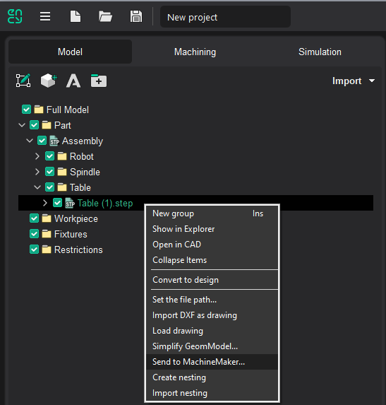</a>

<a class="doc-image-link" href="images/download/attachments/129933049/image2024-8-16_12-48-33.png" rel="noopener" target="_blank" title="Open full-size image">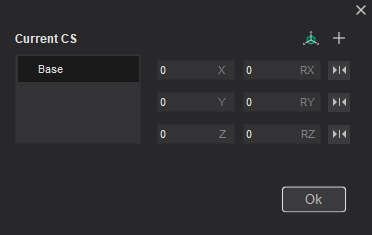</a>

This form will appear. It allows you to set and edit the <i class=""><strong class="">base coordinate system</strong></i> relatively to which the mechanism will be located and <i class=""><strong class="">additional coordinate systems</strong></i> used for the positioning of the mechanism connectors.

<i class=""><strong class="">Add all possible CS 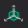
</strong></i> - adds the base coordinate systems of neighboring mechanisms. Hovering the mouse cursor over them will show the silhouettes of the mechanisms associated with them.

<i class=""><strong class="">Ok</strong></i> - sends the 3D model with the set CS to MachineMaker.

 

When loading geometry into MachineMaker in the     
<i class=""><strong class="">Import mechanism geometry</strong></i> 
 window, select the type of mechanism to be transferred from the drop-down list.    
  

<a class="doc-image-link" href="images/download/attachments/129933049/image2024-8-16_12-50-14.png" rel="noopener" target="_blank" title="Open full-size image">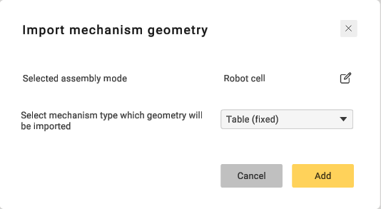</a>

 

After clicking     
<i class=""><strong class="">Add</strong></i><strong class=""> </strong> 
button, the mechanism will be added to the scene and you will be able to    
<a href="assemblies.md">get started with cell assembly</a>.  

 

Let's start from the Robot mechanism.    
  

<h1 class="heading">Robot</h1>

Let's set the base coordinate system <i class=""><strong class="">BaseCS</strong> </i>- this will be the location of the mechanism on the floor. Next set an additional coordinate system <i class=""><strong class="">AdditionalCS</strong></i>, the point to which the next mechanism will be attached. In our case, this is Spindle.

<a class="doc-image-link" href="images/download/attachments/129933049/sendtommrobot.webp" rel="noopener" target="_blank" title="Open full-size image">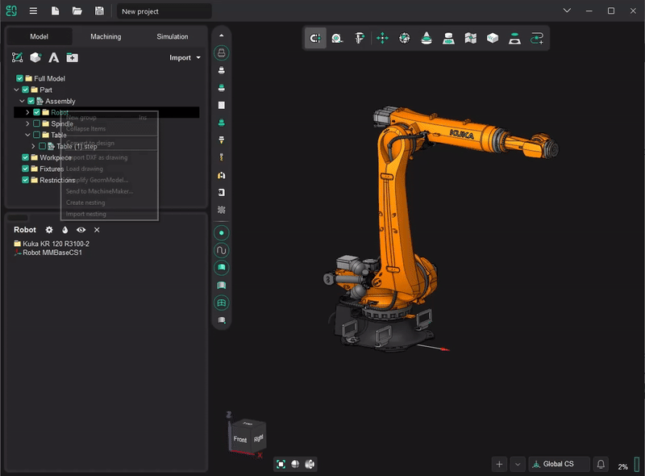</a>

Finally send it to MachineMaker. In the <i class=""><strong class="">Import mechanism geometry</strong></i> window, select the type of mechanism - <strong class=""><i class="">Robot</i></strong>. Verify that MachineMaker is in <i class=""><strong class="">Robot Cell </strong></i>context mode 

<a class="doc-image-link" href="images/download/attachments/129933049/image2022-4-21_16-42-32.png" rel="noopener" target="_blank" title="Open full-size image">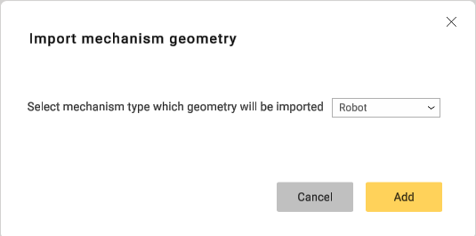</a>

<h1 class="heading">Spindle</h1>

Working with the spindle is very similar to the above. The base coordinate system specifies the point of attachment to the <i class=""><strong class="">AdditionalCS</strong> </i>of the robot and the additional coordinate system specifies the point of attachment of the tool. After sending to MachineMaker, you need to select the type of mechanism to load - <i class=""><strong class="">End effector</strong></i>. If the coordinate systems are correct, then the spindle will automatically join the sixth axis of the robot. In any case, you can manually correct the connection.

<strong class=""><a class="doc-image-link" href="images/download/attachments/129933049/sendtommspindle.webp" rel="noopener" target="_blank" title="Open full-size image">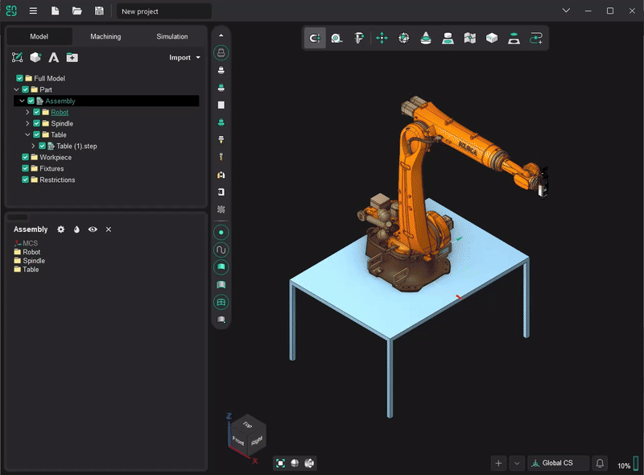</a>
 </strong>

<h1 class="heading">Table</h1>

The base coordinate system of the table is responsible for the location on the floor, and the additional coordinate systems is used for the placement of other mechanisms. You can any have any number of additional CSs. In our case, the additional coordinate system will be automatically set in the robot's <i class=""><strong class="">BaseCS</strong></i>.

Finally select the type of mechanism - <i class=""><strong class="">Table(fixed)</strong></i><strong class=""> </strong>in MachineMaker. Then place the robot on the table.

<a class="doc-image-link" href="images/download/attachments/129933049/sendtommtable.webp" rel="noopener" target="_blank" title="Open full-size image">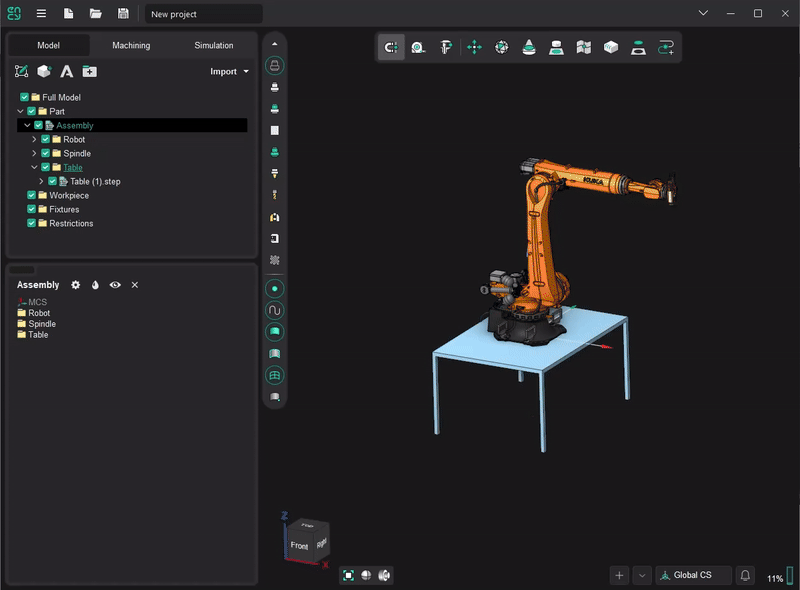</a>

