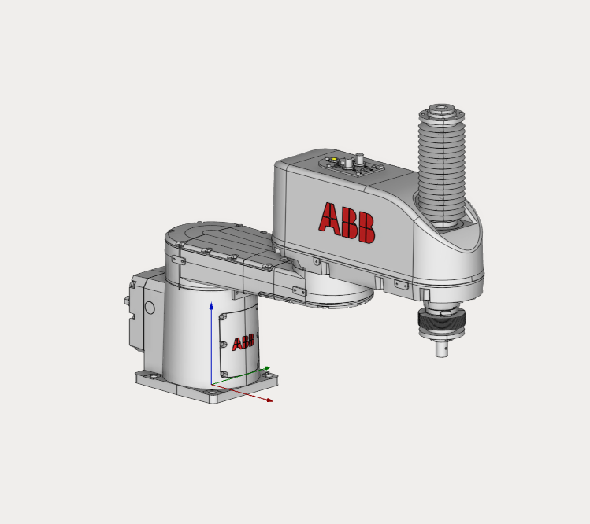

---
title: "SCARA Robot"
---

<link rel="stylesheet" href="assets/manual.css">

<h1 id="src-137005116">SCARA Robot</h1>

Download project here: <strong class=""><a href="https://github.com/EncySoftware/public-docs/releases/download/machinemaker-examples-2026-09-22/SCARA_Robot-e2a143ff76.zip">SCARA Robot.zip</a></strong>

You can see the tutorial video at the <a class="external-link" href="https://www.youtube.com/watch?v=PO9aYKcBq7I&amp;list=PLnaHZJpWJMKPN2hSDvR1DnxmAuFH4tP42&amp;index=16&amp;ab_channel=ENCYSoftware">link</a>.

