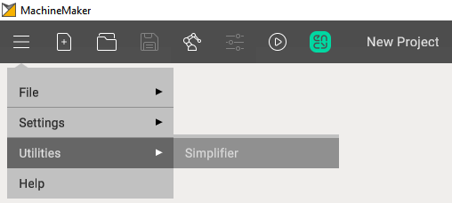
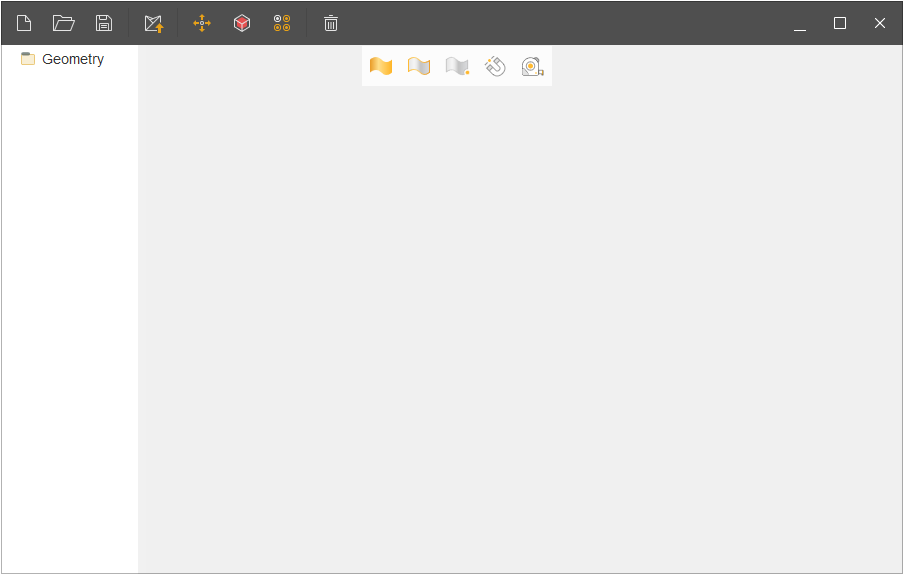
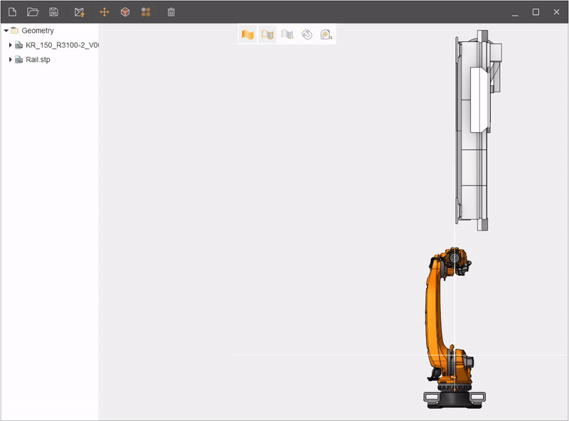
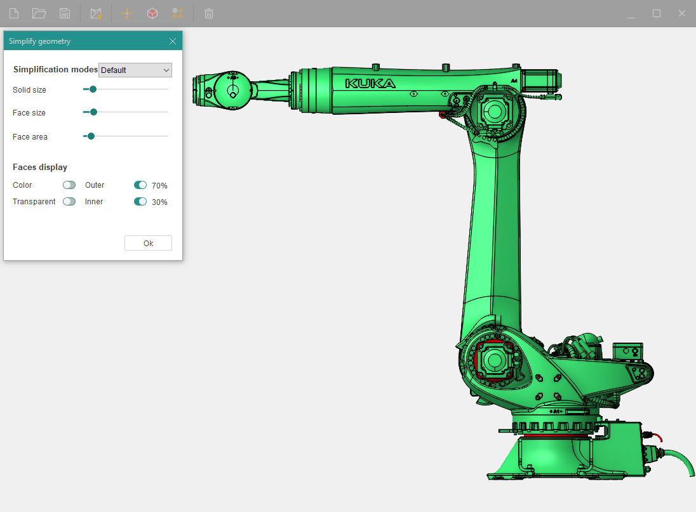
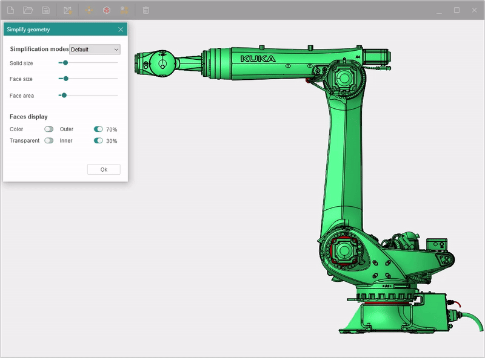
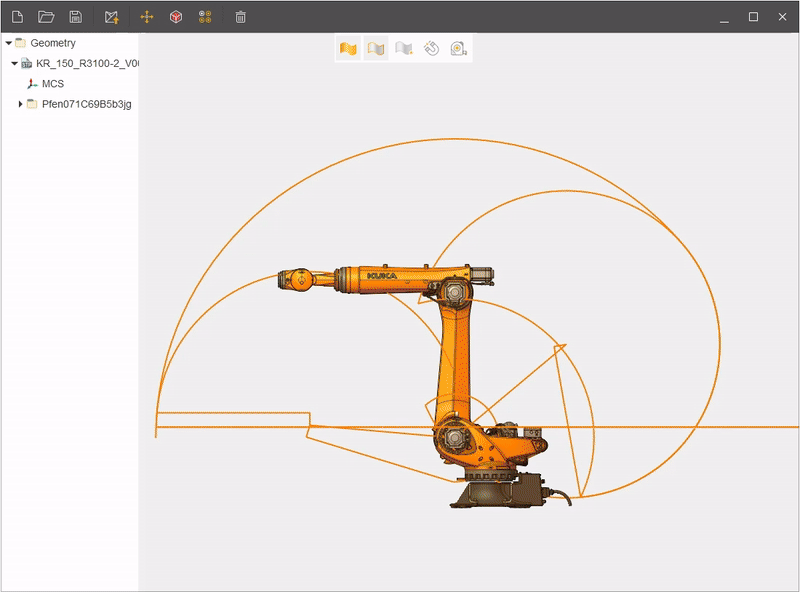
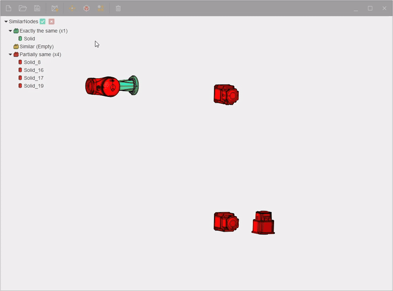

---
title: "Simplifier"
---

<link rel="stylesheet" href="assets/manual.css">

<h1 id="src-129934066">Simplifier</h1>

Simplifier in MachineMaker is intended to simplify complex 3D models. This may include eliminating redundant parts, merging surfaces, optimizing model structure, and other complexity reduction techniques.

To open it you need to click on the drop-down menu and select <strong class="">Simplifier</strong> in the utilities menu.

The main menu of this utility looks like this:

The main window comprises the following sections:

<ol class=""><li class="">
New project.

</li><li class="">
Import.

</li><li class="">
Save as.

</li><li class="">
Send to MachineMaker.

</li><li class="">
Transformation geometry.

</li><li class="">
Simplify geometry.

</li><li class="">
Find similar nodes.

</li><li class="">
Delete.

</li></ol>
Transformation geometry is needed to move objects and has identical functions as in CAM system. 

Simplify geometry - This is one of the main functions of this utility. Here you can select different modes of model simplification. There are 4 templates:

<ol class=""><li class="">
<strong class="">Default</strong> - a mode that removes small objects from the model.

</li><li class="">
<strong class="">Middle</strong> - a mode that removes most of the objects from the surface of the model.

</li><li class="">
<strong class="">Maximum</strong> - a mode that removes everything except large parts of the model.

</li><li class="">
<strong class="">Custom</strong> - a mode in which you manually edit the surface of your model using sliders.

</li></ol>
The Kuka KR 120 R3100-2 robot model will be used for the illustrative test.

 Before removing unnecessary objects from the robot, you can use the faces display function, where you can see in advance which objects will be removed (marked in red).

Simplifier also has a<strong class=""> Find similar nodes</strong> function. It is used to search for similar parts in your model, then it sorts them in a list by different nodes such as:

<ul class=""><li class="">
Exactly the same

</li><li class="">
Similar

</li><li class="">
Partially same

</li></ul>

If necessary, you can delete nodes using the Delete button.

