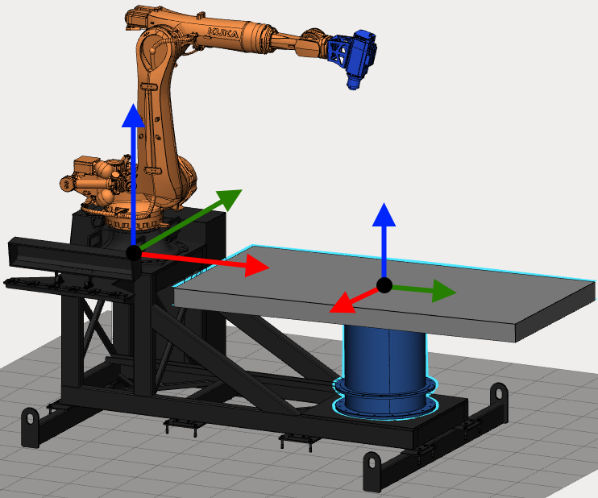
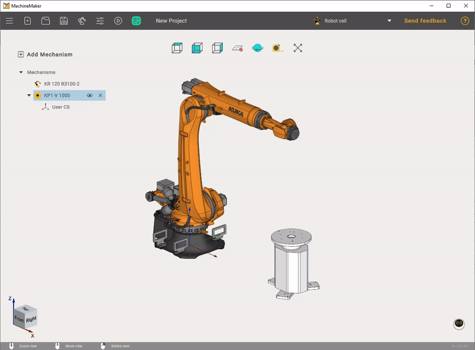
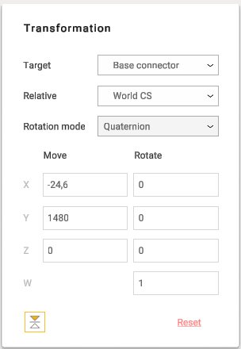

---
title: "Table calibration"
---

<link rel="stylesheet" href="assets/manual.css">

<h1 id="src-129931151">Table calibration</h1>

Table calibration function is available from the <a href="assemblies.md">assembly view</a>. Finish editing mechanism by clicking <i class=""><strong class="">Apply</strong></i><strong class=""> </strong>or <i class=""><strong class="">Cancel</strong></i><strong class=""> </strong>buttons to see the entire mechanisms assembly.

Robot has a Base and TCP coordinate systems. It is necessary to specify User Coordinate System position relative to the Robot Base Coordinate System.

 
Hold down     
<i class=""><strong class="">Left Ctrl</strong></i><strong class=""> </strong> 
key to show all Coordinate Systems.    

<h1 class="heading">How to calibrate a table</h1>

Select a table using the left mouse button in the Transformation panel on the right. Select the desired User CS as <i class=""><strong class="">Target</strong></i><strong class=""> </strong>and select Robot Base CS in the <i class=""><strong class="">Relative</strong></i><strong class=""> </strong>field. Now you can see User Coordinate System position relatively to the Robot Base Coordinate System in the Move and Rotate fields. Enter correct values to finish calibration.

 
Use Robot's User CS calibration function to obtain accurate values    

<h1 class="heading">Quaternions, Radians and Euler angles</h1>

Some robots (such as ABB) use quaternions instead of euler angles. For this kind of robots MachineMaker can show quaternions fields. You can switch to Euler angles if you prefer to use human-friendly Euler angles.

 
MachineMaker will automatically detect that you are doing table calibration and will switch rotation mode to the correct values system. You can switch it back to the Euler angles without loosing your data.    

 
MachineMaker will suggest using quaternions only for robots which support it (like ABB).    

