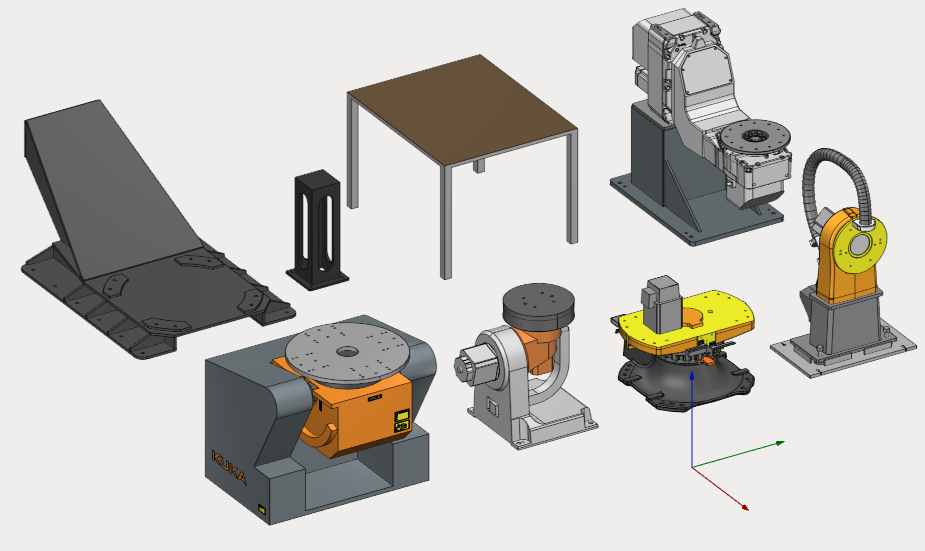
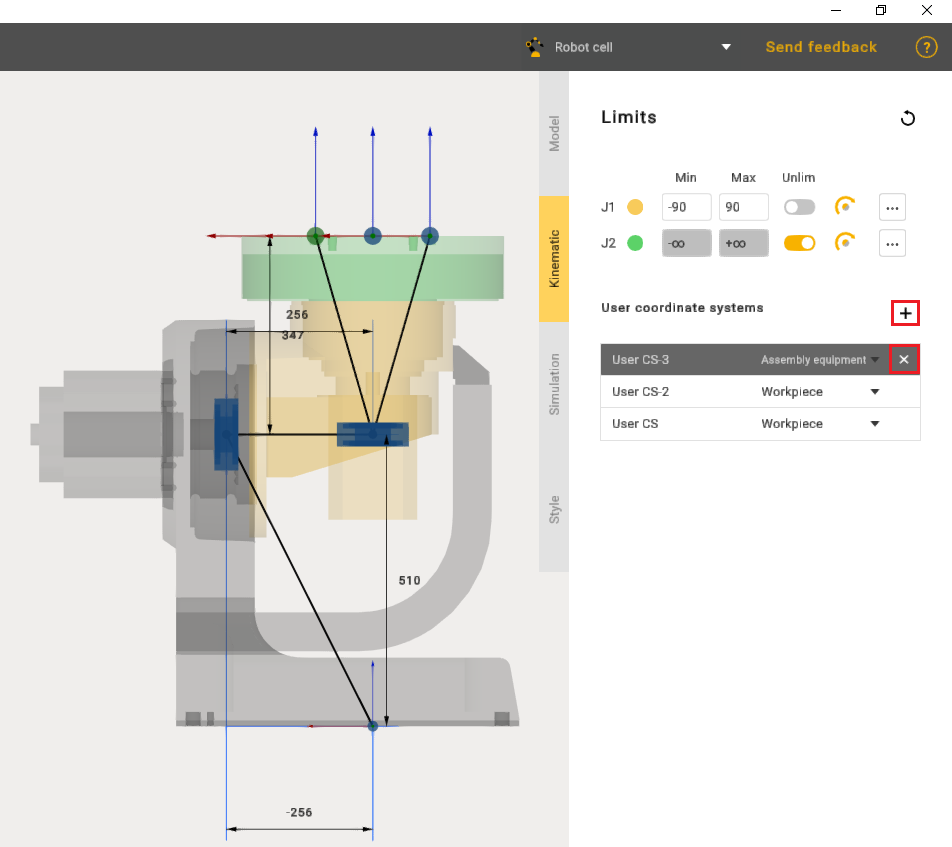
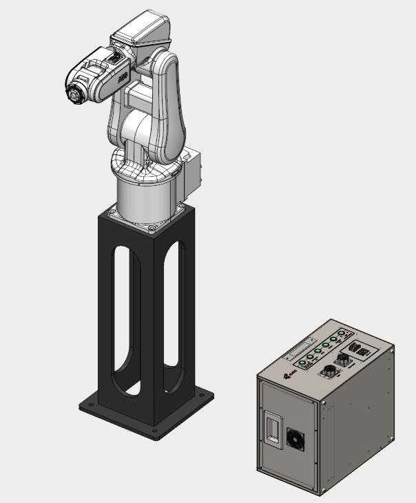
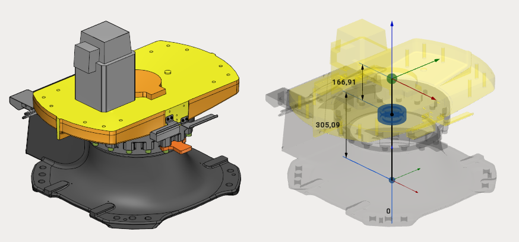
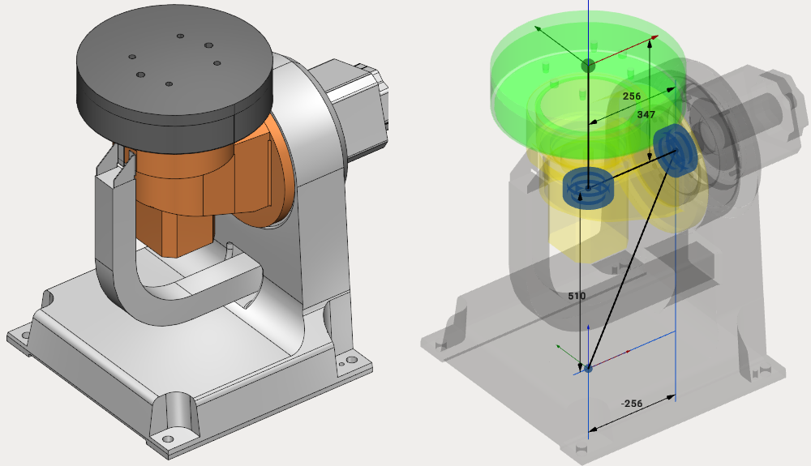

---
title: "Tables and Positioners"
---

<link rel="stylesheet" href="assets/manual.css">

<h1 id="src-129930810">Tables and Positioners</h1>

MachineMaker allows you to create static tables, 1-axis positioners and 2-axes positioners.

<h1 class="heading">Tables</h1>

Table is a fixed (static) object which can hold a workpiece or any another object (including robots or another table).

It is possible to add any number of connectors to the table using 
<strong class=""> </strong>button in the <i class=""><strong class="">User</strong></i> <i class=""><strong class="">Coordinate Systems</strong></i><strong class=""> </strong>panel. Use 
 button to delete the connector. Use double click to rename the coordinate system.

Hold down <i class=""><strong class="">Left Control</strong></i><strong class=""> </strong>key and use drag&amp;drop to place the connector in the correct position; it is also possible to specify the connector's position by changing dimensions or the date in the Transformation Panel, for details see "Transformation panel". You can also select the type of added connector assembly equipment or workpiece.

MachineMaker will use connectors to connect mechanisms with each other when building <strong class="">Assemblies</strong>. All empty connectors will be converted into Workpiece holders for CAM system.

There is a big difference between Fixed Tables and Fixed Objects. A Fixed Object is a standalone static object, it is impossible to place a robot on a Fixed Object. So, Fixed Objects do not have any connectors. Use Fixed Objects option for robot controllers, standalone boxes located in the robot cell, fences and so on. Use Fixed Tables for tables holding robots and workpieces, floors and so on.

<h1 class="heading">1-axis positioner</h1>

1-axis positioner has one rotary joint and an unlimited number of connectors. It is possible to add new connectors using<strong class=""> 
</strong>button in the <i class=""><strong class="">User</strong></i> <i class=""><strong class="">Coordinate Systems</strong></i><strong class=""> </strong>panel.

<h1 class="heading">2-axes positioner</h1>

2-axes positioner has 2 rotary joints and an unlimited number of connectors. It is possible to add new connectors using<strong class=""> 
</strong>button in the <i class=""><strong class="">User</strong></i> <i class=""><strong class="">Coordinate Systems</strong></i><strong class=""> </strong>panel.

