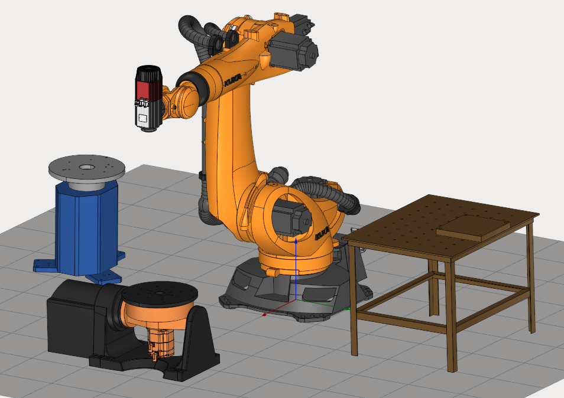

---
title: "Tables and User CS"
---

<link rel="stylesheet" href="assets/manual.css">

<h1 id="src-129937026">Tables and User CS</h1>

Download Project here: <strong class=""><a href="https://github.com/EncySoftware/public-docs/releases/download/machinemaker-examples-2026-09-22/Tables-a887c6f5e1.zip">Tables.zip</a></strong>

You can see the tutorial video at the <a class="external-link" href="https://www.youtube.com/watch?v=zqBhFWM0OL8&amp;list=PLnaHZJpWJMKPN2hSDvR1DnxmAuFH4tP42&amp;index=15">link</a>

