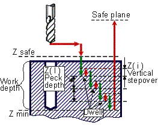

# CYCLE BRKCHP(288) - Deep drilling with chip breaking

> **Kept for compatibility.** **CYCLE** is retained only for compatibility with older postprocessors. Current versions of the CAM system generate the [extended cycle command **EXTCYCLE**](../extcycle/extcycle.md) instead: it offers more capabilities and lets the CAM system fully simulate all of the cycle's nested motions, which **CYCLE** does not. Output of **CYCLE** can still be turned on in the CAM system settings, but this is not recommended.

Deep drilling with chip removing cycle performs rapid approach to the safe level and repeated drilling according to specified cut-in depth value **ZI** and withdrawal **Zi** values.



Cycle includes:

- Rapid travel to the **Z safe** level.
- Work feedrate travel to the **Zl**.
- Rapid retract to the **Zi** withdrawal value and **Dwell**.
- Work feedrate travel to the **Zl** + **Zi** level.
- Rapid retract to the **Zi** withdrawal value and **Dwell**.
- Repeat until the hole depth level is reached.
- Rapid retract to the **Safe plane** level.

**Command**

```text
CYCLE BRKCHP(288), A a, MMPM(315), N nm, F f,
L l, I i, P p, DWELL(279) h, T t
```

or

```text
CYCLE BRKCHP(288), A a, MMPR(316), M nm, F f,
L l, I i, P p, DWELL(279) h, T t
```

## Parameters

| Parameter | CLD array | CLD name | Description |
|---|---|---|---|
| BRKCHP(288) | CLD[1] | CLD.Type | Cycle type 288 (BRKCHP). |
| a | CLD[2] | CLD.A | Hole depth in current measure units (mm or inches). |
| MMPM(315)<br>MMPR(316) | CLD[3] | CLD.MMPM | Feedrate measure units: 315 (MMPM) – mm per minute (inches per minute), 316 (MMPR) – mm per revolution (inches per revolution). |
| nm | CLD[4] | CLD.NM | Work feedrate value. |
| f | CLD[5] | CLD.F | Safe level. |
| L | CLD[6] | CLD.L | Cut in value Zl |
| i | CLD[7] | CLD.I | Withdrawal value Zi |
| p | CLD[8] | CLD.P | Safe plane level. |
| DWELL | CLD[9] | CLD.DWELL | Dwell time keyword. |
| h | CLD[10] | CLD.H | Tool dwell in seconds. |
| t | CLD[11] | CLD.Top | Hole top level. |

## Access from .NET

Delivered through the `OnCycle` handler (dispatch on the cycle type in `cmd`/`cld[1]`):

```csharp
public override void OnCycle(ICLDCycleCommand cmd, CLDArray cld)
```

See [Hole machining cycles (CYCLE)](cycle.md) for the common .NET model.

## See also
- [Hole machining cycles (CYCLE)](cycle.md)
- [CLData access model](../../cldata.md)
