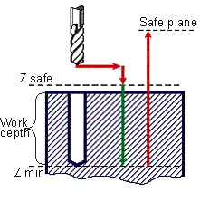

# CYCLE DRILL(163) - G81 drilling cycle

> **Kept for compatibility.** **CYCLE** is retained only for compatibility with older postprocessors. Current versions of the CAM system generate the [extended cycle command **EXTCYCLE**](../extcycle/extcycle.md) instead: it offers more capabilities and lets the CAM system fully simulate all of the cycle's nested motions, which **CYCLE** does not. Output of **CYCLE** can still be turned on in the CAM system settings, but this is not recommended.

G81 simple drilling canned cycle performs drilling with rapid approach to the safe level and consequent retraction to the safe plane.



Cycle includes:

- Rapid travel to **safe Z** level.
- Work feedrate travel to **Z min** level.
- Rapid travel to **Safe plane** level.

**Command**

```text
CYCLE DRILL(163), A a, MMPM(315), N nm, F f, P p, T t
```

or

```text
CYCLE DRILL(163), A a, MMPR(316), M nm, F f, P p, T t
```

## Parameters

| Parameter | CLD array | CLD name | Description |
|---|---|---|---|
| DRILL(163) | CLD[1] | CLD.Type | Cycle type 163 (DRILL). |
| a | CLD[2] | CLD.A | Hole depth in current measure units (mm or inches). |
| MMPM(315)<br>MMPR(316) | CLD[3] | CLD.MMPM | Feedrate measure units: 315 (MMPM) – mm per minute (inches per minute), 316 (MMPR) – mm per revolution (inches per revolution). |
| nm | CLD[4] | CLD.NM | Feedrate. |
| f | CLD[5]<br>CLD[6], CLD[7] | CLD.F<br>Reserved | Safe level. |
| p | CLD[8]<br>CLD[9], CLD[10] | CLD.P<br>Reserved | Safe plane level. |
| t | CLD[11] | CLD.Top | Hole top level. |

## Access from .NET

Delivered through the `OnCycle` handler (dispatch on the cycle type in `cmd`/`cld[1]`):

```csharp
public override void OnCycle(ICLDCycleCommand cmd, CLDArray cld)
```

See [Hole machining cycles (CYCLE)](cycle.md) for the common .NET model.

## See also
- [Hole machining cycles (CYCLE)](cycle.md)
- [CLData access model](../../cldata.md)
