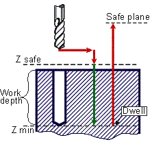

# CYCLE FACE(81) - G82 drilling cycle

> **Kept for compatibility.** **CYCLE** is retained only for compatibility with older postprocessors. Current versions of the CAM system generate the [extended cycle command **EXTCYCLE**](../extcycle/extcycle.md) instead: it offers more capabilities and lets the CAM system fully simulate all of the cycle's nested motions, which **CYCLE** does not. Output of **CYCLE** can still be turned on in the CAM system settings, but this is not recommended.

G82 drilling with dwell canned cycle performs drilling with rapid approach to safe level, dwell at **Z min** level with work feed rate and retracts to the safe plane level at rapid feed rate. Dwell is specified by command parameters.



G82 drilling cycle includes:

- Rapid approach to **Z safe** level.
- Work feed rate travel to **Z min** level.
- **Dwell** at **Z min** level.
- Rapid retraction to **Safe plane** level.

**Command**

```text
CYCLE FACE(81), A a, MMPM(315), N nm, F f, P p, DWELL(279) h, T t
```

or

```text
CYCLE FACE(81), A a, MMPR(316), M nm, F f, P p, DWELL(279) h, T t
```

## Parameters

| Parameter | CLD array | CLD name | Description |
|---|---|---|---|
| FACE(81) | CLD[1] | CLD.Type | Cycle type 81 (FACE). |
| a | CLD[2] | CLD.A | Hole depth in current measure units (mm or inches). |
| MMPM(315)<br>MMPR(316) | CLD[3] | CLD.MMPM | Feedrate measure units: 315 (MMPM) – mm per minute (inches per minute), 316 (MMPR) – mm per revolution (inches per revolution). |
| nm | CLD[4] | CLD.NM | Feedrate value. |
| f | CLD[5] | CLD.F | Safe level. |
|  | CLD[6]<br>CLD[7] |  | Reserved. |
| p | CLD[8] | CLD.P | Safe plane level. |
| DWELL | CLD[9] | CLD.DWell | Dwell time keyword. |
| h | CLD[10] | CLD.H | Dwell time in seconds. |
| t | CLD[11] | CLD.Top | Hole top level. |

## Access from .NET

Delivered through the `OnCycle` handler (dispatch on the cycle type in `cmd`/`cld[1]`):

```csharp
public override void OnCycle(ICLDCycleCommand cmd, CLDArray cld)
```

See [Hole machining cycles (CYCLE)](cycle.md) for the common .NET model.

## See also
- [Hole machining cycles (CYCLE)](cycle.md)
- [CLData access model](../../cldata.md)
