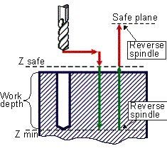

# CYCLE TAP(168) - G84 drilling cycle

> **Kept for compatibility.** **CYCLE** is retained only for compatibility with older postprocessors. Current versions of the CAM system generate the [extended cycle command **EXTCYCLE**](../extcycle/extcycle.md) instead: it offers more capabilities and lets the CAM system fully simulate all of the cycle's nested motions, which **CYCLE** does not. Output of **CYCLE** can still be turned on in the CAM system settings, but this is not recommended.

G84 tapping canned cycle performs rapid approach to safe level, taps the thread on the feedrate retract with reverse spindle rotation.



G84 Cycle consist of:

- Rapid approach to **Z safe** level.
- Work feed rate travel to **Z min** level.
- Spindle rotation stop.
- **Reverse spindle rotation** and work feed rate return to **Z safe** level.
- Spindle rotation stop.
- Restore normal spindle rotation and rapid retract to **Safe plane** level.

**Command**

```text
CYCLE TAP(168), A a, MMPM(315), N nm, F f,
P p, T t, S s, PS ps, SC sc, FR fr
```

or

```text
CYCLE TAP(168), A a, MMPR(316), M nm, F f,
P p, T t, S s, PS ps, SC sc, FR fr
```

## Parameters

| Parameter | CLD array | CLD name | Description |
|---|---|---|---|
| TAP(168) | CLD[1] | CLD.Type | Cycle type 168 (TAP). |
| a | CLD[2] | CLD.A | Hole depth in current measure units (mm or inches). |
| MMPM(315)<br>MMPR(316) | CLD[3] | CLD.MMPM | Feedrate measure units: 315 (MMPM) – mm per minute (inches per minute), 316 (MMPR) – mm per revolution (inches per revolution). |
| nm | CLD[4] | CLD.NM | Feedrate value |
| f | CLD[5] | CLD.F | Z safe level |
| L | CLD[6] | CLD.L | Cut in value Zl |
| i | CLD[7] | CLD.I | Withdrawal value Zi |
| p | CLD[8] | CLD.P | Safe plane level |
| DWELL(279) | CLD[9] | CLD.DWell | Dwell time keyword. |
| h | CLD[10] | CLD.H | Dwell time in seconds. |
| t | CLD[11] | CLD.Top | Hole top level |
| s | CLD[12] | CLD.Step | Threading pitch |
| ps | CLD[13] | CLD.Pos | Spindle start angle |
| sc | CLD[14] | CLD.Socket | Socket type: 0 – floating, 1 – fixed |
| fr | CLD[15] | CLD.FR | Return feedrate |

## Access from .NET

Delivered through the `OnCycle` handler (dispatch on the cycle type in `cmd`/`cld[1]`):

```csharp
public override void OnCycle(ICLDCycleCommand cmd, CLDArray cld)
```

See [Hole machining cycles (CYCLE)](cycle.md) for the common .NET model.

## See also
- [Hole machining cycles (CYCLE)](cycle.md)
- [CLData access model](../../cldata.md)
