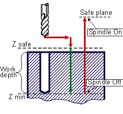

# CYCLE BORE6(210) - G86 drilling cycle

> **Kept for compatibility.** **CYCLE** is retained only for compatibility with older postprocessors. Current versions of the CAM system generate the [extended cycle command **EXTCYCLE**](../extcycle/extcycle.md) instead: it offers more capabilities and lets the CAM system fully simulate all of the cycle's nested motions, which **CYCLE** does not. Output of **CYCLE** can still be turned on in the CAM system settings, but this is not recommended.

G86 boring canned cycle performs rapid approach to the safe level, work feedrate boring to the hole depth level, spindle stop at hole depth level and rapid retract to safe plane level.



G86 cycle includes:

- Rapid approach to the **Z safe** level.
- Work feedrate travel to the **Z min** level.
- **Spindle stop**. If oriented spindle stop is enabled (CLD [14] parameter), it is positioning the spindle in a given angular position and then tool shifts to specified small value of the X, Y and Z coordinates.
- Rapid retract to **Safe plane** level.
- Restore spindle rotation direction and speed.

**Command**

```text
CYCLE BORE6(210), A a, MMPM(315), N nm, F f, P p, T t
```

or

```text
CYCLE BORE6(210), A a, MMPR(316), M nm, F f, P p, T t
```

## Parameters

| Parameter | CLD array | CLD name | Description |
|---|---|---|---|
| BORE6(210) | CLD[1] | CLD.Type | Cycle type 210 (BORE6) |
| a | CLD[2] | CLD.A | Hole depth in current measure units (mm or inches). |
| MMPM(315)<br>MMPR(316) | CLD[3] | CLD.MMPM | Feedrate measure units: 315 (MMPM) – mm per minute (inches per minute), 316 (MMPR) – mm per revolution (inches per revolution). |
| nm | CLD[4] | CLD.NM | Work feedrate value. |
| f | CLD[5] | CLD.F | Safe level. |
|  | CLD[6] |  | The value of tool shift for the X coordinate after oriented spindle stop at the bottom of the hole. |
|  | CLD[7] |  | The value of tool shift for the Y coordinate after oriented spindle stop at the bottom of the hole |
| p | CLD[8] | CLD.P | Safe plane level. |
|  | CLD[9]<br>CLD[10] |  | Reserved. |
| t | CLD[11] | CLD.Top | Hole top level. |
|  | CLD[12] |  | The value of tool shift for the Z coordinate after oriented spindle stop at the bottom of the hole |
|  | CLD[13] |  | The angular position of the spindle when stopping at the bottom of the hole (degrees) |
|  | CLD[14] |  | The state of the oriented spindle stop at the bottom of the hole: 0 - off, 1 - enabled. |

## Access from .NET

Delivered through the `OnCycle` handler (dispatch on the cycle type in `cmd`/`cld[1]`):

```csharp
public override void OnCycle(ICLDCycleCommand cmd, CLDArray cld)
```

See [Hole machining cycles (CYCLE)](cycle.md) for the common .NET model.

## See also
- [Hole machining cycles (CYCLE)](cycle.md)
- [CLData access model](../../cldata.md)
