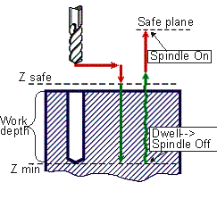

# CYCLE BORE8(212) - G88 drilling cycle

> **Kept for compatibility.** **CYCLE** is retained only for compatibility with older postprocessors. Current versions of the CAM system generate the [extended cycle command **EXTCYCLE**](../extcycle/extcycle.md) instead: it offers more capabilities and lets the CAM system fully simulate all of the cycle's nested motions, which **CYCLE** does not. Output of **CYCLE** can still be turned on in the CAM system settings, but this is not recommended.

G88 boring canned cycle performs rapid approach to the safe level, work feedrate boring with dwell at the hole depth level, spindle stop at the hole depth level and manual retract to the safe plane level.



G88 Cycle includes:

- Rapid approach to the **Z safe** level.
- Work feedrate travel to the **Z min** level.
- **Dwell**.
- **Spindle stop**.
- Manual retract to the **Safe plane** level.
- Restore spindle rotation direction and speed.

**Command**

```text
CYCLE BORE8(212), A a, MMPM(315), N nm, F f, P p, DWELL(279) h, T t
```

or

```text
CYCLE BORE8(212), A a, MMPR(316), M nm, F f, P p, DWELL(279) h, T t
```

## Parameters

| Parameter | CLD array | CLD name | Description |
|---|---|---|---|
| BORE8(212) | CLD[1] | CLD.Type | Cycle type 212 (BORE8). |
| a | CLD[2] | CLD.A | Hole depth in current measure units (mm or inches). |
| MMPM(315)<br>MMPR(316) | CLD[3] | CLD.MMPM | Feedrate measure units: 315 (MMPM) – mm per minute (inches per minute), 316 (MMPR) – mm per revolution (inches per revolution). |
| nm | CLD[4] | CLD.NM | Work feedrate value. |
| f | CLD[5] | CLD.F | Safe level. |
|  | CLD[6]<br>CLD[7] |  | Reserved. |
| p | CLD[8] | CLD.P | Safe plane level. |
| DWELL | CLD[9] | CLD.DWELL | Dwell time keyword. |
| h | CLD[10] | CLD.H | Dwell time in seconds. |
| t | CLD[11] | CLD.Top | Hole top level. |

## Access from .NET

Delivered through the `OnCycle` handler (dispatch on the cycle type in `cmd`/`cld[1]`):

```csharp
public override void OnCycle(ICLDCycleCommand cmd, CLDArray cld)
```

See [Hole machining cycles (CYCLE)](cycle.md) for the common .NET model.

## See also
- [Hole machining cycles (CYCLE)](cycle.md)
- [CLData access model](../../cldata.md)
