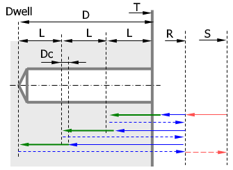

# EXTCYCLE DEEP - Lathe drilling with chip removing cycle

Deep drilling cycle with tool retraction for chip removing `DEEP(153)` is used to machine axial holes by a static tool. The cycle includes:

1. Rapid motion to safe plane level S.
2. Travel to the return level R.
3. Travel to the previous iteration depth (equals the hole top level for the first iteration) with the deceleration Dc.
4. Work feedrate motion to the length L distance.
5. Dwell for the specified time.
6. Return to the return level R.
7. Repeat steps 3 - 6 until the full hole depth is reached.
8. Rapid retract to the safe plane level S.

## Parameters

| CLD array | CLD name | Description |
|---|---|---|
| CLD[1] | CLD.SubCmd | Command type: ON(71) – canned cycle on, CALL(52) – canned cycle call, OFF(72) – canned cycle off. |
| CLD[2] | CLD.SubType | Canned cycle type identifier: DEEP(153). |
| CLD[3] | CLD.CLParams(1) | Upper level of hole (T). |
| CLD[4] | CLD.CLParams(2) | Hole depth from upper level (D). |
| CLD[5] | CLD.CLParams(3) | Return level (R). |
| CLD[6] | CLD.CLParams(4) | Safe level (S). |
| CLD[7] | CLD.CLParams(5) | Delay at low level in seconds (Dwell). |
| CLD[8] | CLD.CLParams(6) | Feed rate type: 0 – mm/rev, 1 – mm/min. |
| CLD[9] | CLD.CLParams(7) | Work feed. |
| CLD[10] | CLD.CLParams(8) | Return feed. |
| CLD[11] | CLD.CLParams(9) | Step for removing bore chip (L) |
| CLD[12] | CLD.CLParams(10) | Deceleration (Dc) |
| CLD[13] | CLD.CLParams(11) | Reserved |
| CLD[14] | CLD.CLParams(12) | Decrease step L for next iteration |

## Access from .NET

This cycle has no dedicated family handler - it is delivered through the base `OnExtCycle` (dispatch on `cmd.CycleType` / `cld[2]`). See [Extended cycle (EXTCYCLE)](extcycle.md).

## See also
- [Extended cycle (EXTCYCLE)](extcycle.md)
- [CLData access model](../../cldata.md)
