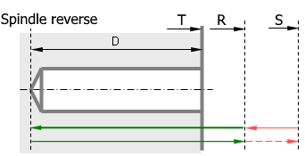

# EXTCYCLE TAP - Lathe tapping cycle (G84)

Lathe tapping cycle `TAP(168)` G84 is used to machine threading by static tap in an axial hole of the workpiece which is rotated by the spindle. The tool approaches the hole axis at the safe plane level, rapid travels to the return level, then work feedrate equal to the threading pitch machines the threading to the specified depth. At the hole bottom the spindle rotation is reversed and the tool is retracted at work feedrate to the return level, where the spindle rotation direction and frequency are reset.

## Parameters

| CLD array | CLD name | Description |
|---|---|---|
| CLD[1] | CLD.SubCmd | Command type: ON(71) – canned cycle on, CALL(52) – canned cycle call, OFF(72) – canned cycle off. |
| CLD[2] | CLD.SubType | Canned cycle type identifier: TAP(168). |
| CLD[3] | CLD.CLParams(1) | Upper level of hole. |
| CLD[4] | CLD.CLParams(2) | Hole depth from upper level. |
| CLD[5] | CLD.CLParams(3) | Return level. |
| CLD[6] | CLD.CLParams(4) | Safe level. |
| CLD[7] | CLD.CLParams(5) | Reserved. |
| CLD[8] | CLD.CLParams(6) | Reserved. |
| CLD[9] | CLD.CLParams(7) | Work feed (thread pitch) |
| CLD[10] | CLD.CLParams(8) | Return feed. |

## Access from .NET

This cycle has no dedicated family handler - it is delivered through the base `OnExtCycle` (dispatch on `cmd.CycleType` / `cld[2]`). See [Extended cycle (EXTCYCLE)](extcycle.md).

## See also
- [Extended cycle (EXTCYCLE)](extcycle.md)
- [CLData access model](../../cldata.md)
