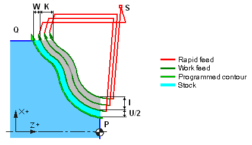

# EXTCYCLE LATHEFINISH - Lathe finish cycle (G70, G73)

`LATHEFINISH(400)` (G73) standard cycle is used for the rough machining of prior formed (molded, for example) workpiece. When machining with the standard cycle it is assumed that the material is removed or missing at a given distance from the programmed tool toolpath (PQ-block).

When cycle machining the values of F, S and T defined before the G73 frame or directly in the G73 frame. Feedrate (F), spindle speed (S) and tool change (T) commands between P and Q lines are ignored.

The first roughing cut offset is defined as (U/2 + I) along the X axis and (W + K) along the Z axis. Every following roughing cut approaches the last roughing cut contour by (I/(D-1)) along the X axis and (K/(D-1)) along the Z axis. The last roughing cut always leaves stock material U/2 for the X axis and W for the Z axis.



**LATHEFINISH** canned cycle is also used to form lathe finishing cycle G70 along the contour. If stocks are zero and there is only one cut then the lathe finishing G70 cycle is called.

Lathe cycles assume the part programmed contour PQ is defined. CAM system passes the contour as NC-subroutine. The number of the subroutine is specified in the `CLD[3]` parameter.

## Parameters

| CLD array | CLD name | Description |
|---|---|---|
| CLD[1] | CLD.SubCmd | Command type: ON(71) — canned cycle on, CALL(52) — canned cycle call, OFF(72) — canned cycle off. |
| CLD[2] | CLD.Subtype | Canned cycle type identifier: LATHEFINISH(400) |
| CLD[3] | CLD.CLParams(1) | The number of the NC subprogram that contains the machined contour PQ. |
| CLD[4] | CLD.CLParams(2) | The pass count (D). If one pass required then D=1, and occur G70. If D>1, then occur G73 cycle. |
| CLD[5] | CLD.CLParams(3) | The signed thickness of layer directed in Z axis Z (K). It is equal to zero for G70. |
| CLD[6] | CLD.CLParams(4) | The signed thickness by X (I) axis. It is equal to zero for G70 cycle. |
| CLD[7] | CLD.CLParams(5) | The signed stock by Z (W) axis. It is equal to zero for G70 cycle. |
| CLD[8] | CLD.CLParams(6) | The signed stock by X (U/2) axis. It is equal to zero for G70 cycle. |
| CLD[11] | CLD.CLParams(9) | Machining type: 0 — Face, 1 — OD (external), 2 — ID (internal). "Face" is a very rare case. Occurs only if the contour does not change along the axial coordinate with absolute accuracy. Most often, even in the case of face turning, there is a non-zero retract along the axis, which turns the face turning into an external (OD) or internal (ID) one. |
| CLD[12] | CLD.CLParams(10) | Availability of finish pass (G70): 0 — without finish pass, 1 — with finish pass. |
| CLD[13] | CLD.CLParams(11) | Equidistant stock for contour |

If a "signed" parameter is positive it is laid off in the positive direction of the respective axis, otherwise it is laid off in the negative direction.

## Access from .NET

In addition to the base `OnExtCycle`, this cycle is delivered through the turning-family handler `OnTurnExtCycle`:

```csharp
public override void OnTurnExtCycle(ICLDExtCycleCommand cmd, CLDArray cld)
```

See [Extended cycle (EXTCYCLE)](extcycle.md) for the common .NET model.

## See also
- [Extended cycle (EXTCYCLE)](extcycle.md)
- [CLData access model](../../cldata.md)
