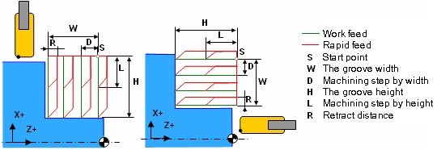

# EXTCYCLE LATHEGROOVE - Lathe grooving cycle (G74, G75)

Cycle `LATHEGROOVE(402)` implements the G74 cylindrical grooving canned cycle and G75 face grooving canned cycle. Groove shape is rectangular and is defined by its dimensions: width and height. The cutting is done by consequent work passes of the tool with Z and X axes stepping.



## Parameters

| CLD array | CLD name | Description |
|---|---|---|
| CLD[1] | CLD.SubCmd | Command type: ON(71) – canned cycle on, CALL(52) – canned cycle call, OFF(72) – canned cycle off. |
| CLD[2] | CLD.SubType | Canned cycle type identifier: LATHEGROOVE(402) |
| CLD[3] | CLD.CLParams(1) | The groove type: 0 – turn groove (G75), 1 – face groove (G74) |
| CLD[4] | CLD.CLParams(2) | The signed width of the groove measured relative to the start point (W) |
| CLD[5] | CLD.CLParams(3) | The signed height of the groove measured relative to the start point (H) |
| CLD[6] | CLD.CLParams(4) | The absolute amount of the machining step by width (D) |
| CLD[7] | CLD.CLParams(5) | The absolute value of the machining step by height (chip breaking depth, L) |
| CLD[8] | CLD.CLParams(6) | The absolute distance of the side retract before return of tool (R) |
| CLD[9] | CLD.CLParams(7) | The absolute value of the lead out for chip breaking. |
| CLD[10] | CLD.CLParams(8) | Delay at the bottom in seconds |
| CLD[11] | CLD.CLParams(9) | Chip breaking mode: 0 - do not use, 1 - on first plunge, 2 - on every plunge. |
| CLD[12] | CLD.CLParams(10) | Width rough stock |
| CLD[13] | CLD.CLParams(11) | Height rough stock |

If a "signed" parameter is positive it is laid off in the positive direction of respective axis, otherwise it is laid off in negative direction.

## Access from .NET

In addition to the base `OnExtCycle`, this cycle is delivered through the turning-family handler `OnTurnExtCycle`:

```csharp
public override void OnTurnExtCycle(ICLDExtCycleCommand cmd, CLDArray cld)
```

See [Extended cycle (EXTCYCLE)](extcycle.md) for the common .NET model.

## See also
- [Extended cycle (EXTCYCLE)](extcycle.md)
- [CLData access model](../../cldata.md)
