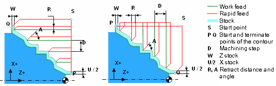

# EXTCYCLE LATHEROUGH - Lathe roughing cycle (G71, G72)

`LATHEROUGH(401)` canned cycle G71 performs roughing machining of the workpiece by the given part shape. F, S and T commands in the G71 line or already set before G71 line are used in the lathe roughing cycle G71. G71 cycle handles two machining toolpath types. If in the programmed toolpath the X axis doesn't change it's direction, then it's the first type toolpath (type I). The second toolpath type (type II) allows the change of the X axis direction. The Z axis direction must not change for both types.

G73 canned cycle is similar to G71, but is used to machine part face.

The last motion for both cycles is the return to the starting S position. As shown on the image S is the tool position when the cycle was called.



Lathe cycles assume the part programmed contour PQ is defined. CAM system passes the contour as NC-subroutine. The number of the subroutine is specified in the `CLD[3]` parameter.

If the parameter CLD[12]=1, then after roughing cycle G71 or G72 can be caused by a finishing pass along the contour - G70 cycle.

## Parameters

| CLD array | CLD name | Description |
|---|---|---|
| CLD[1] | CLD.SubCmd | Command type: ON(71) – canned cycle on, CALL(52) – canned cycle call, OFF(72) – canned cycle off. |
| CLD[2] | CLD.SubType | Canned cycle type identifier: LATHEROUGH(401) |
| CLD[3] | CLD.CLParams(1) | The number of the subroutine that machines the PQ contour. |
| CLD[4] | CLD.CLParams(2) | The step of machining (D). |
| CLD[5] | CLD.CLParams(3) | The direction of machining: 0 – along the turn axis (G71), 1 – perpendicular to the turn axis (G72). |
| CLD[6] | CLD.CLParams(4) | The overlap mode switch: 0 – the overlap option is off, 1 – the overlap option is on (the toolpath contains additional tool movements along the machined contour cutting scallops) |
| CLD[7] | CLD.CLParams(5) | The signed Z (W) stock |
| CLD[8] | CLD.CLParams(6) | The signed X(U/2) stock |
| CLD[9] | CLD.CLParams(7) | The retract distance (R) |
| CLD[10] | CLD.CLParams(8) | The retract angle (A) |
| CLD[11] | CLD.CLParams(9) | Machining type: 1 – OD, 2 – ID |
| CLD[12] | CLD.CLParams(10) | Availability of finish pass (G70): 0 - without finish pass, 1 - with finish pass. |
| CLD[13] | CLD.CLParams(11) | Equidistant stock for contour |

If a "signed" parameter is positive it is laid off in the positive direction of respective axis, otherwise it is laid off in negative direction.

## Access from .NET

In addition to the base `OnExtCycle`, this cycle is delivered through the turning-family handler `OnTurnExtCycle`:

```csharp
public override void OnTurnExtCycle(ICLDExtCycleCommand cmd, CLDArray cld)
```

See [Extended cycle (EXTCYCLE)](extcycle.md) for the common .NET model.

## See also
- [Extended cycle (EXTCYCLE)](extcycle.md)
- [CLData access model](../../cldata.md)
