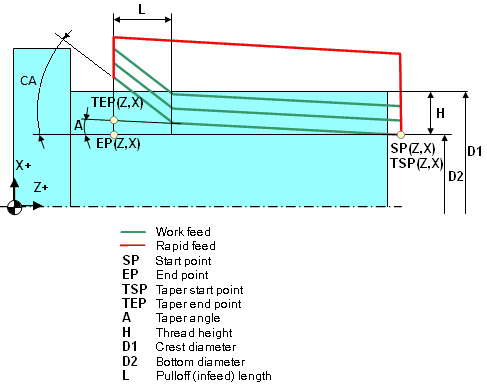
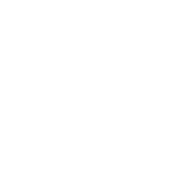
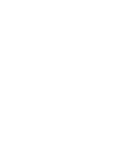
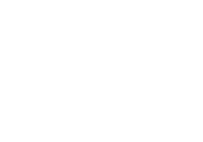

# EXTCYCLE LATHETHREAD - Lathe threading cycle (G76)

`LATHETHREAD(403)` Lathe multipass threading canned cycle G76 is used to form a single line command that specifies all threading parameters. The desired threading depth is achieved by automatic multiple passes. Cycle parameters include threading start and end point coordinates, conical angle (for taper threading), chamfer dimensions, pressure angles, threading depth, pass count, cut-in strategy, etc.



## Parameters

| CLD array | CLD name | Description |
|---|---|---|
| CLD[1] | CLD.SubCmd | Command type: ON(71) – canned cycle on, CALL(52) – canned cycle call, OFF(72) – canned cycle off. |
| CLD[2] | CLD.SubType | Canned cycle type identifier: LATHETHREAD(403). |
| CLD[3] | CLD.CLParams(1) | The thread direction: 0 – left, 1 – right. |
| CLD[4] | CLD.CLParams(2) | The thread orientation: 0 – outer diameter, 1 – inner diameter, 2 – face. |
| CLD[5] | CLD.CLParams(3) | The cone angle in degrees (for a taper thread) (A). |
| CLD[6] | CLD.CLParams(4) | The Z coordinate of the thread start point (SP.Z). |
| CLD[7] | CLD.CLParams(5) | The X coordinate of the thread start point (SP.X). |
| CLD[8] | CLD.CLParams(6) | The Z coordinate of the thread end point (EP.Z). |
| CLD[9] | CLD.CLParams(7) | The X coordinate of the thread end point (EP.X). |
| CLD[10] | CLD.CLParams(8) | The Z coordinate of the taper thread start point (TSP.Z). |
| CLD[11] | CLD.CLParams(9) | The X coordinate of the taper thread start point (TSP.X). |
| CLD[12] | CLD.CLParams(10) | The Z coordinate of the taper thread end point (TEP.Z). |
| CLD[13] | CLD.CLParams(11) | The X coordinate of the taper thread end point (TEP.X). |
| CLD[14] | CLD.CLParams(12) | The pulloff length at the thread termination (L). |
| CLD[15] | CLD.CLParams(13) | The thread type: 0 – special, 1 – metric, 2 – cylinder pipe thread, 3 – trapezium thread, 4 – stop thread, 5 – round thread, 6 – cone pipe thread, 7 – internal cone thread, 8 – internal cylinder thread, 9 – cone imperial thread. |
| CLD[16] | CLD.CLParams(14) | The crest diameter (D1). |
| CLD[17] | CLD.CLParams(15) | The bottom diameter (D2). |
| CLD[18] | CLD.CLParams(16) | The thread height (H). |
| CLD[19] | CLD.CLParams(17) | The thread profile angle between two neighboring thread edges  |
| CLD[20] | CLD.CLParams(18) | The thread profile angle between a vertical line and a thread edge  |
| CLD[21] | CLD.CLParams(19) | The number of the thread starts. |
| CLD[22] | CLD.CLParams(20) | The thread step definition mode: 0 – by distance, 1 – by number of the threads per unit. |
| CLD[23] | CLD.CLParams(21) | The thread step amount. |
| CLD[24] | CLD.CLParams(22) | The thread sequence: 0 – radial  1 – Flank  2 – Alternate flank  |
| CLD[25] | CLD.CLParams(23) | The cut depth calculation method: 0 – keep the cutting area constant  1 – keep the cutting depth constant  |
| CLD[26] | CLD.CLParams(24) | The cut depth definition mode: 0 – by the cut depth of the first cut, 1 – by the number of cuts. |
| CLD[27] | CLD.CLParams(25) | The first cut depth (is used together with the "0" cut depth definition method). |
| CLD[28] | CLD.CLParams(26) | The number of depth cuts (is used together with the "1" cut depth definition mode). |
| CLD[29] | CLD.CLParams(27) | The finish cut depth. |
| CLD[30] | CLD.CLParams(28) | The Spring cut number. |
| CLD[31] | CLD.CLParams(29) | The rough pass minimal depth |
| CLD[32] | CLD.CLParams(30) | The pulloff angle at the thread termination in degrees (CA). |
| CLD[33] | CLD.CLParams(31) | The spindle start angle in degrees (for multistart threads). |
| CLD[34] | CLD.CLParams(32) | Thread engage length along turn axis (like L size on the picture but at the start of thread). |
| CLD[35] | CLD.CLParams(33) | Tool plunge angle in degrees which depends on CLD[24] also. |
| CLD[36] | CLD.CLParams(34) | Thread retract length along turn axis (like L size on the picture but it does not depend on retract angle) |

## Access from .NET

In addition to the base `OnExtCycle`, this cycle is delivered through the turning-family handler `OnTurnExtCycle`:

```csharp
public override void OnTurnExtCycle(ICLDExtCycleCommand cmd, CLDArray cld)
```

See [Extended cycle (EXTCYCLE)](extcycle.md) for the common .NET model.

## See also
- [Extended cycle (EXTCYCLE)](extcycle.md)
- [CLData access model](../../cldata.md)
