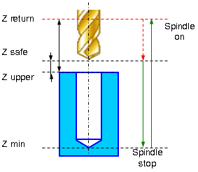

# EXTCYCLE W5DBore5 - Drilling cycle (G85)

Boring cycle `W5DBore5(485)` (G85) performs tool approach to the hole center, hole boring with stop at minimum level and work feedrate retract to the **Return** level.



Boring canned cycle G85 consists of:

- Rapid travel to the hole center at the **Z return** level.
- Rapid travel to the **Z safe** level.
- Work feedrate travel to the **Z min** level.
- **Spindle stop**.
- Work feedrate return to the **Z return** level.
- Restore spindle rotation direction and speed.

## Parameters

| CLD array | CLD name | Description |
|---|---|---|
| CLD[1] | CLD.SubCmd | Command type: ON(71) – canned cycle on, CALL(52) – canned cycle call, OFF(72) – canned cycle off. |
| CLD[2] | CLD.SubType | Canned cycle type identifier: W5DBore5(485). |
| CLD[3] | CLD.CLParams(1) | Nx, X coordinate of the tool normal vector |
| CLD[4] | CLD.CLParams(2) | Ny, Y coordinate of the tool normal vector |
| CLD[5] | CLD.CLParams(3) | Nz, Z coordinate of the tool normal vector |
| CLD[6] | CLD.CLParams(4) | Sf, Normal distance from current tool position to the safe plane level |
| CLD[7] | CLD.CLParams(5) | Tp, Normal distance from current tool position to the hole top level |
| CLD[8] | CLD.CLParams(6) | Bt, Normal distance from current tool position to the hole bottom level |
| CLD[9] | CLD.CLParams(7) | Work feed measurements: 0 – mm/rev, 1 – mm/min |
| CLD[10] | CLD.CLParams(8) | Work feed value |
| CLD[11] | CLD.CLParams(9) | Approach feed measurements: 0 – mm/rev, 1 – mm/min |
| CLD[12] | CLD.CLParams(10) | Approach feed value |
| CLD[13] | CLD.CLParams(11) | Return feed measurements: 0 – mm/rev, 1 – mm/min |
| CLD[14] | CLD.CLParams(12) | Return feed value |
| CLD[15] | CLD.CLParams(13) | Delay at the bottom level in seconds |
| CLD[50] | CLD.CLParams(48) | What spindle is used to machining: 1 - driven tool, 2 - workpiece spindle (lathe). |


## Access from .NET

In addition to the base `OnExtCycle`, this cycle is delivered through the hole-family handler `OnHoleExtCycle`:

```csharp
public override void OnHoleExtCycle(ICLDExtCycleCommand cmd, CLDArray cld)
```

See [Extended cycle (EXTCYCLE)](extcycle.md) for the common .NET model.

## See also
- [Extended cycle (EXTCYCLE)](extcycle.md)
- [CLData access model](../../cldata.md)
