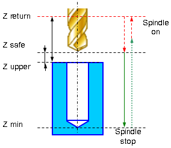

# EXTCYCLE W5DBore7 - Drilling cycle (G87)

Boring cycle `W5DBore7(487)` (G87) performs tool approach to the hole center, hole boring with stop at minimum level and manual retract to the **Return** level.



Boring canned cycle G87 consists of:

- Rapid travel to the hole center at the **Z return** level.
- Rapid travel to the **Z safe** level.
- Work feedrate travel to the **Z min** level.
- **Spindle stop**. If oriented spindle stop is enabled (CLD[17] parameter), it is positioning the spindle in a given angular position and then tool shifts to specified small value of the X, Y and Z coordinates.
- Manual retract to the **Z return** level.
- Restore spindle rotation direction and speed.

## Parameters

| CLD array | CLD name | Description |
|---|---|---|
| CLD[1] | CLD.SubCmd | Command type: ON(71) – canned cycle on, CALL(52) – canned cycle call, OFF(72) – canned cycle off. |
| CLD[2] | CLD.SubType | Canned cycle type identifier: W5DBore7(487) (G87). |
| CLD[3] | CLD.CLParams(1) | Nx, X coordinate of the tool normal vector |
| CLD[4] | CLD.CLParams(2) | Ny, Y coordinate of the tool normal vector |
| CLD[5] | CLD.CLParams(3) | Nz, Z coordinate of the tool normal vector |
| CLD[6] | CLD.CLParams(4) | Sf, Normal distance from current tool position to the safe plane level |
| CLD[7] | CLD.CLParams(5) | Tp, Normal distance from current tool position to the hole top level |
| CLD[8] | CLD.CLParams(6) | Bt, Normal distance from current tool position to the hole bottom level |
| CLD[9] | CLD.CLParams(7) | Work feed measurements: 0 – mm/rev, 1 – mm/min |
| CLD[10] | CLD.CLParams(8) | Work feed value |
| CLD[11] | CLD.CLParams(9) | Approach feed measurements: 0 – mm/rev, 1 – mm/min |
| CLD[12] | CLD.CLParams(10) | Approach feed value |
| CLD[13] | CLD.CLParams(11) | Return feed measurements: 0 – mm/rev, 1 – mm/min |
| CLD[14] | CLD.CLParams(12) | Return feed value |
| CLD[17] | CLD.CLParams(15) | The state of the oriented spindle stop at the bottom of the hole: 0 - off, 1 - enabled. |
| CLD[18] | CLD.CLParams(16) | The angular position of the spindle when stopping at the bottom of the hole (degrees) |
| CLD[19] | CLD.CLParams(17) | The value of tool shift for the X coordinate after oriented spindle stop at the bottom of the hole. |
| CLD[20] | CLD.CLParams(18) | The value of tool shift for the Y coordinate after oriented spindle stop at the bottom of the hole. |
| CLD[21] | CLD.CLParams(19) | The value of tool shift for the Z coordinate after oriented spindle stop at the bottom of the hole. |
| CLD[50] | CLD.CLParams(48) | What spindle is used to machining: 1 - driven tool, 2 - workpiece spindle (lathe). |


## Access from .NET

In addition to the base `OnExtCycle`, this cycle is delivered through the hole-family handler `OnHoleExtCycle`:

```csharp
public override void OnHoleExtCycle(ICLDExtCycleCommand cmd, CLDArray cld)
```

See [Extended cycle (EXTCYCLE)](extcycle.md) for the common .NET model.

## See also
- [Extended cycle (EXTCYCLE)](extcycle.md)
- [CLData access model](../../cldata.md)
