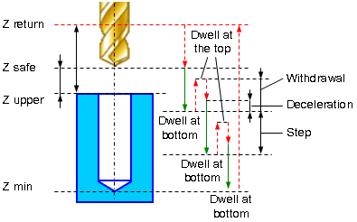

# EXTCYCLE W5DChipBreaking - Drilling with chip breaking cycle (G73)

Drilling with chip breaking cycle `W5DChipBreaking(473)` (G73) performs tool approach to the hole center at the **Z return level**. When cyclic drilling is performed with tool retraction for chip breaking.



The cycle consists of:

- Rapid approach to the hole center at the **Z return** level.
- Rapid travel to the **Z safe** level.
- Work feedrate motion to the **Step depth S**.
- **Dwell** for the **Delay** at the bottom time.
- Rapid tool retraction for the `Withdrawal distance (Ld)`.
- **Dwell** for the **Dwell at the top** time.

- Rapid motion to the previous depth level, with a `Deceleration (Dcl)`.
- Work feedrate to the `Deceleration (Dcl)` with `Step (S)`.
- **Dwell** at for the **Dwell at the bottom** time.
- Repeat previous five iterations until the full hole depth is reached.
- Rapid tool return to the **Z retract** level..

## Parameters

| CLD array | CLD name | Description |
|---|---|---|
| CLD[1] | CLD.SubCmd | Command type: ON(71) – canned cycle on, CALL(52) – canned cycle call, OFF(72) – canned cycle off. |
| CLD[2] | CLD.SubType | Canned cycle type identifier: W5DChipBreaking(473). |
| CLD[3] | CLD.CLParams(1) | Nx, X coordinate of the tool normal vector |
| CLD[4] | CLD.CLParams(2) | Ny, Y coordinate of the tool normal vector |
| CLD[5] | CLD.CLParams(3) | Nz, Z coordinate of the tool normal vector |
| CLD[6] | CLD.CLParams(4) | Sf, Normal distance from current tool position to the safe plane level |
| CLD[7] | CLD.CLParams(5) | Tp, Normal distance from current tool position to the hole top level |
| CLD[8] | CLD.CLParams(6) | Bt, Normal distance from current tool position to the hole bottom level |
| CLD[9] | CLD.CLParams(7) | Work feed measurements: 0 – mm/rev, 1 – mm/min |
| CLD[10] | CLD.CLParams(8) | Work feed value |
| CLD[11] | CLD.CLParams(9) | Approach feed measurements: 0 – mm/rev, 1 – mm/min |
| CLD[12] | CLD.CLParams(10) | Approach feed value |
| CLD[13] | CLD.CLParams(11) | Return feed measurements: 0 – mm/rev, 1 – mm/min |
| CLD[14] | CLD.CLParams(12) | Return feed value |
| CLD[15] | CLD.CLParams(13) | Delay at the bottom level in seconds |
| CLD[16] | CLD.CLParams(14) | Delay at the top level in seconds |
| CLD[17] | CLD.CLParams(15) | St, chip breaking step value |
| CLD[18] | CLD.CLParams(16) | Dg, each iteration chip breaking step degression |
| CLD[19] | CLD.CLParams(17) | Dc, before drilling deceleration value for each step |
| CLD[20] | CLD.CLParams(18) | Ld, each step lead out value for cutting process breaking |
| CLD[50] | CLD.CLParams(48) | What spindle is used to machining: 1 - driven tool, 2 - workpiece spindle (lathe). |

## Access from .NET

In addition to the base `OnExtCycle`, this cycle is delivered through the hole-family handler `OnHoleExtCycle`:

```csharp
public override void OnHoleExtCycle(ICLDExtCycleCommand cmd, CLDArray cld)
```

See [Extended cycle (EXTCYCLE)](extcycle.md) for the common .NET model.

## See also
- [Extended cycle (EXTCYCLE)](extcycle.md)
- [CLData access model](../../cldata.md)
