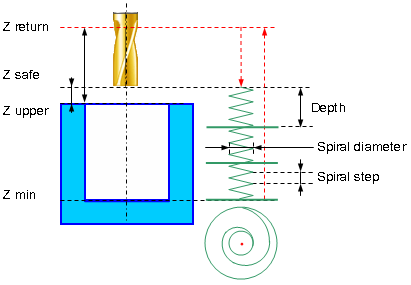
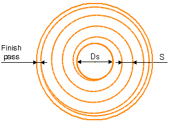

# EXTCYCLE W5DHolePocketing - Hole pocketing cycle

`W5DHolePocketing(491)` is used to machine holes whose diameter is greater than the tool diameter. The pocketing is performed by layers. The tool cuts in along a spiral to each layer and then expands the hole to the desired diameter by moving along Archimedes spiral with finishing pass along the circle.



Hole pocketing cycle includes the following:

- Rapid approach to the center of the hole at the **Z retract** level.
- Rapid motion to the **Z safe** level.

- Work feedrate spiral cut-in to the **Z machining depth**.

- Archimedes spiral with **Step S** motion at that level until the tool axis has reaches the circle with diameter equal to hole diameter reduced by the tool diameter.
- Finishing pass along specified above circle without level change.
- Repeat previous three steps until desired hole depth is machined with travel to the next cut-in point without level change.
- Return to the hole center.
- Rapid travel to the **Z retract** level.

Spiral twist direction can be one of the following:

- **Right**. The Spiral is twisted right. The tool is rotating clockwise if watched from above.
- **Left**. The spiral is twisted left. The tool is rotating counter clockwise if watched from above..
- **Counter**. Spiral twist direction is determined by the spindle rotation direction and corresponds to the up cutting milling. When counter pocketing milling tool rotation direction and spiral direction are opposite to each other.
- **Follow**. Spiral twist direction is determined by the spindle rotation direction and corresponds to the down cutting milling. When counter pocketing milling tool rotation direction and spiral direction are coincident.



If the finishing pass value is not zero, then additional pass along the circle with specified stock is performed before the final pass along the circle. This allows to ensure equal stock final pass.

## Parameters

| CLD array | CLD name | Description |
|---|---|---|
| CLD[1] | CLD.SubCmd | Command type: ON(71) – cycle on, CALL(52) – cycle call, OFF(72) – cycle off. |
| CLD[2] | CLD.SubType | Cycle type identifier: W5DHolePocketing(491). |
| CLD[3] | CLD.CLParams(1) | Nx, X coordinate of the tool normal vector |
| CLD[4] | CLD.CLParams(2) | Ny, Y coordinate of the tool normal vector |
| CLD[5] | CLD.CLParams(3) | Nz, Z coordinate of the tool normal vector |
| CLD[6] | CLD.CLParams(4) | Sf, Normal distance from current tool position to the safe plane level |
| CLD[7] | CLD.CLParams(5) | Tp, Normal distance from current tool position to the hole top level |
| CLD[8] | CLD.CLParams(6) | Bt, Normal distance from current tool position to the hole bottom level |
| CLD[9] | CLD.CLParams(7) | Work feed measurements: 0 – mm/rev, 1 – mm/min |
| CLD[10] | CLD.CLParams(8) | Work feed value |
| CLD[11] | CLD.CLParams(9) | Approach feed measurements: 0 – mm/rev, 1 – mm/min |
| CLD[12] | CLD.CLParams(10) | Approach feed value |
| CLD[13] | CLD.CLParams(11) | Return feed measurements: 0 – mm/rev, 1 – mm/min |
| CLD[14] | CLD.CLParams(12) | Return feed value |
| CLD[16] | CLD.CLParams(14) | Hole diameter |
| CLD[17] | CLD.CLParams(15) | Spiral step |
| CLD[18] | CLD.CLParams(16) | Spiral diameter |
| CLD[19] | CLD.CLParams(17) | Spiral direction: 0 – counter, 1 – follow, 2 – right, 3 – left. In the 0 and 1 cases spiral direction depend on the tool rotation direction, in the 2 and 3 cases they are independent. |
| CLD[20] | CLD.CLParams(18) | Cutting depth along tool axis |
| CLD[21] | CLD.CLParams(19) | Axial cut count |
| CLD[22] | CLD.CLParams(20) | Archimedean spiral step |
| CLD[23] | CLD.CLParams(21) | Finish pass value |

## Access from .NET

In addition to the base `OnExtCycle`, this cycle is delivered through the hole-family handler `OnHoleExtCycle`:

```csharp
public override void OnHoleExtCycle(ICLDExtCycleCommand cmd, CLDArray cld)
```

See [Extended cycle (EXTCYCLE)](extcycle.md) for the common .NET model.

## See also
- [Extended cycle (EXTCYCLE)](extcycle.md)
- [CLData access model](../../cldata.md)
