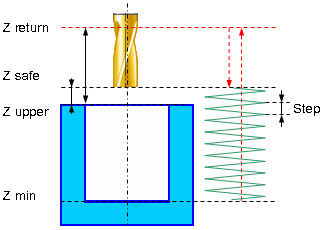
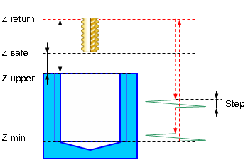
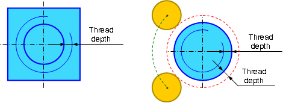
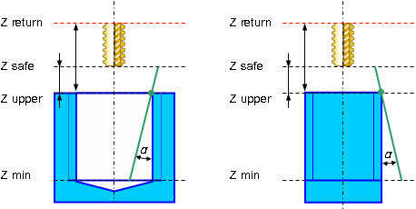
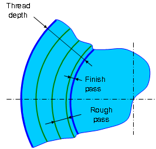

# EXTCYCLE W5DThreadMill - Thread milling cycle

Thread milling `W5DThreadMill(490)` cycle is used to machine external or internal threading or to machine hole by a helix. Spiral machining is used when hole diameter is larger than the tool diameter. The tool rotates around the hole axis and simultaneously travels along the axis. spiral diameter is chosen according to the hole and the tool dimensions. Machining can be done in several passes to mill holes of desired diameter.



Spiral machining includes the following steps:

- Rapid approach to the hole center at the **Z retract** level.
- Rapid travel to the **Z safe** level.
- Work feedrate travel to the spiral start.
- Work feedrate spiral motion to the **Z min level**.
- Optional circular pass on the bottom level. Circle diameter equals spiral diameter.
- Return to the hole center.
- Rapid travel to the **Z safe** level.
- If additional roughing and finishing passes are applied previous five steps are repeated until desired hole diameter is reached.
- Rapid travel to the **Z retract** level.

**Threadmilling** provides the following advantages over traditional tapping:

- blind and through, left and right threads are machined by the same tool;
- different threads with the same pitch are machined by the same tool;
- all precision parameters are secured by the same tool;
- accurate threading is machined to the full depth of the blind hole as the mill has no chamfer;
- different materials are machined by the same tool;
- high reliability of the machining because of good chip handling;
- high efficiency of threadmilling due to higher cutting speed and feedrate;
- low spindle torque even for coarse thread machining.

For threadmilling both single-cutter tools and multi-cutter ones allowing to machine several thread turns in one pass. Multi-cutter tool machining is much similar to spiral machining.



When using the multi-cutter tool threadmilling machining includes the following steps:

- Rapid approach to the hole center at the **Z retract** level.
- Rapid travel to the **Z safe** level.
- Rapid travel to the tool cutting edge length distance which is determined by the number and size of the mill tooth size (thread pitch).
- Work feedrate travel to the start of the spiral.
- Machining along one spiral turn with step equaling thread pitch.
- Retract to the hole center.
- If one spiral turn is not enough to machine the threading to the full hole depth descend to the cutting-edge length and spiral motion are repeated until desired threading depth is reached.
- Rapid return to the **Z retract** level.

If additional roughing and finishing passes are applied then the above steps are repeated until specified thread depth is achieved.

**Thread type** parameter specifies whether the threading is **External** or **Internal**.

There are cases when technology requires that threading is machined upside down and there are cases when threading is done from the bottom to the top. This cycle supports both technologies.

Thread kind, right or left, is determined by the **Thread spiral direction** parameter. For spiral machining it is convenient to define the spiral direction according to the spindle rotation direction. When **Follow** direction is specified the tool rotation and the spiral directions coincide, for the **Counter** direction they are opposite.

**Threading depth** parameter, is used to specify the difference between outer and inner diameters of the thread.



**Bottom circle pass** parameter specifies whether the circle motion is performed when the bottom of the thread is reached.

Multi-start thread is machined if **Thread start count** parameter is greater than 1. If start count is 1 single-start thread is machined.

Thread milling cycle supports tapered thread machining. **Taper angle** parameter is used to specify the thread taper angle in degrees.The taper angle is measured from the top level of the hole (lug). Positive angle direction for tapered thread machining of the hole is the direction to the center of the hole. Positive angle direction for tapered thread machining of the lug is the direction from the center of the lug.



Threadmilling can be performed by several passes. Use the **Roughing passes count**, **Roughing pass step** and **Finish pass step** parameters to process this machining cycles.



**Toolpath type** parameter is used defines the toolpath type according to the used tool type. It can be one of the following

- **Continuous**. This toolpath type is used for the single-cutter tool, which forms only one thread turn with each turn of the spiral. Geometrically the toolpath is a continuous spiral.

- **Transition along the axis**. This type is used for multi-cutter tool which forms multiple thread turns for one turn of the toolpath spiral. The toolpath consists of subsequent spiral turns connected with rapid cutting-edge long transitions along the spiral axis.

**Cutting edge length** is used only for **Transition along the axis** toolpath type. It specifies the length of transitions between adjacent spiral turns.

The **Number of spiral turns** parameter is used to machine threads with pitch smaller than the distance between the tool's teeth. This parameter is generally unused (equals 1).

## Parameters

| CLD array | CLD name | Description |
|---|---|---|
| CLD[1] | CLD.SubCmd | Command type: ON(71) – cycle on, CALL(52) – cycle call, OFF(72) – cycle off. |
| CLD[2] | CLD.SubType | Cycle type identifier: W5DThreadMill(490). |
| CLD[3] | CLD.CLParams(1) | Nx, X coordinate of the tool normal vector |
| CLD[4] | CLD.CLParams(2) | Ny, Y coordinate of the tool normal vector |
| CLD[5] | CLD.CLParams(3) | Nz, Z coordinate of the tool normal vector |
| CLD[6] | CLD.CLParams(4) | Sf, Normal distance from current tool position to the safe plane level |
| CLD[7] | CLD.CLParams(5) | Tp, Normal distance from current tool position to the hole top level |
| CLD[8] | CLD.CLParams(6) | Bt, Normal distance from current tool position to the hole bottom level |
| CLD[9] | CLD.CLParams(7) | Work feed measurements: 0 – mm/rev, 1 – mm/min |
| CLD[10] | CLD.CLParams(8) | Work feed value |
| CLD[11] | CLD.CLParams(9) | Approach feed measurements: 0 – mm/rev, 1 – mm/min |
| CLD[12] | CLD.CLParams(10) | Approach feed value |
| CLD[13] | CLD.CLParams(11) | Return feed measurements: 0 – mm/rev, 1 – mm/min |
| CLD[14] | CLD.CLParams(12) | Return feed value |
| CLD[16] | CLD.CLParams(14) | D, thread outer diameter |
| CLD[17] | CLD.CLParams(15) | St, thread step |
| CLD[18] | CLD.CLParams(16) | Thread type: 0 – inner, 1 – outer |
| CLD[19] | CLD.CLParams(17) | Thread spiral direction: 0 – counter, 1 – follow, 2 – right, 3 – left. In the 0 and 1 cases thread direction depend on the tool rotation direction, in the 2 and 3 cases they are independent. |
| CLD[20] | CLD.CLParams(18) | Machining sequence: 0 – top-down, 1 – bottom-up |
| CLD[21] | CLD.CLParams(19) | Thread start count |
| CLD[22] | CLD.CLParams(20) | Thread depth (difference between outer and inner radiuses) |
| CLD[23] | CLD.CLParams(21) | Rough passes step |
| CLD[24] | CLD.CLParams(22) | Rough passes count |
| CLD[25] | CLD.CLParams(23) | Finish pass step |
| CLD[26] | CLD.CLParams(24) | Bottom circle pass necessity: 0 – do not make last circle pass, 1 – make last circle pass |
| CLD[27] | CLD.CLParams(25) | Taper angle in degrees |
| CLD[28] | CLD.CLParams(26) | Method of forming a spiral: 0 – continuously through the entire depth of the holes, 1 – with transition for multitoothed tool |
| CLD[29] | CLD.CLParams(27) | The length of the working part of cutters (determined by the number of teeth). This value determines the length of the transition to the method of forming a spiral "with transition". |
| CLD[30] | CLD.CLParams(28) | The number of revolutions of the spiral to the method of forming a spiral "with transition" (usually equal to 1, but can be greater than 1 when milling the thread with step smaller than cutter step). |

## Access from .NET

In addition to the base `OnExtCycle`, this cycle is delivered through the hole-family handler `OnHoleExtCycle`:

```csharp
public override void OnHoleExtCycle(ICLDExtCycleCommand cmd, CLDArray cld)
```

See [Extended cycle (EXTCYCLE)](extcycle.md) for the common .NET model.

## See also
- [Extended cycle (EXTCYCLE)](extcycle.md)
- [CLData access model](../../cldata.md)
