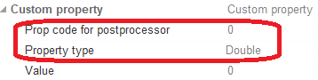

# Additional parameters

## NCAction

`NCAction` element has one own parameters:

| CLDArray | Type | Description |
|---|---|---|
| CmdPrm.Int[-1] | Integer | Probing cycle type: NCAction value = 1 |
| CmdPrm.Int[-2] | Integer | SubCode of cycle specified in " SubCode for postprocessor " property on the `Job Assignment` tab |

## Custom properties

Custom properties have their own parameter codes that are stored in cycles and `NCAction` element:

| CLDArray | Type | Description |
|---|---|---|
| CmdPrm.Int[-10] | Integer | Set WCS offset - mode. 0 - Global (all G54-G59); 1 - One WCS (one of G54-G59); 2 - Parametrical offset (G10 L2 P1 XYZ); 3 - Local CS offset (G52 XYZ) |
| CmdPrm.Int[-11] | Integer | Set WCS offset - CS Number ( Set WCS offset - mode = 1 or 2). |
| CmdPrm.Int[-12] | Integer | Set offset of tool number - Tool number |
| CmdPrm.Int[-13] | Integer | Set offset of tool number - Corrector 1 |
| CmdPrm.Int[-14] | Integer | Set offset of tool number - Corrector 2 |
| CmdPrm.Int[-15] | Integer | Check for broken tool - Tool number |
| CmdPrm.Int[-16] | Integer | Check for broken tool - Corrector 1 |
| CmdPrm.Int[-17] | Integer | Check for broken tool - Corrector 2 |
| CmdPrm.Int[-18] | Integer | Calibrate the tool probe number - Probe number |
| CmdPrm.Int[-19] | Integer | Calibrate the tool probe number - Corrector 1 |
| CmdPrm.Int[-20] | Integer | Calibrate the tool probe number - Corrector 2 |
| CmdPrm.Int[-21] | Integer | Calibrate the part probe number - Probe number |
| CmdPrm.Int[-22] | Integer | Calibrate the part probe number - Corrector 1 |
| CmdPrm.Int[-23] | Integer | Calibrate the part probe number - Corrector 2 |
| CmdPrm.Int[-24] | Integer | Write to report - Component number |
| CmdPrm.Int[-25] | Integer | Write to report - Feature number |

For `Custom property` element, in `Job assignment` tab of probing cycle operation you manually set the code for the parameter to be stored in CLData and you can also set the type of the parameter. Custom parameter code must not be repeated with other codes.

## Probe On/Off

The cycle on and off commands has parameters:

| CLDArray | Type | Description |
|---|---|---|
| CmdPrm.Int[-1] | Integer | Probing cycle type: Cycle On/Off value = 0 |
| CmdPrm.Int[-2] | Integer | Cycle On/Off SubCode = -500 |
| CmdPrm.Bol[-3] | Boolean | On/Off mode. True is "On", false is "Off" |

## See also
- [Probing cycle (WProbing)](wprobing.md)
- [Extended cycle (EXTCYCLE)](../extcycle.md)
- [CLData access model](../../../cldata.md)
