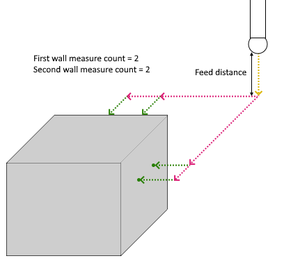
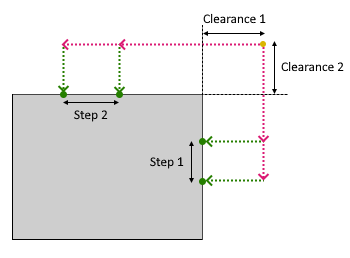

# Double wall external corner probing parameters

 

Double wall external corner probing consist of the following steps:

1. The tool moves the distance specified in the `Feed distance` and approaches the starting point of the measurement cycle that is the intersection is the intersection of first touch point of first side and first touch point of second side at a distance specified in `Clearance 1`, `Clearance 2`, respectively, along orthogonal direction of their vectors. The movement is executed at "Approach feed";
2. The tool approaches a point remote from the first touch point on first side along its `Target vector` at the `Clearance 1` distance (moving at "Long link feed" ) and approaches first touch point of the first side (moving at "Work feed") and then returns (moving at "Long link feed" ) to previous position;
3. If `First wall measure count` >1 then:
  1. The tool moves to the next touch point on the current side at a distance specified in the `Clearance 1` in the direction of its target vector;
  2. The tool approaches touch point (moving at "Work feed") and then returns (moving at "Long link feed" ) to previous position;
4. Steps 3 are repeated as many times as indicated in `First wall measure count`;
5. The tool returns to the starting point of the cycle. The movement is executed at "Long link feed";
6. The tool approaches a point remote from the first touch point on second side along its `Target vector` at the `Clearance 2` distance (moving at "Long link feed" ) approaches first touch point of the second side (moving at "Work feed") and then returns (moving at "Long link feed" ) to previous position;
7. If `Second wall measure count` >1 then:
  1. The tool moves to the next touch point on the current side at a distance specified in the `Clearance 2` in the direction of its target vector;
  2. The tool approaches touch point (moving at "Work feed") and then returns (moving at "Long link feed" ) to previous position;
8. Steps 7 are repeated as many times as indicated in `Second wall measure count`;
9. The tool returns to the starting point of the cycle. Moving at "Long link feed";
10. The tool is lifted up by a distance equal to `Feed distance`.

## Parameters

| CLDArray | Type | Description |
|---|---|---|
| CmdPrm.Int[-1] | Integer | Probing cycle type: Double wall external corner probing value = 14 |
| CmdPrm.Int[-2] | Integer | SubCode of cycle specified in " SubCode for postprocessor " property on the `Job Assignment` tab |
| CmdPrm.Flt[-50] | Double | Feed distance, distance to start position of cycle |
| CmdPrm.Flt[-56] | Double | Clearance 1, approach distance to touch points on first side |
| CmdPrm.Flt[-57] | Double | Clearance 2, approach distance to touch points on second side |
| CmdPrm.Int[-63] | Integer | First wall measure count, count of touch points on first side |
| CmdPrm.Int[-64] | Integer | Second wall measure count, count of touch points on second side |
| CmdPrm.Flt[-65] | Double | Step 1, distance between touch points on first wall |
| CmdPrm.Flt[-67] | Double | Step 2, distance between touch points on second wall |
| CmdPrm.Flt[-100] | Double | First touch point on first side value along X-axis |
| CmdPrm.Flt[-101] | Double | First touch point on first side value along Y-axis |
| CmdPrm.Flt[-102] | Double | First touch point on first side value along Z-axis |
| CmdPrm.Flt[-103] | Double | First target vector on first side value along X-axis |
| CmdPrm.Flt[-104] | Double | First target vector on first side value along Y-axis |
| CmdPrm.Flt[-105] | Double | First target vector on first side value along Z-axis |
| CmdPrm.Flt[-100-((N-1)*6)] | Double | Other touch point on first/second side value along X-axis. N - number of touch point |
| CmdPrm.Flt[-101-((N-1)*6)] | Double | Other touch point on first/second side value along Y-axis. N - number of touch point |
| CmdPrm.Flt[-102-((N-1)*6)] | Double | Other touch point on first/second side value along Z-axis. N - number of touch point |
| CmdPrm.Flt[-103-((N-1)*6)] | Double | Other target vector on first/second side value along X-axis. N - number of touch point |
| CmdPrm.Flt[-104-((N-1)*6)] | Double | Other target vector on first/second side value along Y-axis. N - number of touch point |
| CmdPrm.Flt[-105-((N-1)*6)] | Double | Other target vector on first/second side value along Z-axis. N - number of touch point |
| CmdPrm.Flt[-100-6*C] | Double | First touch point on second side value along X-axis. C - count of touch point on first side |
| CmdPrm.Flt[-101-6*C] | Double | First touch point on second side value along Y-axis. C - count of touch point on first side |
| CmdPrm.Flt[-102-6*C] | Double | First touch point on second side value along Z-axis. C - count of touch point on first side |
| CmdPrm.Flt[-103-6*C] | Double | First target vector on second side value along X-axis. C - count of touch point on first side |
| CmdPrm.Flt[-104-6*C] | Double | First target vector on second side value along Y-axis. C - count of touch point on first side |
| CmdPrm.Flt[-105-6*C] | Double | First target vector on second side value along Z-axis. C - count of touch point on first side |
| CmdPrm.Flt[-100-6*C-((N-1)*6)] | Double | Other touch point on second side value along X-axis. N - number of touch point. C - count of touch point on first side |
| CmdPrm.Flt[-101-6*C-((N-1)*6)] | Double | Other touch point on second side value along Y-axis. N - number of touch point on second side. C - count of touch point on first side |
| CmdPrm.Flt[-102-6*C-((N-1)*6)] | Double | Other touch point on second side value along Z-axis. N - number of touch point on second side. C - count of touch point on first side |
| CmdPrm.Flt[-103-6*C-((N-1)*6)] | Double | Other target vector on second side value along X-axis. N - number of touch point on second side. C - count of touch point on first side |
| CmdPrm.Flt[-104-6*C-((N-1)*6)] | Double | Other target vector on second side value along Y-axis. N - number of touch point on second side. C - count of touch point on first side |
| CmdPrm.Flt[-105-6*C-((N-1)*6)] | Double | Other target vector on second side value along Z-axis. N - number of touch point on second side. C - count of touch point on first side |
| CmdPrm.Flt[-200] | Double | Original first touch point on first side value along X-axis |
| CmdPrm.Flt[-201] | Double | Original first touch point on first side value along Y-axis |
| CmdPrm.Flt[-202] | Double | Original first touch point on first side value along Z-axis |
| CmdPrm.Flt[-203] | Double | Original first target vector on first side value along X-axis |
| CmdPrm.Flt[-204] | Double | Original first target vector on first side value along Y-axis |
| CmdPrm.Flt[-205] | Double | Original first target vector on first side value along Z-axis |
| CmdPrm.Flt[-200-((N-1)*6)] | Double | Other touch point on first/second side value from original point along X-axis. N - number of touch point |
| CmdPrm.Flt[-201-((N-1)*6)] | Double | Other touch point on first/second side value from original point along Y-axis. N - number of touch point |
| CmdPrm.Flt[-202-((N-1)*6)] | Double | Other touch point on first/second side value from original point along Z-axis. N - number of touch point |
| CmdPrm.Flt[-203-((N-1)*6)] | Double | Other target vector on first/second side value from original vector along X-axis. N - number of touch point |
| CmdPrm.Flt[-204-((N-1)*6)] | Double | Other target vector on first/second side value from original vector along Y-axis. N - number of touch point |
| CmdPrm.Flt[-205-((N-1)*6)] | Double | Other target vector on first/second side value from original vector along Z-axis. N - number of touch point |
| CmdPrm.Flt[-200-6*C] | Double | First touch point on second side value along X-axis specified in the Job Assignment. C - count of touch point on first side |
| CmdPrm.Flt[-201-6*C] | Double | First touch point on second side value along Y-axis specified in the Job Assignment. C - count of touch point on first side |
| CmdPrm.Flt[-202-6*C] | Double | First touch point on second side value along Z-axis specified in the Job Assignment. C - count of touch point on first side |
| CmdPrm.Flt[-203-6*C] | Double | First target vector on second side value along X-axis specified in the Job Assignment. C - count of touch point on first side |
| CmdPrm.Flt[-204-6*C] | Double | First target vector on second side value along Y-axis specified in the Job Assignment. C - count of touch point on first side |
| CmdPrm.Flt[-205-6*C] | Double | First target vector on second side value along Z-axis specified in the Job Assignment. C - count of touch point on first side |
| CmdPrm.Flt[-200-6*C-((N-1)*6)] | Double | Other touch point on second side value from original point along X-axis. N - number of touch point. C - count of touch point on first side |
| CmdPrm.Flt[-201-6*C-((N-1)*6)] | Double | Other touch point on second side value from original point along Y-axis. N - number of touch point on second side. C - count of touch point on first side |
| CmdPrm.Flt[-202-6*C-((N-1)*6)] | Double | Other touch point on second side value from original point along Z-axis. N - number of touch point on second side. C - count of touch point on first side |
| CmdPrm.Flt[-203-6*C-((N-1)*6)] | Double | Other target vector on second side value from original vector along X-axis. N - number of touch point on second side. C - count of touch point on first side |
| CmdPrm.Flt[-204-6*C-((N-1)*6)] | Double | Other target vector on second side value from original vector along Y-axis. N - number of touch point on second side. C - count of touch point on first side |
| CmdPrm.Flt[-205-6*C-((N-1)*6)] | Double | Other target vector on second side value from original vector along Z-axis. N - number of touch point on second side. C - count of touch point on first side |
| CmdPrm.Flt[-66] | Integer | Compensate dimensions, retrurn values: 0 - Off, 1 - On |

## See also
- [Probing cycle (WProbing)](wprobing.md)
- [Extended cycle (EXTCYCLE)](../extcycle.md)
- [CLData access model](../../../cldata.md)
