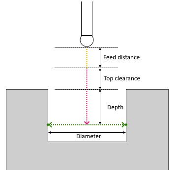

# Hole probing parameters

Hole probing consist of the following steps:

1. If the `Top clearance` parameter is checked:
  1. The tool moves to the distance specified in the `Feed distance` and approaches the starting point of the `Top clearance` position. The movement is executed at "Approach feed";
  2. The tool moves to the distance specified in the `Top clearance` plus `Depth` value and approaches the center of hole (starting point of cycle). The movement is executed at "Long link feed";
2. If the `Top clearance` parameter is unchecked:
  1. The tool moves to the distance specified in the `Feed distance` and approaches the center of hole (starting point of cycle) according to depth. The movement is executed at "Approach feed";
3. The tool approaches the first touch point (moving at "Work feed" ) along its inverted `Target vector` and then returns (moving at "Long link feed" ) to the center point. This action is repeated as many times as there are touch points;
4. If the `Top clearance` parameter is checked: the tool moves up a distance equal to the `Top clearance` value + `Depth` value. Moving at "Long link feed";
5. The tool retracts a distance to the `Feed distance` position. Moving at "Return feed".

## Parameters

| CLDArray | Type | Description |
|---|---|---|
| CmdPrm.Int[-1] | Integer | Probing cycle type: Hole probing value = 3 |
| CmdPrm.Int[-2] | Integer | SubCode of cycle specified in " SubCode for postprocessor " property on the `Job Assignment` tab |
| CmdPrm.Flt[-50] | Double | Feed distance, distance to start position of cycle |
| CmdPrm.Flt[-51] | Double | Depth, distance from top side to center of touch points |
| CmdPrm.Flt[-52] | Double | Diameter of measured hole |
| CmdPrm.Flt[-55] | Double | Top clearance, distance from top side |
| CmdPrm.Int[-59] | Integer | Cycle variant. 0 - rectangular mode, 1 - angular mode |
| CmdPrm.Flt[-60] | Double | Start angle (for cycle variant = 1). Starting angle of touch points |
| CmdPrm.Flt[-61] | Double | Angular step (for cycle variant = 1). R adial distance between touch points |
| CmdPrm.Int[-62] | Integer | Step count (for cycle variant = 1). Count of touch points |
| CmdPrm.Flt[-100] | Double | First touch point value along X-axis |
| CmdPrm.Flt[-101] | Double | First touch point value along Y-axis |
| CmdPrm.Flt[-102] | Double | First touch point value along Z-axis |
| CmdPrm.Flt[-103] | Double | First target vector value along X-axis |
| CmdPrm.Flt[-104] | Double | First target vector value along Y-axis |
| CmdPrm.Flt[-105] | Double | First target vector value along Z-axis |
| CmdPrm.Flt[-100-((N-1)*6)] | Double | Other touch point value along X-axis. N - number of touch point |
| CmdPrm.Flt[-101-((N-1)*6)] | Double | Other touch point value along Y-axis. N - number of touch point |
| CmdPrm.Flt[-102-((N-1)*6)] | Double | Other touch point value along Z-axis. N - number of touch point |
| CmdPrm.Flt[-103-((N-1)*6)] | Double | Other target vector value along X-axis. N - number of touch point |
| CmdPrm.Flt[-104-((N-1)*6)] | Double | Other target vector value along Y-axis. N - number of touch point |
| CmdPrm.Flt[-105-((N-1)*6)] | Double | Other target vector value along Z-axis. N - number of touch point |
| CmdPrm.Flt[-200] | Double | Original first touch point value along X-axis specified in the**Job Assignment** |
| CmdPrm.Flt[-201] | Double | Original first touch point value along Y-axis specified in the **Job Assignment** |
| CmdPrm.Flt[-202] | Double | Original first touch point value along Z-axis specified in the**Job Assignment** |
| CmdPrm.Flt[-203] | Double | Original first target vector value along X-axis specified in the **Job Assignment** |
| CmdPrm.Flt[-204] | Double | Original first target vector value along Y-axis specified in the **Job Assignment** |
| CmdPrm.Flt[-205] | Double | Original first target vector value along Z-axis specified in the **Job Assignment** |
| CmdPrm.Flt[-200-((N-1)*6)] | Double | Other touch point value from original point along X-axis. N - number of touch point |
| CmdPrm.Flt[-201-((N-1)*6)] | Double | Other touch point value from original point along Y-axis. N - number of touch point |
| CmdPrm.Flt[-202-((N-1)*6)] | Double | Other touch point value from original point along Z-axis. N - number of touch point |
| CmdPrm.Flt[-203-((N-1)*6)] | Double | Other target vector value from original vector along X-axis. N - number of touch point |
| CmdPrm.Flt[-204-((N-1)*6)] | Double | Other target vector value from original vector along Y-axis. N - number of touch point |
| CmdPrm.Flt[-205-((N-1)*6)] | Double | Other target vector value from original vector along Z-axis. N - number of touch point |

## See also
- [Probing cycle (WProbing)](wprobing.md)
- [Extended cycle (EXTCYCLE)](../extcycle.md)
- [CLData access model](../../../cldata.md)
