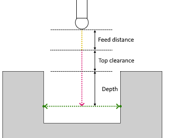
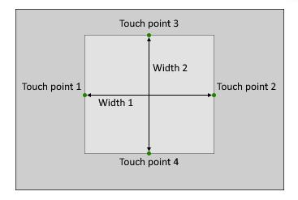

# Internal rectangle probing parameters

 

Internal rectangle probing consist of the following steps:

1. If the `Top clearance` parameter is checked:
  1. The tool moves to the distance specified in the `Feed distance` and approaches the starting point of the `Top clearance` position. The movement is executed at "Approach feed";
  2. The tool moves to the distance specified in the `Top clearance` plus `Depth` value and approaches the center of sides (starting point of cycle). The movement is executed at "Long link feed";
2. If the `Top clearance` parameter is unchecked:
  1. The tool moves to the distance specified in the `Feed distance` and approaches the center of sides (starting point of cycle) according to depth. Moving at "Approach feed";
3. The tool approaches the first touch point (moving at "Work feed" ) along its inverted `Target vector` and then returns (moving at "Long link feed" ) to the center point. This action is repeated 3 times for each touch points;
4. If the `Top clearance` parameter is checked: the tool moves up a distance equal to the `Top clearance` value + `Depth` value. Moving at "Long link feed";
5. The tool retracts a distance to the `Feed distance` position. Moving at "Return feed".

## Parameters

| CLDArray | Type | Description |
|---|---|---|
| CmdPrm.Int[-1] | Integer | Probing cycle type: Internal rectangle probing value = 6 |
| CmdPrm.Int[-2] | Integer | SubCode of cycle specified in " SubCode for postprocessor " property on the `Job Assignment` tab |
| CmdPrm.Flt[-50] | Double | Feed distance, distance to start position of cycle |
| CmdPrm.Flt[-51] | Double | Depth, distance from top side to center of touch points |
| CmdPrm.Flt[-53] | Double | Width 1, distance from Touch point 1 to Touch point 2 |
| CmdPrm.Flt[-54] | Double | Width 2, distance from Touch point 3 to Touch point 4 |
| CmdPrm.Flt[-55] | Double | Top clearance, distance from top side |
| CmdPrm.Flt[-100] | Double | First touch point value along X-axis |
| CmdPrm.Flt[-101] | Double | First touch point value along Y-axis |
| CmdPrm.Flt[-102] | Double | First touch point value along Z-axis |
| CmdPrm.Flt[-103] | Double | First target vector value along X-axis |
| CmdPrm.Flt[-104] | Double | First target vector value along Y-axis |
| CmdPrm.Flt[-105] | Double | First target vector value along Z-axis |
| CmdPrm.Flt[-106] | Double | Second touch point value along X-axis |
| CmdPrm.Flt[-107] | Double | Second touch point value along Y-axis |
| CmdPrm.Flt[-108] | Double | Second touch point value along Z-axis |
| CmdPrm.Flt[-109] | Double | Second target vector value along X-axis |
| CmdPrm.Flt[-110] | Double | Second target vector value along Y-axis |
| CmdPrm.Flt[-111] | Double | Second target vector value along Z-axis |
| CmdPrm.Flt[-112] | Double | Third touch point value along X-axis |
| CmdPrm.Flt[-113] | Double | Third touch point value along Y-axis |
| CmdPrm.Flt[-114] | Double | Third touch point value along Z-axis |
| CmdPrm.Flt[-115] | Double | Third target vector value along X-axis |
| CmdPrm.Flt[-116] | Double | Third target vector value along Y-axis |
| CmdPrm.Flt[-117] | Double | Third target vector value along Z-axis |
| CmdPrm.Flt[-118] | Double | Fourth touch point value along X-axis |
| CmdPrm.Flt[-119] | Double | Fourth touch point value along Y-axis |
| CmdPrm.Flt[-120] | Double | Fourth touch point value along Z-axis |
| CmdPrm.Flt[-121] | Double | Fourth target vector value along X-axis |
| CmdPrm.Flt[-122] | Double | Fourth target vector value along Y-axis |
| CmdPrm.Flt[-123] | Double | Fourth target vector value along Z-axis |
| CmdPrm.Flt[-200] | Double | First original touch point value along X-axis specified in the **Job Assignment** |
| CmdPrm.Flt[-201] | Double | First original touch point value along Y-axis specified in the **Job Assignment** |
| CmdPrm.Flt[-202] | Double | First original touch point value along Z-axis specified in the **Job Assignment** |
| CmdPrm.Flt[-203] | Double | First original target vector value along X-axis specified in the **Job Assignment** |
| CmdPrm.Flt[-204] | Double | First original target vector value along Y-axis specified in the **Job Assignment** |
| CmdPrm.Flt[-205] | Double | First original target vector value along Z-axis specified in the **Job Assignment** |
| CmdPrm.Flt[-206] | Double | Second original touch point value along X-axis specified in the **Job Assignment** |
| CmdPrm.Flt[-207] | Double | Second original touch point value along Y-axis specified in the **Job Assignment** |
| CmdPrm.Flt[-208] | Double | Second original touch point value along Z-axis specified in the **Job Assignment** |
| CmdPrm.Flt[-209] | Double | Second original target vector value along X-axis specified in the **Job Assignment** |
| CmdPrm.Flt[-210] | Double | Second original target vector value along Y-axis specified in the **Job Assignment** |
| CmdPrm.Flt[-211] | Double | Second original target vector value along Z-axis specified in the **Job Assignment** |
| CmdPrm.Flt[-212] | Double | Third original touch point value along X-axis specified in the **Job Assignment** |
| CmdPrm.Flt[-213] | Double | Third original touch point value along Y-axis specified in the **Job Assignment** |
| CmdPrm.Flt[-214] | Double | Third original touch point value along Z-axis specified in the **Job Assignment** |
| CmdPrm.Flt[-215] | Double | Third original target vector value along X-axis specified in the **Job Assignment** |
| CmdPrm.Flt[-216] | Double | Third original target vector value along Y-axis specified in the **Job Assignment** |
| CmdPrm.Flt[-217] | Double | Third original target vector value along Z-axis specified in the **Job Assignment** |
| CmdPrm.Flt[-218] | Double | Fourth original touch point value along X-axis specified in the **Job Assignment** |
| CmdPrm.Flt[-219] | Double | Fourth original touch point value along Y-axis specified in the **Job Assignment** |
| CmdPrm.Flt[-220] | Double | Fourth original touch point value along Z-axis specified in the **Job Assignment** |
| CmdPrm.Flt[-221] | Double | Fourth original target vector value along X-axis specified in the **Job Assignment** |
| CmdPrm.Flt[-222] | Double | Fourth original target vector value along Y-axis specified in the **Job Assignment** |
| CmdPrm.Flt[-223] | Double | Fourth original target vector value along Z-axis specified in the **Job Assignment** |

## See also
- [Probing cycle (WProbing)](wprobing.md)
- [Extended cycle (EXTCYCLE)](../extcycle.md)
- [CLData access model](../../../cldata.md)
