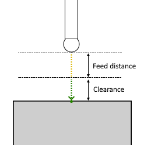

# Surface probing parameters

Surface probing consist of the following steps:

1. The tool moves to the distance specified in the `Feed distance` and approaches the starting point of the measurement cycle. The movement is executed at "Approach feed";
2. The tool moves to the distance specified in the `Clearance` and approaches touch point of the surface. The movement is executed at "Work feed";
3. The tool returns to starting point for a distance specified in the `Clearance`. The movement is executed at "Retract feed";
4. The tool returns for a distance specified in the `Feed distance`. The movement is executed at "Return feed".

## Parameters

| CLDArray | Type | Description |
|---|---|---|
| CmdPrm.Int[-1] | Integer | Probing cycle type: Surface probing value = 2 |
| CmdPrm.Int[-2] | Integer | SubCode of cycle specified in "SubCode for postprocessor" property on the `Job Assignment` tab |
| CmdPrm.Flt[-50] | Double | Feed distance, distance to start position of cycle |
| CmdPrm.Flt[-100] | Double | Touch point value along X-axis |
| CmdPrm.Flt[-101] | Double | T ouch point value along Y-axis |
| CmdPrm.Flt[-102] | Double | T ouch point value along Z-axis |
| CmdPrm.Flt[-103] | Double | Target vector value along X-axis |
| CmdPrm.Flt[-104] | Double | Target vector value along Y-axis |
| CmdPrm.Flt[-105] | Double | Target vector value along Z-axis |
| CmdPrm.Flt[-200] | Double | Original touch point value along X-axis specified in the **Job Assignment** |
| CmdPrm.Flt[-201] | Double | Original touch point value along Y-axis specified in the **Job Assignment** |
| CmdPrm.Flt[-202] | Double | Original touch point value along Z-axis specified in the **Job Assignment** |
| CmdPrm.Flt[-203] | Double | Original target vector value along X-axis specified in the **Job Assignment** |
| CmdPrm.Flt[-204] | Double | Original target vector value along Y-axis specified in the **Job Assignment** |
| CmdPrm.Flt[-205] | Double | Original target vector value along Z-axis specified in the **Job Assignment** |
| CmdPrm.Flt[-56] | Double | Clearance, approach distance to touch point |
| CmdPrm.Flt[-66] | Integer | Compensate dimensions, retrurn values: 0 - Off, 1 - On |

## See also
- [Probing cycle (WProbing)](wprobing.md)
- [Extended cycle (EXTCYCLE)](../extcycle.md)
- [CLData access model](../../../cldata.md)
