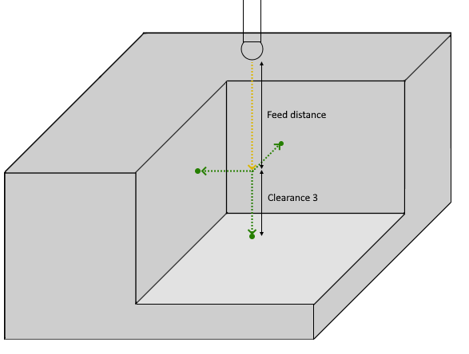
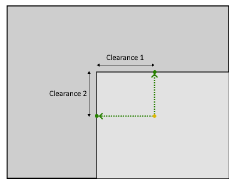

# Triple wall internal corner probing parameters

** **

Triple wall internal corner probing consist of the following steps:

1. The tool moves the distance specified in the `Feed distance` and approaches the starting point of the measurement cycle that is the intersection of three touch points at a distance specified in `Clearance 1`, `Clearance 2`, `Clearance 3`, respectively, along their vectors. Moving at "Approach feed";
2. The tool approaches touch point of the first side (moving at "Work feed") and then returns (moving at "Long link feed" ) to previous position;
3. The tool approaches touch point of the second side (moving at "Work feed") and then returns (moving at "Long link feed" ) to previous position;
4. The tool approaches touch point of the third side (moving at "Work feed") and then returns (moving at "Long link feed" ) to previous position;
5. The tool is lifted up by a distance equal to `Feed distance`.

## Parameters

| CLDArray | Type | Description |
|---|---|---|
| CmdPrm.Int[-1] | Integer | Probing cycle type: Triple wall internal corner probing value = 15 |
| CmdPrm.Int[-2] | Integer | SubCode of cycle specified in " SubCode for postprocessor " property on the `Job Assignment` tab |
| CmdPrm.Flt[-50] | Double | Feed distance, distance to start position of cycle |
| CmdPrm.Flt[-56] | Double | Clearance 1, approach distance to touch point on first side |
| CmdPrm.Flt[-57] | Double | Clearance 2, approach distance to touch point on second side |
| CmdPrm.Flt[-58] | Double | Clearance 3, approach distance to touch point on third side |
| CmdPrm.Flt[-100] | Double | Touch point on first wall value along X-axis |
| CmdPrm.Flt[-101] | Double | T ouch point on first wall value along Y-axis |
| CmdPrm.Flt[-102] | Double | T ouch point on first wall value along Z-axis |
| CmdPrm.Flt[-103] | Double | T arget vector of touch point on first wall value along X-axis |
| CmdPrm.Flt[-104] | Double | T arget vector of touch point on first wall value along Y-axis |
| CmdPrm.Flt[-105] | Double | T arget vector of touch point on first wall value along Z-axis |
| CmdPrm.Flt[-106] | Double | T ouch point on second wall value along X-axis |
| CmdPrm.Flt[-107] | Double | T ouch point on second wall value along Y-axis |
| CmdPrm.Flt[-108] | Double | T ouch point on second wall value along Z-axis |
| CmdPrm.Flt[-109] | Double | T arget vector of touch point on second wall value along X-axis |
| CmdPrm.Flt[-110] | Double | T arget vector of touch point on second wall value along Y-axis |
| CmdPrm.Flt[-111] | Double | T arget vector of touch point on second wall value along Z-axis |
| CmdPrm.Flt[-112] | Double | T ouch point on third wall value along X-axis |
| CmdPrm.Flt[-113] | Double | T ouch point on third wall value along Y-axis |
| CmdPrm.Flt[-114] | Double | T ouch point on third wall value along Z-axis |
| CmdPrm.Flt[-115] | Double | T arget vector of touch point on third wall value along X-axis |
| CmdPrm.Flt[-116] | Double | T arget vector of touch point on third wall value along Y-axis |
| CmdPrm.Flt[-117] | Double | T arget vector of touch point on third wall value along Z-axis |
| CmdPrm.Flt[-200] | Double | Original touch point on first wall value along X-axis specified in the Job Assignment |
| CmdPrm.Flt[-201] | Double | Original touch point on first wall value along Y-axis specified in the Job Assignment |
| CmdPrm.Flt[-202] | Double | Original touch point on first wall value along Z-axis specified in the Job Assignment |
| CmdPrm.Flt[-203] | Double | Original target vector of touch point on first wall value along X-axis specified in the Job Assignment |
| CmdPrm.Flt[-204] | Double | Original target vector of touch point on first wall value along Y-axis specified in the Job Assignment |
| CmdPrm.Flt[-205] | Double | Original target vector of touch point on first wall value along Z-axis specified in the Job Assignment |
| CmdPrm.Flt[-206] | Double | Original touch point on second wall value along X-axis specified in the Job Assignment |
| CmdPrm.Flt[-207] | Double | Original touch point on second wall value along Y-axis specified in the Job Assignment |
| CmdPrm.Flt[-208] | Double | Original touch point on second wall value along Z-axis specified in the Job Assignment |
| CmdPrm.Flt[-209] | Double | Original target vector of touch point on second wall value along X-axis specified in the Job Assignment |
| CmdPrm.Flt[-210] | Double | Original target vector of touch point on second wall value along Y-axis specified in the Job Assignment |
| CmdPrm.Flt[-211] | Double | Original target vector of touch point on second wall value along Z-axis specified in the Job Assignment |
| CmdPrm.Flt[-212] | Double | Original touch point on third wall value along X-axis specified in the Job Assignment |
| CmdPrm.Flt[-213] | Double | Original touch point on third wall value along Y-axis specified in the Job Assignment |
| CmdPrm.Flt[-214] | Double | Original touch point on third wall value along Z-axis specified in the Job Assignment |
| CmdPrm.Flt[-215] | Double | Original target vector of touch point on third wall value along X-axis specified in the Job Assignment |
| CmdPrm.Flt[-216] | Double | Original target vector of touch point on third wall value along Y-axis specified in the Job Assignment |
| CmdPrm.Flt[-217] | Double | Original target vector of touch point on third wall value along Z-axis specified in the Job Assignment |

## See also
- [Probing cycle (WProbing)](wprobing.md)
- [Extended cycle (EXTCYCLE)](../extcycle.md)
- [CLData access model](../../../cldata.md)
