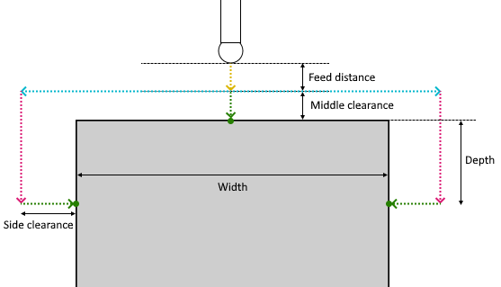

# Web probing (three points) parameters

Web probing (three points) consist of the following steps:

1. The tool moves the distance specified in the `Feed distance` and approaches the starting position of the cycle. Moving at "Approach feed";
2. The tool approaches a point remote from the left touch point along its `Target vector` at the `Side clearance` distance but elevated at the `Top clearance` value + `Depth` value. Moving at "Long link feed";
3. The tool is lowered by a distance equal to `Top clearance` value + `Depth` value. Moving at "Long link feed";
4. The tool approaches the left touch point (moving at "Work feed" ) and then returns (moving at "Long link feed" ) to previous position;
5. The tool is lifted up by a distance equal to `Top clearance` value + `Depth` value. Moving at "Long link feed";
6. The tool returns to the starting position;
7. Steps 2-6 are repeated for the right touch point;
8. The tool approaches the middle touch point (moving at "Work feed" ) and then returns (moving at "Long link feed" ) to previous position;
9. The tool is lifted up by a distance equal to `Feed distance`.

## Parameters

| CLDArray | Type | Description |
|---|---|---|
| CmdPrm.Int[-1] | Integer | Probing cycle type: Web probing (three points) value = 10 |
| CmdPrm.Int[-2] | Integer | SubCode of cycle specified in " SubCode for postprocessor " property on the `Job Assignment` tab |
| CmdPrm.Flt[-50] | Double | Feed distance, distance to start position of cycle |
| CmdPrm.Flt[-51] | Double | Depth, distance from middle side to center of left and right point |
| CmdPrm.Flt[-53] | Double | Width, distance from left point to right point |
| CmdPrm.Flt[-56] | Double | Side clearance, approach distance to right/left touch point |
| CmdPrm.Flt[-57] | Double | Middle clearance, approach distance to middle touch point |
| CmdPrm.Flt[-100] | Double | Left touch point value along X-axis |
| CmdPrm.Flt[-101] | Double | Left touch point value along Y-axis |
| CmdPrm.Flt[-102] | Double | Left touch point value along Z-axis |
| CmdPrm.Flt[-103] | Double | Left target vector value along X-axis |
| CmdPrm.Flt[-104] | Double | Left target vector value along Y-axis |
| CmdPrm.Flt[-105] | Double | Left target vector value along Z-axis |
| CmdPrm.Flt[-106] | Double | Right touch point value along X-axis |
| CmdPrm.Flt[-107] | Double | Right touch point value along Y-axis |
| CmdPrm.Flt[-108] | Double | Right touch point value along Z-axis |
| CmdPrm.Flt[-109] | Double | Right target vector value along X-axis |
| CmdPrm.Flt[-110] | Double | Right target vector value along Y-axis |
| CmdPrm.Flt[-111] | Double | Right target vector value along Z-axis |
| CmdPrm.Flt[-112] | Double | Middle touch point value along X-axis |
| CmdPrm.Flt[-113] | Double | Middle touch point value along Y-axis |
| CmdPrm.Flt[-114] | Double | Middle touch point value along Z-axis |
| CmdPrm.Flt[-115] | Double | Middle target vector value along X-axis |
| CmdPrm.Flt[-116] | Double | Middle target vector value along Y-axis |
| CmdPrm.Flt[-117] | Double | Middle target vector value along Z-axis |
| CmdPrm.Flt[-200] | Double | Left original touch point value along X-axis specified in the Job Assignment |
| CmdPrm.Flt[-201] | Double | Left original touch point value along Y-axis specified in the Job Assignment |
| CmdPrm.Flt[-202] | Double | Left original touch point value along Z-axis specified in the Job Assignment |
| CmdPrm.Flt[-203] | Double | Left original target vector value along X-axis specified in the Job Assignment |
| CmdPrm.Flt[-204] | Double | Left original target vector value along Y-axis specified in the Job Assignment |
| CmdPrm.Flt[-205] | Double | Left original target vector value along Z-axis specified in the Job Assignment |
| CmdPrm.Flt[-206] | Double | Right original touch point value along X-axis specified in the Job Assignment |
| CmdPrm.Flt[-207] | Double | Right original touch point value along Y-axis specified in the Job Assignment |
| CmdPrm.Flt[-208] | Double | Right original touch point value along Z-axis specified in the Job Assignment |
| CmdPrm.Flt[-209] | Double | Right original target vector value along X-axis specified in the Job Assignment |
| CmdPrm.Flt[-210] | Double | Right original target vector value along Y-axis specified in the Job Assignment |
| CmdPrm.Flt[-211] | Double | Right original target vector value along Z-axis specified in the Job Assignment |
| CmdPrm.Flt[-212] | Double | Middle original touch point value along X-axis specified in the Job Assignment |
| CmdPrm.Flt[-213] | Double | Middle original touch point value along Y-axis specified in the Job Assignment |
| CmdPrm.Flt[-214] | Double | Middle original touch point value along Z-axis specified in the Job Assignment |
| CmdPrm.Flt[-215] | Double | Middle original target vector value along X-axis specified in the Job Assignment |
| CmdPrm.Flt[-216] | Double | Middle original target vector value along Y-axis specified in the Job Assignment |
| CmdPrm.Flt[-217] | Double | Middle original target vector value along Z-axis specified in the Job Assignment |
| CmdPrm.Flt[-66] | Integer | Compensate dimensions, retrurn values: 0 - Off, 1 - On |

## See also
- [Probing cycle (WProbing)](wprobing.md)
- [Extended cycle (EXTCYCLE)](../extcycle.md)
- [CLData access model](../../../cldata.md)
