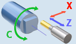
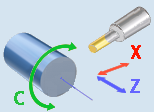
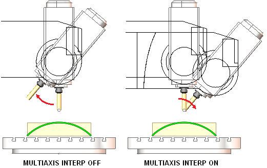

# INTERPOLATION - Interpolation mode

## Command caption

How the command appears in the CLData command list:

```text
INTERPOLATION ON(71) | OFF(72), CARTESIAN(9020) | POLAR(9021) |
CYLINDRICAL(9022) | MULTIAXIS(9023), P1 p1, P2 p2, P3 p3
```

**INTERPOLATION** command activates or deactivates interpolation modes like cylindrical or polar interpolation.

Interpolation mode specified by the `CLD[2]` (`CLD.Mode`) parameter is activated if `CLD[1]` (`CLD.SubCmd`) parameter is `ON(71)`, otherwise the specified interpolation is deactivated.

Parameters `CLD[3]` (`CLD.P1`), `CLD[4]` (`CLD.P2`), `CLD[5]` (`CLD.P3`) specify additional parameters of interpolation modes.

## Access from sppx

Handler: `program Interpolation`

| Parameter | CLD array | CLD name | Description |
|---|---|---|---|
| ON(71)<br>OFF(72) | CLD[1] | CLD.SubCmd | ON(71) – activate, OFF(72) – deactivate. |
| CARTESIAN(9020)<br>POLAR(9021)<br>CYLINDRICAL(9022)<br>MULTIAXIS(9023) | CLD[2] | CLD.Mode | CARTESIAN(9020) – cartesian interpolation; POLAR(9021) – polar interpolation; CYLINDRICAL(9022) – cylindrical interpolation; MULTIAXIS(9023) – multiaxis interpolation |
| P1 | CLD[3] | CLD.P1 | Specifies cylinder radius for the cylindrical interpolation mode |
| P2 | CLD[4] | CLD.P2 | Reserved |
| P3 | CLD[5] | CLD.P3 | Reserved |

The **Polar interpolation** mode is usually used on turn-milling machines without the Y axis in order to machine parts from the side. In this mode the tool movement in Y direction is replaced by the simultaneous rotation of the workpiece around the rotary axis (C) and the tool movement along the radial axis (X). Depending on the control used the Y coordinate in the NC code may be replaced with the C coordinate.



The **Cylindrical interpolation** mode is used to machine cylindrical pockets on cylindrical parts. The NC code contains a 2d contour of a pocket in the XY coordinates where the X coordinate is the coordinate along the cylinder axis, while the Y coordinate is equal to the Cylinder Radius multiplied by the rotation Angle of the workpiece around the rotary axis. Depending on the control used the Y coordinate in the NC code may be replaced with the C coordinate.



The **MULTIAXIS interpolation** mode is used for simultaneous five axis milling. In this mode the XYZ coordinates of a NC block are the coordinates of the tool center point relative to the workpiece coordinate system rotating together with the rotary table. Opposed to the standard Cartesian interpolation mode in the MULTIAXIS interpolation mode if a NC block consists only of the commands positioning rotary axes, the position of the tool tip to the workpiece remains the same. It means the tool is rotated around the tool center (see the figure below).



If you program a tilting table movement while multiaxis interpolation is active, the control rotates the coordinate system accordingly. If, for example, you rotate the C axis by 90° (through a positioning command or datum shift) and then program a movement in the X axis, the control executes the movement in the machine axis Y.

Different controls use different commands for enabling and disabling the Multiaxis interpolation mode. In Heidenhain the mode is known as the Tool center point management controlled by the TCPM, M128 and M129 functions. In Sinumeric the mode is turned on/off by the TRAORI and TRAFOOF commands.

Example (from the Fanuc (30i)_Mill postprocessor):

```pascal
program Interpolation
  case cld[2] of
    9023: begin ! 5-axis
      if CLD.SubCmd=71 then begin ! On
        NeedKorDl = 43.4
        IsMultiaxisInterpolation = 1
      end else begin              ! Off
        KorDl = 49;! KorDl@ = MaxReal
        IsMultiaxisInterpolation = 0
      end
      OutBlock
    end
    9021: begin ! POLAR
      OutBlock
      if CLD.SubCmd=71 then begin ! On
        GInterpRot = 12.1
        YAddress = "A"
        IsRotaryInterpolation = 1
      end else begin              ! Off
        GInterpRot = 13.1
        YAddress = "Y"
        IsRotaryInterpolation = 0
      end
      GInterpRot@ = MaxReal
      OutBlock
    end
    9022: begin ! CYLINDRICAL
      OutBlock
      if CLD.SubCmd=71 then begin ! On
        GInterpRot = 07.1
        A = CLD.P1; A@ = MaxReal
        YAddress = "A"
        IsRotaryInterpolation = 2
        CylR = CLD.P1
        CirclesThroughRadius = 1
      end else begin              ! Off
        GInterpRot = 07.1
        A = 0; A@ = MaxReal
        YAddress = "Y"
        IsRotaryInterpolation = 0
        CirclesThroughRadius = 0
      end
      GInterpRot@ = MaxReal
      OutBlock
    end
  end
end
```

## Access from .NET

Handlers:

```csharp
public override void OnInterpolation(ICLDInterpolationCommand cmd, CLDArray cld)
public override void OnInterpPolar(ICLDInterpolationCommand cmd, CLDArray cld)   // POLAR(9021)
public override void OnInterpCylindrical(ICLDInterpolationCommand cmd, CLDArray cld)   // CYLINDRICAL(9022)
public override void OnInterp5x(ICLDInterpolationCommand cmd, CLDArray cld)   // MULTIAXIS(9023)
```

Inheritance: `ICLDInterpolationCommand : ICLDCommand`.

Read the parameters from the strongly-typed `cmd` object (**recommended**); the raw `cld[i]` array (same indices as in sppx) and the named `cmd["..."]` helpers are available too. The table lists the command's members, including those inherited from its base interfaces; the common `ICLDCommand` members (navigation, `CLD`, `CLDFile`, `TechOperation`, ...) are described in the [CLData access model](../cldata.md).

| Member | Type | Description |
|---|---|---|
| `cmd.IsOn` | `bool` | Returns "True" if it's interpolation switch ON command, otherwise it returns "False". |
| `cmd.IsOff` | `bool` | Returns "True" if it's interpolation switch OFF command, otherwise it returns "False". |
| `cmd.InterpMode` | `CLDInterpMode` | Defines the type of an interpolation (polar-G112, cylindrical-G107 or continuous multiaxis-G43.4, TCPM, TRAORI). |
| `cmd.InterpType` | `int` | Numerical code to specify the type of an interpolation (polar, cylindrical or continuous multiaxis). |
| `cmd.CylRadius` | `double` | Specifies the cylinder radius for the cylindrical interpolation mode. |

Example - `OnInterpolation` (from the Sinumerik (840D)_Mill_DN postprocessor):

```csharp
public override void OnInterpolation(ICLDInterpolationCommand cmd, CLDArray cld)
{
    if (cmd.InterpType == 9023){// MULTIAXIS interpolation
        if (cmd.IsOn){ // Switch on
            nc.Block.Out();
            nc.WriteLineWithBlockN($"TRAORI"); 
            nc.CoordSys.v0 = double.MaxValue; nc.Block.Out();
            nc.WriteLineWithBlockN($"ORIWKS");
            nc.WriteLineWithBlockN($"ORIAXES");
        }else{          // Switch off
            nc.Block.Out();
            nc.WriteLineWithBlockN($"TRAFOOF");
        }
    }else if (cmd.InterpType == 9021) {// Polar interpolation
        if (cmd.IsOn) { // Switch on
            nc.Block.Out();
            nc.WriteLine("TRANSMIT");
            Cycle.SetPolarInterpolationStatus(true);
            csC = Cos(nc.A.v);
            snC = -Sin(nc.A.v);
        }else {          // Switch off
            nc.Block.Out();
            nc.WriteLine("TRANSMIT");
            Cycle.SetPolarInterpolationStatus(true);
            nc.A.RestoreDefaultValue(false);
        }
    }else if (cmd.InterpType == 9022) {// Cylindrical interpolation
        if (cmd.IsOn) { // Switch on
            nc.Block.Out();
            nc.WriteLine("TRACYL(" + Str(2*cld[3]) + ")");
            Cycle.SetCilindInterpolationStatus(true);
        }else{             // Switch off
            nc.Block.Out();
            nc.WriteLine("TRAFOOF");
            //Output "TMCOFF"
            Cycle.SetCilindInterpolationStatus(false);
            nc.A.RestoreDefaultValue(false);
        }
    }
}
```

## See also
- [CLData access model](../cldata.md)
