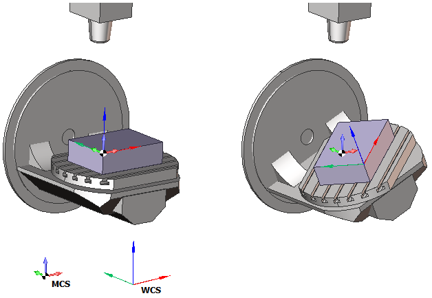
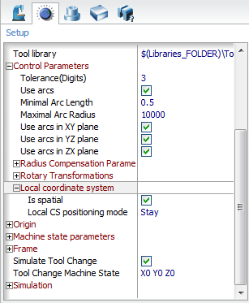

# ORIGIN - Original coordinates

## Command caption

How the command appears in the CLData command list:

```text
ORIGIN X x, Y y, Z z, PPFUN f, N n, A a, B b, C c
```

The **ORIGIN** command specifies the coordinate system of the subsequent NC code.

Actually there are two modes of the Origin command.

In the first mode the Origin command is used to activate one of the predefined workpiece coordinate systems (G54-G59). The mode is indicated by the `CLD[4]` (`CLD.PPFun`) parameter set to zero. The number of the coordinate system being activated is specified in the `CLD[5]` (`CLD.N`) parameter.

In the second mode the Origin command is used to define a transformation of the workpiece coordinate system (Sinumeric TRANS, ROT, Heidenhain CYCLE7, CYCLE19, PLANE SPATIAL|AXIAL, Fanuc G52, G68 etc). The mode is indicated by the `CLD[4]` (`CLD.PPFun`) parameter set to `PPFun(1079)`. The transformation is defined by shift along the XYZ axes (CLD[1], CLD[2], CLD[3]) and rotation around the same axes (CLD[6], CLD[7], CLD[8]).

## Access from sppx

Handler: `program Origin`

The `cld` array is read by index or by name - in sppx by the typed short name (e.g. `cld.X`), in .NET by the same name as a string key (e.g. `cld["X"]`).

| Parameter | CLD array | CLD name | Description |
|---|---|---|---|
| x<br>y<br>z | CLD[1]<br>CLD[2]<br>CLD[3] | CLD.X<br>CLD.Y<br>CLD.Z | Offsets of local system along X, Y and Z axes respectively. |
| f | CLD[4] | CLD.PPFun | Mode of coordinate system definition: 0 – command specifies one of standard systems; PPFun(1079) – local coordinate system transformation. |
| n | CLD[5] | CLD.N | The number of chosen standard coordinate system: 54 (G54), 55 (G55), 59 (G59) and so on. |
| a<br>b<br>c | CLD[6]<br>CLD[7]<br>CLD[8] | CLD.A<br>CLD.B<br>CLD.C | Angles of rotation around X, Y and Z axes respectively. The sequence of rotations around the axes (notation of Euler angles) may vary and is defined in the settings of the machine scheme. |

### Access by parameter name (helpers)

Parameters available through the `cmd` operator (the same in sppx and .NET):

| TCLDOrigin: ComplexType | The command of coordinate system definition |
|---|---|
| OriginType: Integer | cmd.Int["OriginType"] - Type of coordinate system definition command:0 (SelectStandardLCS) - standard workpiece coordinate system selection command (G54-G59), 1 (TransformLCS) - local coordinate system transformation command. |
| CSNumber: Integer | cmd.Int["CSNumber"] - The number of the standard workpiece coordinate system: 54 (G54), 55 (G55), 59 (G59) and so on. |
| MCS: ComplexType | cmd.Ptr["MCS"] - Parameters of the new coordinate system |
| OriginPoint: ComplexType | cmd.Ptr["MCS.OriginPoint"] - The shift of the original point of the coordinate system |
| X: Double | cmd.Flt["MCS.OriginPoint.X"] - offset in X |
| Y: Double | cmd.Flt["MCS.OriginPoint.Y"] - offset in Y |
| Z: Double | cmd.Flt["MCS.OriginPoint.Z"] - offset in Z |
| RotAngles: ComplexType | cmd.Ptr["MCS.RotAngles"] - The angles of rotation of the coordinate system along the axes (in degrees). The sequence of rotations around the axes (notation of Euler angles) may vary and is defined in the settings of the machine scheme. |
| A: Double | cmd.Flt["MCS.RotAngles.A"] - angle of rotation around the X axis |
| B: Double | cmd.Flt["MCS.RotAngles.B"] - angle of rotation around the Y axis |
| C: Double | cmd.Flt["MCS.RotAngles.C"] - angle of rotation around the Z axis |
| WCS: ComplexType | cmd.Ptr["WCS"] - Parameters of the new coordinate system. The parameters that defines the transformation on the new coordinate system in relation to the mobile workpiece coordinate system. It includes the geometrical (spatial) coordinates. |
| OriginPoint: ComplexType | cmd.Ptr["WCS.OriginPoint"] - Shift of coordinate system origin |
| X: Double | cmd.Flt["WCS.OriginPoint.X"] - offset in X |
| Y: Double | cmd.Flt["WCS.OriginPoint.Y"] - offset in Y |
| Z: Double | cmd.Flt["WCS.OriginPoint.Z"] - offset in Z |
| RotAngles: ComplexType | cmd.Ptr["WCS.RotAngles"] - The angles of rotation of the coordinate system along the axes (in degrees). The sequence of rotations around the axes (notation of Euler angles) may vary and is defined in the settings of the machine scheme. |
| A: Double | cmd.Flt["WCS.RotAngles.A"] - angle of rotation around the X axis |
| B: Double | cmd.Flt["WCS.RotAngles.B"] - angle of rotation around the Y axis |
| C: Double | cmd.Flt["WCS.RotAngles.C"] - angle of rotation around the Z axis |
| Axes: Array, Key="AxisID" | cmd.Ptr["Axes"] - Array of the "Axes" records. Defines the positions of the real (machine) axes that corresponds to the defined coordinate system. Origin command can contain positions for the few axes. |
| Axis: ComplexType | cmd.Ptr["Axes"].Item[Index] or cmd.Ptr["Axes(**AxisName**)"] - The item of the Axes array. It contains the position of a machine axis. Access for the array item is available by the index of by the key field. Here **AxisName** - value of the key field that must be equal to value of field **AxisID**. |
| AxisID: String | cmd.Str["Axes(**AxisName**).AxisID"] - Identifier of machine axis for that the position is defined. It is described in the machine schema. |
| Value: Double | cmd.Flt["Axes(**AxisName**).Value"] - Axis position. |
| IsSpatial: Integer | cmd.Int["IsSpatial"] - parameter, that defines the priority what is main or geometrical coordinates (A,B,C) or machine axes. Two values is possible: 0 - machine axes defined by Axes array has the priority.1 - geometrical coordinates defined by the MCS and WCS have the priority. |
| PositioningMode: Integer | cmd.Int["PositioningMode"] - parameter that defines or this command generate the real motions of the machine axes or defines the local coordinate system inside CNC without any motions.Three value are possible:0 - STAY - transformation does not generate the real machine motions., 1 - TURN - transformation moves the machine rotary axes only., 2 - MOVE transformation moves all necessary axes to save the same tool tip position in the new coordinate system. |

Some controls require definition of local coordinate systems by spatial angles while the other controls support definition of local coordinate systems only by real machine angles. The ORIGIN command includes all the needed information for the both definition methods. The cmd.Ptr["MCS"] and the cmd.Ptr["WCS"] properties contain spatial angles (A, B, C) of the LCS, while the cmd.Ptr["Axes"] array contain the corresponding coordinates of machine rotary axes. The main advantage of the cmd.Ptr["Axes"] property is that it defines the LCS unambiguously while for the cmd.Ptr["WCS"] there are commonly two possible solutions. For the controls requiring spatial angles for the LCS definition the machine angles can be used to resolve ambiguous cases. (See an example below).

Note: spatial angles are specified relative to the local coordinate system being active at the moment of definition of the ORIGIN command.

In case a control supports both methods of LCS definition, you can specify the desired output format of the ORIGIN command in CAM system in the Control parameters settings. In the postprocessor the desired output format is available in the cmd.Int["IsSpatial"] property of the ORIGIN command.

Some controls support various positioning modes of the ORIGIN command. CAM system offers the following LCS positioning modes.

cmd.Int["PositioningMode"]=STAY. The origin command does not move the machine axes.

cmd.Int["PositioningMode"]=TURN. The origin command rotates the machine axes in such a way the tool axis direction becomes aligned with the Z axis of the local coordinate system

cmd.Int["PositioningMode"]=MOVE. The origin command rotates the machine axes to align the tool axis with the Z axis of the local coordinate system and moves the linear axes in such a way the tool tip position stays the same relative to the workpiece

The controls define a local coordinate system relative to some reference workpiece coordinate system (G54). Depending on the control used you should use either the MCS matrix or the WCS matrix to define a LCS.

Modern controls know about the machine kinematics. On those controls the workpiece coordinate system is rotated together with the rotary table. So on those controls you can define a local coordinate system relative to the rotating workpiece coordinate system. In this case you are happy to use the WCS matrix.

Old controls know nothing about the machine kinematics and can not rotate the workpiece coordinate system together with the rotary table. For those controls you should use the MCS matrix to define a LCS transformation.

At the following figures you can see the difference between the reference coordinate systems for the MCS, and the WCS matrices. Using the WCS matrix is preferable as the WCS matrix is not dependent on the workpiece setup, while the MCS is heavily dependent on it.



CAM system Local CS settings.

In CAM system the settings of the ORIGIN command are specified in the Machine configuration file.

`SCType ID="MachineName" type="AbstractMachine"`

```text
...
<ControlData>
...
<LocalCS>
<IsSpatial DefaultValue="True"/>
<PositioningMode DefaultValue="Stay"/>
</LocalCS>
...
</ControlData>
...
<SCType>
```

The options are also available from the GUI in the Control Parameters section of the Machine parameters.



Code samples of the **ORIGIN** command.

Example - a G54-G59 / G52 datum shift:

```pascal
program Origin
  if cmd.Int["OriginType"]=0 then begin !G54-G59
    Output "G" + cmd.Str["CSNumber"]
  end else begin !G52 X Y Z
    X = cmd.Flt["MCS.OriginPoint.X"]
    Y = cmd.Flt["MCS.OriginPoint.Y"]
    Z = cmd.Flt["MCS.OriginPoint.Z"]
    Output "G52 X" + Str(X) + " Y" + Str(Y) + " Z" + Str(Z)
  end
end
```

Example - a Heidenhain-style CYCL DEF datum shift and working plane:

```pascal
program Origin
  if CLD[4]=0 then begin ! Select standart LCS (G54-G59)
    ! Do nothing for Heidenhain
  end else if CLD[4]=1079 then begin ! Transform LCS
    Output "CYCL DEF 7.0 DATUM SHIFT"
    Output "CYCL DEF 7.1 X" + Str(cmd.Flt["WCS.OriginPoint.X"])
    Output "CYCL DEF 7.2 Y" + Str(cmd.Flt["WCS.OriginPoint.Y"])
    Output "CYCL DEF 7.3 Z" + Str(cmd.Flt["WCS.OriginPoint.Z"])
    if (abs(cmd.Flt["WCS.RotAngles.A"])>0.0001) or
    (abs(cmd.Flt["WCS.RotAngles.B"])>0.0001) or
    (abs(cmd.Flt["WCS.RotAngles.C"])>0.0001)
    then begin
      Output "CYCL DEF 19.0 WORKING PLANE"
      if cmd.Int["IsSpatial"]>0 then begin ! Spatial coordinates
        Output "CYCL DEF 19.1 A" + str(cmd.Flt["WCS.RotAngles.A"]) +
        " B" + str(cmd.Flt["WCS.RotAngles.B"]) +
        " C" + str(cmd.Flt["WCS.RotAngles.C"])
      end else begin ! Machine axes
        OutStr$ = "CYCL DEF 19.1"
        if cmd.Ptr["Axes(AxisBPos)"]<>0 then begin
          OutStr$ = OutStr$ + " B" + str(cmd.Flt["Axes(AxisBPos).Value"])
        end
        if cmd.Ptr["Axes(AxisCPos)"]<>0 then begin
          OutStr$ = OutStr$ + " C" + str(cmd.Flt["Axes(AxisCPos).Value"])
        end
        Output OutStr$
      end
    end
  end
end
```

## Access from .NET

Handlers - besides the base `OnOrigin`, the framework calls `OnWorkpieceCS` for the G54-G59 case and
`OnLocalCS` for a local-CS transform; ORIGIN is also a movement command, so the movement-group brackets fire:

```csharp
public override void OnOrigin(ICLDOriginCommand cmd, CLDArray cld)         // base dispatcher
public override void OnWorkpieceCS(ICLDOriginCommand cmd, CLDArray cld)    // G54-G59
public override void OnLocalCS(ICLDOriginCommand cmd, CLDArray cld)        // local CS transform
public override void OnBeforeMovement(ICLDMotionCommand cmd, CLDArray cld)
public override void OnAfterMovement(ICLDMotionCommand cmd, CLDArray cld)
```

Inheritance: `ICLDOriginCommand : ICLDMultiMotionCommand : ICLDMotionCommand : ICLDCommand`.

Read the parameters from the strongly-typed `cmd` object (**recommended**); the raw `cld[i]` array (same indices as in sppx) and the named `cmd[...]` helpers are available too. The table lists the command's members, including those inherited from its base interfaces; the common `ICLDCommand` members (navigation, `CLD`, `CLDFile`, `TechOperation`, ...) are described in the [CLData access model](../cldata.md).

| Property | Type | Description |
|---|---|---|
| `cmd.OriginType` | `CLDOriginType` | Standard workpiece CS selection (G54-G59) or a specific local CS switch (G68.2, PLANE SPATIAL, Cycle800). |
| `cmd.IsWorkpieceCS`<br>`cmd.IsLocalCS` | bool | True if this is a workpiece-CS selection / a local-CS switch command. |
| `cmd.IsOn`<br>`cmd.IsOff` | bool | True if this is a CS switch-ON / switch-OFF command. |
| `cmd.CSNumber` | double | Number of the standard workpiece CS to activate. |
| `cmd.MCS` | `TInpLocation` | Cartesian coordinates of the new CS relative to the machine base. |
| `cmd.WCS` | `TInpLocation` | Cartesian coordinates of the new CS relative to the workpiece (may rotate with it). |
| `cmd.QMCS`<br>`cmd.QWCS` | `TInpQuaternion` | Quaternion orientation of the new CS relative to the machine base / the workpiece. |
| `cmd.Convention` | `TInpComplexRotationConvention` | The Euler-angle convention used inside MCS and WCS. |
| `cmd.IsSpatial` | bool | True if cartesian coordinates should be preferred over physical machine axes for defining the new CS. |
| `cmd.PositioningMode` | `CLDOriginPositionMode` | How machine axes change when switching CS: `Stay`, `Turn` or `Move`. |

Plus the inherited `ICLDMultiMotionCommand` members (`EN`, `MSFlags`, `Time`, `AxesCount`, `Axis`, `Axes`,
`HasAxis`) and `EP` - see [MULTIGOTO](multigoto.md) for their descriptions.

Example - `OnWorkpieceCS` (from the Fanuc (30i)_Mill_DN postprocessor):

```csharp
public override void OnWorkpieceCS(ICLDOriginCommand cmd, CLDArray cld)
{
    nc.GWCS.v = cmd.CSNumber;   // G54..G59
}
```

Example - `OnLocalCS` (from the Fanuc (30i)_Mill_DN postprocessor):

```csharp
public override void OnLocalCS(ICLDOriginCommand cmd, CLDArray cld)
{
    if (cmd.IsOn) {
        nc.GLCS.Show(68.2);
        nc.X.Show(cmd.WCS.P.X);
        nc.Y.Show(cmd.WCS.P.Y);
        nc.Z.Show(cmd.WCS.P.Z);
        nc.I.Show(cmd.WCS.N.A);
        nc.J.Show(cmd.WCS.N.B);
        nc.K.Show(cmd.WCS.N.C);  
        nc.Block.Hide(nc.GInterp);              
        nc.Block.Out();
        nc.Block.Reset(nc.X, nc.Y, nc.Z);
        nc.OutWithN("G53.1");
    } else {
        nc.GLCS.Show(69);
        nc.Block.Out();
    }
}
```

## See also
- [CLData access model](../cldata.md)
