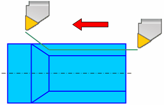

# SINGLETHREAD - Single-pass thread

## Command caption

How the command appears in the CLData command list:

```text
SINGLETHREAD OD(0) | ID(1) | FACE(2), STEP(0) | COUNT(1), s, ANGLE a
```

**SINGLETHREAD** command is used in continuous cylindrical or conical thread cutting with constant step by a lathe tool. Commonly this is the G32 or G33 G-codes in NC-programs.



When the threading mode is activated the tool movement and spindle rotation synchronization mode is activated. All following movements of the tool are performed in this mode until feed rate change ([`FEDRAT`](fedrat.md)) command or rapid travel ([`RAPID`](rapid.md)) command is received. If the tool is traveling along the spindle axis then cylindrical thread is formed. If the tool is traveling along the spindle axis and also perpendicular to it then conical thread is machined. It is possible to machine a face thread by moving the tool only perpendicularly to the spindle axis.

**SINGLETHREAD** command parameters define the threading orientation, the thread pitch and the spindle start angle.

There are two ways to specify the thread pitch: by specifying the value of the pitch, or by specifying the number of thread turns per length unit.

Spindle start angle is specified in degrees and defines the angle that is laid off the zero signal of the spindle probe before thread cutting. Specify different angle values for different passes to machine multi-start thread.

## Access from sppx

Handler: `program SingleThread`

| Parameter | CLD array | CLD name | Description |
|---|---|---|---|
| OD(0)<br>ID(1)<br>FACE(2) | CLD[1] | CLD.Orientation | Threading orientation: OD(0) – external, ID(1) – internal, FACE(2) – face. |
| STEP(0)<br>COUNT(1) | CLD[2] | CLD.IsCount | Thread pitch defining: STEP(0) – value, COUNT(1) – number of thread turns per length unit. |
| s | CLD[3] | CLD.Value | Thread pitch value. |
| a | CLD[4] | CLD.StartAngle | Spindle start angle (for multiple-start thread). |

Example (from the Fanuc (30i)_Mill postprocessor):

```pascal
program SingleThread
  Feed_ = cld[3]; Feed_@ = MaxReal
  QStartAngle = cld[4]; QStartAngle@ = MaxReal
  Interp_ = 33; Interp_@ = MaxReal
end
```

## Access from .NET

Handler:

```csharp
public override void OnSinglePassThread(ICLDSinglePassThreadCommand cmd, CLDArray cld)
```

Inheritance: `ICLDSinglePassThreadCommand : ICLDCommand`.

Read the parameters from the strongly-typed `cmd` object (**recommended**); the raw `cld[i]` array (same indices as in sppx) and the named `cmd["..."]` helpers are available too. The table lists the command's members, including those inherited from its base interfaces; the common `ICLDCommand` members (navigation, `CLD`, `CLDFile`, `TechOperation`, ...) are described in the [CLData access model](../cldata.md).

| Member | Type | Description |
|---|---|---|
| `cmd.Orientation` | `CLDThreadOrient` | Thread orientation (OD, ID, Face) |
| `cmd.IsODThread` | `bool` | Returns "True" if it's an external thread cutting command. |
| `cmd.IsIDThread` | `bool` | Returns "True" if it's an internal thread cutting command. |
| `cmd.IsFaceThread` | `bool` | Returns "True" if it's a face thread cutting command. |
| `cmd.Units` | `CLDThreadUnits` | Thread pitch units (mm or TPI). |
| `cmd.StepIsDistance` | `bool` | Returns "True" if thread pitch specified in a linear units (usually in mm). |
| `cmd.StepIsTPU` | `bool` | Returns "True" if thread pitch specified as a Threads per units (usually as threads per inch). |
| `cmd.Step` | `double` | Thread pitch value. |
| `cmd.StartAngle` | `double` | Thread start angle in degrees. Frequently can be used for a multi-start threads. |

Example - `OnSinglePassThread` (from the Goodway SW postprocessor):

```csharp
public override void OnSinglePassThread(ICLDSinglePassThreadCommand cmd, CLDArray cld)
{
        nc.GInterp.v = 32;
        if (cmd.StepIsTPU)
            nc.F.v = 1.0/cmd.Step;
        else
            nc.F.v = cmd.Step;
        nc.QThreadAngle.v = cmd.StartAngle;
        nc.QThreadAngle.v0 = 0;
}
```

## See also
- [CLData access model](../cldata.md)
