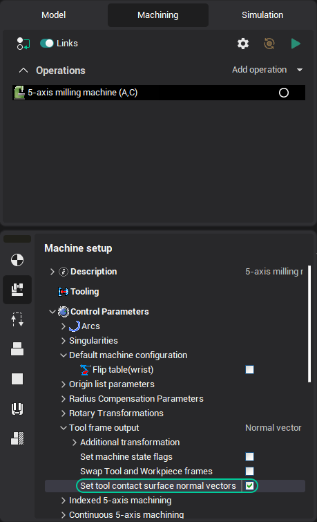

# TLCONTACT - Tool contact

The TLContact command provides information about the normal to the machining surface at the point of contact of the tool with this surface. This is used to calculate 5D correction. In fact, this information determines in which direction (along which vector) the tool needs to be shifted in space by the amount of correction (the difference between the radius of the theoretical and actual tool).

## Access from sppx

Handler: `program TLContact`

| Parameter | CLD array | CLD name | Description |
|---|---|---|---|
| OnOff | CLD[1] | CLD.OnOff | Determines whether the tool contacts the machined surface in subsequent movements. ON(1) - there is contact information, OFF(0) - there is no contact information. |
| NX | CLD[2] | CLD.NX | The X component of the surface normal vector |
| NY | CLD[3] | CLD.NY | The Y component of the surface normal vector |
| NZ | CLD[4] | CLD.NZ | The Z component of the surface normal vector |

This command will be generated in CLData only if the corresponding option "Set tool contact surface normal vectors" is enabled in the settings of the machine schema.



Example:

```pascal
! deltaR - difference between the tool radius set in CAM and the real tool radius on the machine
! (assign it once, where the real tool radius becomes known)

program TLContact
  ! cld[1] - contact flag ON(1)|OFF(0); cld[2..4] - contact surface normal NX, NY, NZ
  if cld[1] = 1 then begin
    NcX = cld[2]  NcY = cld[3]  NcZ = cld[4]             ! remember the contact normal in globals
    HasContact = 1
    Output "( CONTACT N = " + Str(NcX) + " " + Str(NcY) + " " + Str(NcZ) + " )"
  end else
    HasContact = 0
end

program AbsMov
  ! shift the tool tip along the remembered contact normal by deltaR
  if HasContact = 1 then begin
    X = cld[1] + NcX * deltaR
    Y = cld[2] + NcY * deltaR
    Z = cld[3] + NcZ * deltaR
  end else begin
    X = cld[1]  Y = cld[2]  Z = cld[3]
  end
  OutBlock
end
```

## Access from .NET

Handler:

```csharp
public override void OnTLContact(ICLDTLContactCommand cmd, CLDArray cld)
```

Inheritance: `ICLDTLContactCommand : ICLDCommand`.

Read the parameters from the strongly-typed `cmd` object (**recommended**); the raw `cld[i]` array (same indices as in sppx) and the named `cmd["..."]` helpers are available too. The table lists the command's members, including those inherited from its base interfaces; the common `ICLDCommand` members (navigation, `CLD`, `CLDFile`, `TechOperation`, ...) are described in the [CLData access model](../cldata.md).

| Member | Type | Description |
|---|---|---|
| `cmd.IsOn` | `bool` | Determines whether the tool contacts the machined surface in subsequent movements. "True" - there is contact information, "False" - there is no contact information. |
| `cmd.IsOff` | `bool` | Determines whether the tool contacts the machined surface in subsequent movements. "True" - there is no contact information, "False" - there is contact information. |
| `cmd.ContactNormal` | `TInp3DPoint` | Machining surface contact normal vector (X, Y, Z). |

Example:

```csharp
// deltaR - difference between the tool radius set in CAM and the real tool radius on the machine
TInp3DPoint contactNormal;
bool hasContact;

public override void OnTLContact(ICLDTLContactCommand cmd, CLDArray cld)
{
    if (cmd.IsOn) {
        contactNormal = cmd.ContactNormal;      // remember the surface contact normal
        hasContact = true;
        nc.OutWithN($"( CONTACT N = {contactNormal.X} {contactNormal.Y} {contactNormal.Z} )");
    } else {
        hasContact = false;
    }
}

public override void OnGoto(ICLDGotoCommand cmd, CLDArray cld)
{
    // shift the tool tip along the remembered contact normal by deltaR (radius correction)
    if (hasContact) {
        nc.X.Show(cmd.EP.X + contactNormal.X * deltaR);
        nc.Y.Show(cmd.EP.Y + contactNormal.Y * deltaR);
        nc.Z.Show(cmd.EP.Z + contactNormal.Z * deltaR);
    } else {
        nc.X.Show(cmd.EP.X);
        nc.Y.Show(cmd.EP.Y);
        nc.Z.Show(cmd.EP.Z);
    }
    nc.Block.Out();
}
```

## See also
- [CLData access model](../cldata.md)
