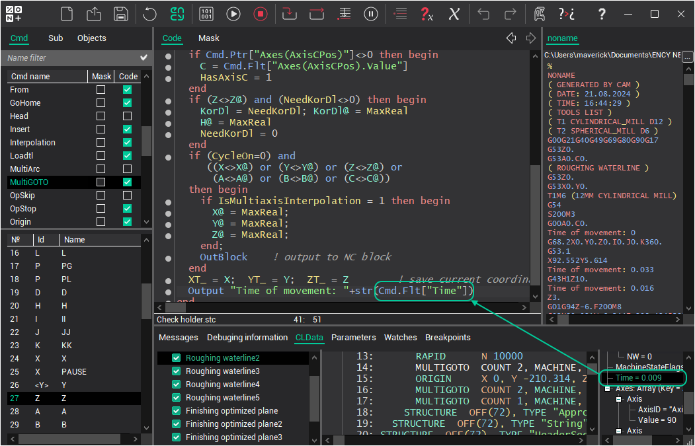

# Named CLData parameters

From the CAM system to the postprocessor comes a set of data, called CLData, on the basis of which the postprocessor generates a G-code. The data inside CLData can describe a lot of different parameters that relate to completely different complex objects: technological operation, toolpath, tool, project, workpiece, etc. Therefore, within CLData, they are definitely structured and in fact are not a simple list, a parameter tree. These parameters are accessed from the postprocessor code by a string name. Since we have a parameter tree, then usually the full name of the parameter is a complex string consisting of several identifiers separated by dots and sometimes brackets, i.e.

**GroupName.SubGroupName.ParameterName.SubParameterName** etc. The level of nesting of parameters can be different - from one to several identifiers separated by dots. An example of the real name of the parameter responsible for the smoothing radius of the toolpath inside the operation: "**Operation.Smoothing.Radius**".

## Access from sppx

The syntax for accessing a parameter from the postprocessor program code is as follows.

```text
ObjectKeyWord.TypeKeyWord["ParameterName"]
```

Here ObjectKeyWord is a keyword that tells which object from CLData we are requesting parameters. Now, as an **ObjectKeyWord** can be:

- **[Cmd](current-command.md)** - current CLData command.
- [**CLDFile[***index1***]**.**Cmd[***index2***]**](files.md). CLData command with index index2 from the cld-file with index index1. Here index1 and index2 are any integer numbers.
- [**Project**](project.md)- CAM system project, in which the parameters relating to all operations are grouped, and not to an individual operation, for example, the workpiece.

**TypeKeyWord** is a keyword that determines the form (string, number, etc.) to get the value of the parameter. Parameters can be of different types: **string**, **integer**, **floating**-point numbers, **complex** (parameters of this type have no eigenvalue, but they can have child properties of any of the types described here; required to combine several parameters into a group), **array** (as complex ones do not have their own values and can have child properties, however, the child properties of arrays, as a rule, have a common type and, therefore, the same name, so the access to the child properties of arrays is carried out not by name, but by index).

The following keywords are available.

- `Str["ParameterName"]` - returns the value of the command parameter with the name ParameterName as a text String.
- `Int["ParameterName"]` - returns the value of the command parameter with the name ParameterName as an Integer number.
- `Flt["ParameterName"]` - returns the value of the command parameter with the name ParameterName as a Real number (floating point number).
- `Ptr["ParameterName"]` - returns a reference (not value) to the command parameter with the ParameterName name. It is convenient to use for access to parameters having type complex and array. If a parameter with that name in this command does not exist, then the operator returns the value 0, otherwise the number is nonzero. Thus, the test for equality to zero can be used to check the existence of a parameter.

```pascal
   if cmd.Ptr["Axes(AxisCPos)"]<>0 then begin
     C = cmd.Flt["Axes(AxisCPos).Value"]
   end
```

From the obtained reference through the point may be accessed either to the value of this parameter or to one of the child parameters. To do this, after the point again need to specify one of the commands described here: **Str**, **Int**, **Flt**, **Ptr**, **Item**, **ItemCount**, **Name**. If the following instructions do not specify the parameter name, it means that it refers to this parameter. For example, the instruction `Cmd.Ptr["Parameter1"].Int` means take the value of the parameter with the name `Parameter1` as an integer number. A record `Cmd.Ptr["Parameter1"].Int["SubParameter1"]` means to take an integer value of the child parameter `SubParameter1` inside parameter `Parameter1`.

`Cmd.Item[Index]` - returns a reference to the child parameter by index. Parameter's indexing starts with 1.

`Cmd.ItemCount` - returns the number of child parameters in list.

For array type parameters, all child parameters one level down can have the same name. In this case, access by name is not possible; instead, you must use access by index.

- `ObjectKeyWord.Ptr["NameOfArrayParameter"].Item[Index]` - returns a reference to the child parameter by index. Parameter's indexing starts with 1.
- `ObjectKeyWord.Ptr["NameOfArrayParameter"].ItemCount` - returns the number of child parameters in list.

In addition to index access, access to the child array parameters in some cases can be implemented by a key. If the array has a defined Key parameter, which specifies the name of the key field in the child parameters, to obtain access to a particular element of the array after the array name must specify the key value in parentheses. For example, the instruction `Cmd.Ptr["ArrayName(KeyValue)"]` means to take the parameter **ArrayName** from the current command, where to find the child property with a key field equal **KeyValue**.

As the parameter name in them can be not only a string constant, as shown here, but the string variables and expressions.

There is a convenient way to form a string to access the desired parameter. All parameters for CLData objects are shown in a separate tree on the CLData tab in its right side. It is necessary to select the necessary command in the list, or the project in the list of operations. At the same time in the tree on the right you will see the parameters of the selected object. Then you need to find the desired parameter in this tree and double-click on it. The line of access to the specified parameter will be inserted into the current cursor position in the code editing window.



Example of MultiGoto command processing using various methods to access elements of array parameter Axes (by index, by key, and by compound name):

```pascal
program MultiGoto
  i: Integer
  AxisName: String
  for i = 1 to Cmd.Ptr["Axes"].ItemCount do begin
    AxisName = cmd.Ptr["Axes"].Item[i].Str["AxisID"]
    if AxisName="AxisXPos" then begin
      X = cmd.Ptr["Axes"].Item[i].Flt["Value"]
    end else
    if AxisName="AxisYPos" then begin
      Y = cmd.Ptr["Axes("+Str(i)+")"].Flt["Value"]
    end else
    if AxisName="AxisZPos" then begin
      Z = cmd.Flt["Axes("+Str(i)+").Value"]
    end else
    if cmd.Ptr["Axes(AxisCPos)"]<>0 then begin
      C = cmd.Flt["Axes(AxisCPos).Value"]
    end
  end
  OutBlock
end
```

More examples of named-parameter access are given in [Current command](current-command.md).

## Access from .NET

.NET uses the same named-parameter model, exposed by the `INamedProperty` interface. Every CLData object that carries named parameters implements it - the current command (`ICLDCommand`), an arbitrary command taken through [CLDFile](files.md), and the [project](project.md) (`ICLDProject`). The keywords match the sppx ones one-to-one:

| sppx | .NET | Description |
|---|---|---|
| `Str["Name"]` | `Str["Name"]` | the parameter value as a string |
| `Int["Name"]` | `Int["Name"]` | the parameter value as an integer |
| `Flt["Name"]` | `Flt["Name"]` | the parameter value as a floating-point number |
| - | `Bol["Name"]` | the parameter value as a boolean |
| `Ptr["Name"]` | `Ptr["Name"]` | a reference to the (complex) parameter as an `INamedProperty` |
| - | `Arr["Name"]` | a reference to an array parameter as an `INamedPropertiesCollection` |
| `Item[i]` | `Arr["Name"][i]` | the i-th child of an array parameter (0-based in .NET) |
| `ItemCount` | `Arr["Name"].TopItem` | the maximal index in an array parameter |
| `Name` | `Name` | the parameter's own name |

> **Index base.** When the children of an array parameter are addressed by index, the numbering differs between the two subsystems: it is **1-based in sppx** (`Item[1]` ... `Item[ItemCount]`) and **0-based in .NET** (`Arr["Name"][0]` ... `Arr["Name"][TopItem]`). Correspondingly, the sppx `ItemCount` is the number of children, whereas the .NET `TopItem` is the maximal index - one less than the count - so a .NET loop runs `for (int i = 0; i <= coll.TopItem; i++)`. (This concerns the named array-parameter children only; the numeric [CLD array](cld-array.md) is 1-based in both subsystems.)

As in sppx, the name can be a **compound** string with dots and brackets - `Ptr["StartPoint.X"]`, `Ptr["Axes(AxisCPos).Value"]` - resolved to any nesting depth; the character case does not matter. In addition, `INamedProperty` offers `FindChild(name)`, `GetNextChild(child)`, `Parent`, `SimpleType` (the `NamedParamType` of the value) and the typed value accessors `ValueAsString` / `ValueAsInteger` / `ValueAsDouble` / `ValueAsBoolean`.

```csharp
public override void OnMultiGoto(ICLDMultiGotoCommand cmd, CLDArray cld)
{
    var axes = cmd.Arr["Axes"];
    for (int i = 0; i <= axes.TopItem; i++) {
        string axisName = axes[i].Str["AxisID"];
        double value = axes[i].Flt["Value"];
        // ... output the axis
    }
    // or address a single axis directly by its key:
    if (cmd.Ptr["Axes(AxisCPos)"] != null)
        C = cmd.Flt["Axes(AxisCPos).Value"];
}
```

## See also

- [Current command (Cmd operator)](current-command.md)
- [CLData files (CLDFile operator)](files.md)
- [Project information (Project operator)](project.md)
- [CLData access functions and operators](functions.md)
