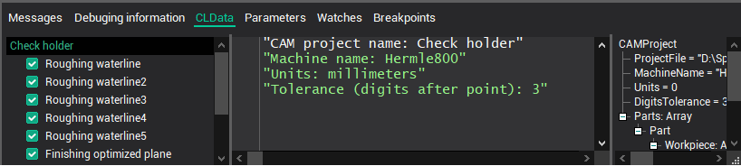

# Project information in CLData

The information about the CAM system project placed inside CLData available through the Project operator.

You can display it on the screen if on the CLData tab select the first item with the name of the project. Properties will be shown in the parameters tree on the right.

The list of possible properties described in tables below. Information about the properties structure, presented as an XML file, is available in the CAM system installation folder in a subfolder Supplement\Operations\CLData.xml.

| Type | Description | Subfield description |
|---|---|---|
| Equipment: ComplexType | "Equipment" - this is a keyword that allows you to access machine properties that have been loaded from a CAM system machine schema file. The list of properties inside this node can vary depend on the machine schema file. |   |
|   | Schemas: Array | Equipment.Ptr["Schemas"] - The list of machine schemas used in the project (usually only one schema). |
| MachineSchema: ComplexType | Equipment.Ptr["Schemas(1)"] - root element of the machine schema property nodes, Usually the name of this property uniquely identifies the machine schema ID: Equipment.Ptr["Schemas(1)"].Name - unique identifier of the machine schema. |   |
| Name: String | Equipment.Str["Schemas(1).Name"] - user friendly name of the machine. |   |
| ProjectFile: String | Project.Str["ProjectFile"] - the full path to the CAM system project file name. Can be empty for new projects when they are not saved. |   |
| MachineName: String | Project.Str["MachineName"] - the name of the machine from the machine schema file. |   |
| Units: Integer | Project.Int["Units"] - The project's units system: 0 - metric (mm), 1 - imperial (inch). |   |
| DigitsTolerance: Integer | Project.Int["DigitsTolerance"] - the number of digits for the project's tolerance. Typical value is 3 (which means 0.001). It can be changed in CAM system's settings window. |   |
| SetupStages: Array | Project.Ptr["SetupStages"] - The list of Setup stage groups. |   |
|   | SetupStage: ComplexType | Project.Ptr["SetupStages"].Item[index] - Setup stage group information. |
| Index: Integer | Project.Ptr["SetupStages"].Item[index].Int["Index"] - The index of the setup stage group in the list of setup stages in CAM system project. |   |
| Name: String | Project.Ptr["SetupStages"].Item[index].Str["Name"] - The name of the setup stage group in CAM system project. |   |
| Parts: Array | Project.Ptr["Parts"] - The list of structures that contain information about the part. The count of items depend on count of parts in the project. |   |
| Part: ComplexType | Project.Ptr["Parts"].Item[index] - the structure that contain information about one part. |   |
| Name: String | Project.Ptr["Parts"].Item[index].Str["Name"] - The Part name (group name) that is set in CAM system. |   |
| SetupStageIndex: Integer | Project.Ptr["Parts"].Item[index].Int["SetupStageIndex"] - The index of the setup stage group in the list of setup stages in CAM system project inside which the Part is. |   |
| PartIndex: Integer | Project.Ptr["Parts"].Item[index].Int["PartIndex"] - Index of the Part in the list of CAM system's project parts list |   |
| PartNumber: Integer | Project.Ptr["Parts"].Item[index].Int["PartNumber"] - Part number that is explicitly set by the user in the part parameters of CAM system |   |
| WorkpieceConnector: String | Project.Ptr["Parts"].Item[index].Str["WorkpieceConnector"] - The textual identifier of the workpiece connector in which the Part is fixed. This identifier depend on the Workpiece connector node id inside machine schema file. |   |
| WCSList: Array | Project.Ptr["Parts"].Item[index].Ptr["WCSList"] - The list of workpiece coordinate systems that are used when machining this part (for example G54, G55, etc.). |   |
| WCS: ComplexType | A structure for describing the Workpiece coordinate system |   |
| Number: Integer | The workpiece coordinate system number |   |
| Location: ComplexType | Geometrical parameters of the WCS |   |
| vX: Complex type | X axis vector of the WCS in the base coordinate system |   |
| X: Double | X coordinate of the vector |   |
| Y: Double | Y coordinate of the vector |   |
| Z: Double | Z coordinate of the vector |   |
| vY: Complex type | Y axis vector of the WCS in the base coordinate system |   |
| X: Double | X coordinate of the vector |   |
| Y: Double | Y coordinate of the vector |   |
| Z: Double | Z coordinate of the vector |   |
| vZ: Complex type | Z axis vector of the WCS in the base coordinate system |   |
| X: Double | X coordinate of the vector |   |
| Y: Double | Y coordinate of the vector |   |
| Z: Double | Z coordinate of the vector |   |
| vT: Complex type | Original point of the WCS in the base coordinate system |   |
| X: Double | X coordinate of the point |   |
| Y: Double | Y coordinate of the point |   |
| Z: Double | Z coordinate of the point |   |
| PartBox: ComplexType | Project.Ptr["Parts(1).PartBox"] - A structure for describing the overall dimensions of the part. |   |
| Empty: Boolean | The state of the part dimensions: false (0) - dimensions are set and have correct values, true (1) - dimension are empty (for example when part geometry absent). |   |
| Min: ComplexType | Left bottom corner point of the overall box of the Part. |   |
| X: Double | X coordinate of the point |   |
| Y: Double | Y coordinate of the point |   |
| Z: Double | Z coordinate of the point |   |
| Max: ComplexType | Right top corner point of the overall box of the Part. |   |
| X: Double | X coordinate of the point |   |
| Y: Double | Y coordinate of the point |   |
| Z: Double | Z coordinate of the point |   |
| WorkpieceBox: ComplexType | Project.Ptr["Parts(1).WorkpieceBox"] - A structure for describing the overall dimensions of the workpiece. |   |
| Empty: Boolean | The state of the workpiece dimensions: false (0) - dimensions are set and have correct values, true (1) - dimension are empty (for example when workpiece geometry absent). |   |
| Min: ComplexType | Left bottom corner point of the overall box of the Workpiece. |   |
| X: Double | X coordinate of the point |   |
| Y: Double | Y coordinate of the point |   |
| Z: Double | Z coordinate of the point |   |
| Max: ComplexType | Right top corner point of the overall box of the Workpiece. |   |
| X: Double | X coordinate of the point |   |
| Y: Double | Y coordinate of the point |   |
| Z: Double | Z coordinate of the point |   |
| Workpiece: Array | Project.Ptr["Parts"].Item[index].Ptr["Workpiece"] - the list of structures that contain information about workpiece items that correspond to the part with defined index. |   |
| Item: TCLDModelItem | Project.Ptr["Parts"].Item[index].Ptr["Workpiece"].Item[index2] - the structure that contain information about the one workpiece item. The composition of the properties depends on the type of element. All of them are inheritors from complex type TCLDModelItem, so all elements have one common property - the primitive type. See **Possible workpiece items** table below. |   |
| PrimitiveType: Integer | Project.Ptr["Parts"].Item[index].Ptr["Workpiece"].Item[index2].Int["PrimitiveType"] - the type of the geometrical primitive: 0 - Unknown, 1 - Empty workpiece 2 - Faces (reference to the CAD model) 3 - Casting 4 - Box 5 - Turn envelope 6 - Cylinder 7 - Tube 8 - Prism 9 - Polygonal prism |   |

**Possible workpiece items**

| Type | Description |   |   |   |
|---|---|---|---|---|
| EmptyWorkpiece: TCLDModelItem | Element of the workpiece, which says that the processing begins with a void. For example, if we grow a part from scratch by methods of additive processing |   |   |   |
| Box: TCLDModelItem | The workpiece item representing the parallelepiped given by two points. |   |   |   |
| Min: ComplexType | Left bottom corner point of the box. |   |   |   |
| X: Double | X coordinate of the point |   |   |   |
| Y: Double | Y coordinate of the point |   |   |   |
| Z: Double | Z coordinate of the point |   |   |   |
| Max: ComplexType | Right top corner point of the box |   |   |   |
| X: Double | X coordinate of the point |   |   |   |
| Y: Double | Y coordinate of the point |   |   |   |
| Z: Double | Z coordinate of the point |   |   |   |
| RevBody: TCLDModelItem | The workpiece item representing the turn envelope defined by the axis around which the rotation is performed and a set of geometric primitives that rotate. |   |   |   |
| Origin: ComplexType | Start point of the rotation axis |   |   |   |
| X: Double | X coordinate of the point |   |   |   |
| Y: Double | Y coordinate of the point |   |   |   |
| Z: Double | Z coordinate of the point |   |   |   |
| Axis: ComplexType | Vector that represents the axis of rotation |   |   |   |
| X: Double | X coordinate of the vector |   |   |   |
| Y: Double | Y coordinate of the vector |   |   |   |
| Z: Double | Z coordinate of the vector |   |   |   |
| Cylinder: RevBody | The workpiece item representing cylinder along defined axis. It is a successor of the RevBody type, therefore it contains all its properties, which are described above. |   |   |   |
| HMin: Double | Start level of the cylinder. This is the distance along the axis, starting from the point of origin. |   |   |   |
| HMax: Double | Finish level of the cylinder. This is the distance along the axis, starting from the point of origin. |   |   |   |
| ROut: Double | Outer radius of the cylinder. |   |   |   |
| Tube: Cylinder | The workpiece item representing tube along defined axis. It is a successor of the Cylinder type, therefore it contains all its properties, which are described above. |   |   |   |
| RInn: Double | Inner radius (hole radius) of the tube. |   |   |   |
| Prism: TCLDModelItem | The workpiece item representing the prism (extrusion item) defined by the axis along which the extrusion is performed and profile to extrude. |   |   |   |
| Origin: ComplexType | Start point of the extrusion axis |   |   |   |
| X: Double | X coordinate of the point |   |   |   |
| Y: Double | Y coordinate of the point |   |   |   |
| Z: Double | Z coordinate of the point |   |   |   |
| Axis: ComplexType | Vector that defines the direction of extrusion |   |   |   |
| X: Double | X coordinate of the vector |   |   |   |
| Y: Double | Y coordinate of the vector |   |   |   |
| Z: Double | Z coordinate of the vector |   |   |   |
| HMin: Double | Start level of the prism. This is the distance along the axis, starting from the point of origin. |   |   |   |
| HMax: Double | Finish level of the prism. This is the distance along the axis, starting from the point of origin. |   |   |   |
| PolygonalPrism: Prism | The workpiece item representing regular polygonal prism along defined axis. It is a successor of the Prism type, therefore it contains all its properties, which are described above. |   |   |   |
| RInn: Double | The radius of the inscribed circle of the polygon |   |   |   |
| Angle: Double | The angle of rotation of the polygon around the axis |   |   |   |
| CornerCount: Integer | The corners count of the polygon |   |   |   |
| Faces: TCLDModelItem | The workpiece item representing the general form body specified by the CAD model reference. |   |   |   |
| Box: ComplexType | The box around CAD-model. Lets you know the overall dimensions. |   |   |   |
| Min: ComplexType | Left bottom corner point of the box. |   |   |   |
| X: Double | X coordinate of the point |   |   |   |
| Y: Double | Y coordinate of the point |   |   |   |
| Z: Double | Z coordinate of the point |   |   |   |
| Max: ComplexType | Right top corner point of the box |   |   |   |
| X: Double | X coordinate of the point |   |   |   |
| Y: Double | Y coordinate of the point |   |   |   |
| Z: Double | Z coordinate of the point |   |   |   |
| Casting: TCLDModelItem | The workpiece item representing the body, which is obtained by adding an additional stock to the body of the general form specified by the CAD model reference. |   |   |   |
|   | Box: ComplexType | The box around CAD-model with stock. Lets you know the overall dimensions. |   |   |
|   |   | Min: ComplexType | Left bottom corner point of the box. |   |
|   |   |   | X: Double | X coordinate of the point |
|   |   |   | Y: Double | Y coordinate of the point |
|   |   |   | Z: Double | Z coordinate of the point |
|   |   | Max: ComplexType | Right top corner point of the box |   |
|   |   |   | X: Double | X coordinate of the point |
|   |   |   | Y: Double | Y coordinate of the point |
|   |   |   | Z: Double | Z coordinate of the point |
|   | Stock: Double | The value of stock. |   |   |

## See also
- [CLData](cldata.md)
