# Prepare computer to develop .NET postprocessors
To be able to build the binary file *.dll of a postprocessor from its source files (Postprocessor.cs, Registers.cs, *.csproj etc.) follow the instructions below.
1. Download and install **.NET SDK 8.0 x64** from the official site (https://dotnet.microsoft.com/download, size ~200 Mb). There is a simple step-by-step guide there.
2. To be able to write source files, download and install the latest available version of **Visual Studio Code** (https://code.visualstudio.com/download, size ~100 Mb).
3. Install the [**C#** extension](https://marketplace.visualstudio.com/items?itemName=ms-dotnettools.csharp) from the Visual Studio Code marketplace.

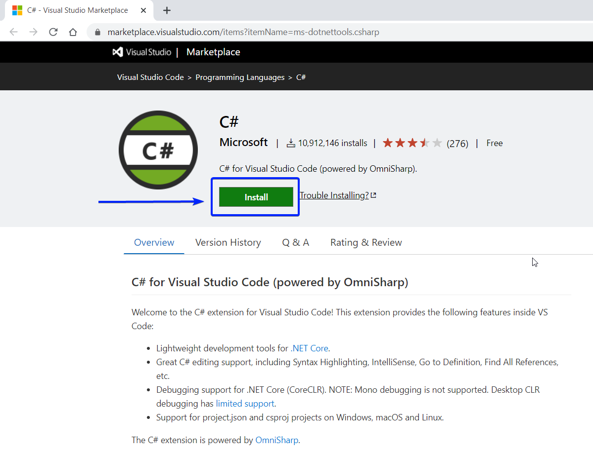

4. It will start a Visual Studio Code (abbreviated VSCode) instance on **the Extensions tab**. Just click the "**Install**" button next to the extension name.

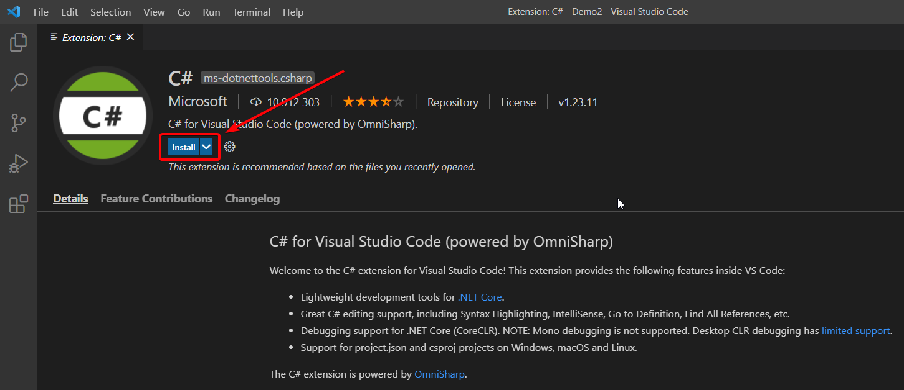

   *In the latest versions of VS Code, when installing an extension for `C#`, you are prompted to immediately install the "**C# Dev Kit**". However, according to the terms, this set requires a Visual Studio license. Using the **"C# Dev Kit" extension is not necessary** for developing postprocessors; everything works fine without it, and it does not require purchasing Visual Studio.*

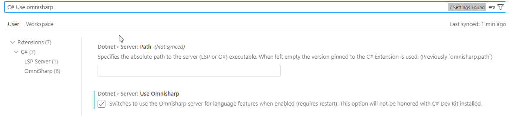

   *Sometimes the Omnisharp versions of the `C#` extension work better so you can try enabling the "**C#: Use Omnisharp**" setting which you can find after clicking on the gear button next to the extension install button.*

5. It is recommended (but not required) to install the extension for editing xml files "**XML Language Support by Red Hat**" (https://marketplace.visualstudio.com/items?itemName=redhat.vscode-xml).
6. If you have not yet, download and install the latest version of the CAM system from the official resource.
7. Start the CAM system and **launch the CLData Viewer** from the Utilities menu.

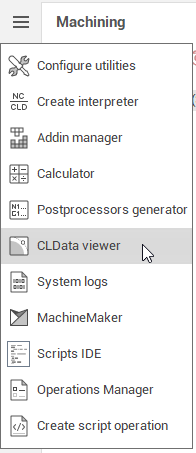

8. It will add the "InpCoreDir" environment variable to the Windows' variables. To be able to launch Visual Studio Code from the CAM system, the system "Path" environment variable should include the VS Code installation folder. Usually the VSCode installer adds everything itself and you just **need to restart the computer** for the environment variables to take effect. We recommend restarting the computer after the first launch of the CLData Viewer for environment variables to take effect.
9. Start the CAM system and launch the CLData Viewer again. Now you can try to create a new postprocessor. Click the main menu **CLData viewer/Create new postprocessor/Simple postprocessor…**.

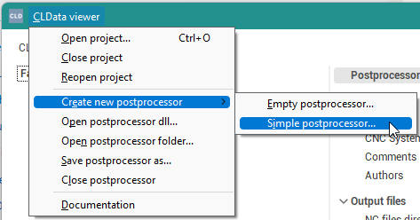

10. A standard folder selection dialog box will open. Here you will need to create a new empty folder that will contain all the postprocessor files. **The folder name will match the name of the new postprocessor**.
11. In the context menu of the postprocessor choose the "**Launch postprocessor project in VS Code**" item or just double-click on the postprocessor in the list.

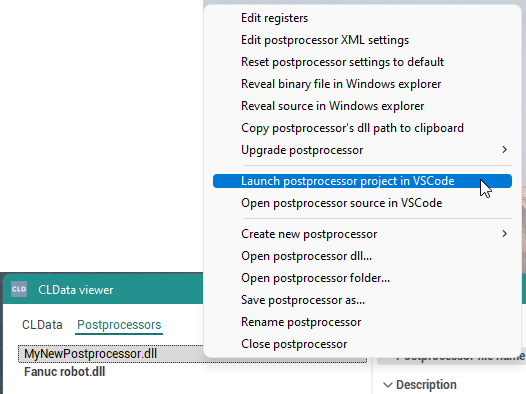

12. The new VSCode window will appear with the **main Postprocessor.cs source file** of the selected postprocessor. The first time you open a postprocessor, it may take some extra time for the Omnisharp extension (`C#`) to download the latest updates and dependencies automatically.

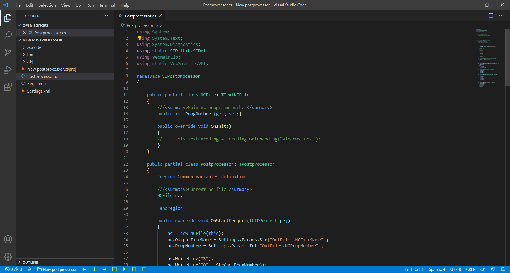

13. Then you can set a **breakpoint inside the OnStartProject** procedure, choose the **"Run and Debug" tab** and click **"Launch post" (F5 key)**.

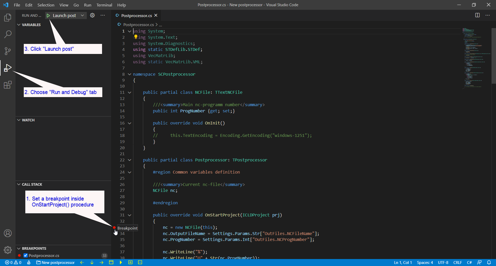

14. It will build the postprocessor from sources and start debugging. The CLData Viewer window should appear (if it was minimized before). Execution should stop at the defined breakpoint. Now you can use **Step Over (F10)** at the toolbar in order to walk through the lines of the postprocessor code. As the lines are written to the output file, the CLData Viewer will show intermediate results.

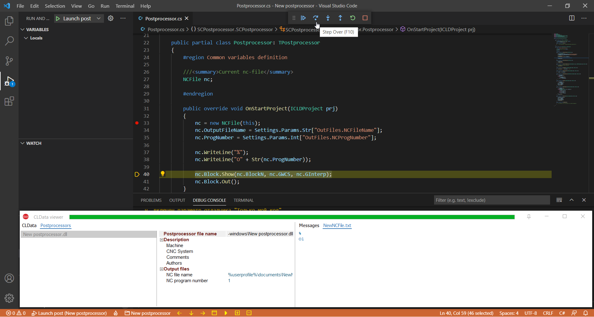

15. Finally, **you can modify the postprocessor code** in the Postprocessor.cs, Registers.cs and Settings.xml files as you need and debug it using all available features of Visual Studio Code. If you are not yet familiar with the capabilities of VSCode, we recommend that you visit the "Get started" section from its official documentation (https://code.visualstudio.com/docs/getstarted/introvideos).
16. After you have written and debugged the postprocessor source code, you can obtain and use the postprocessor binary output *.dll file. Just select "**Reveal binary file in Windows explorer**" from the context menu of the postprocessor in the CLData Viewer. This will select the postprocessor binary in explorer from where you can copy or send it to the customer.

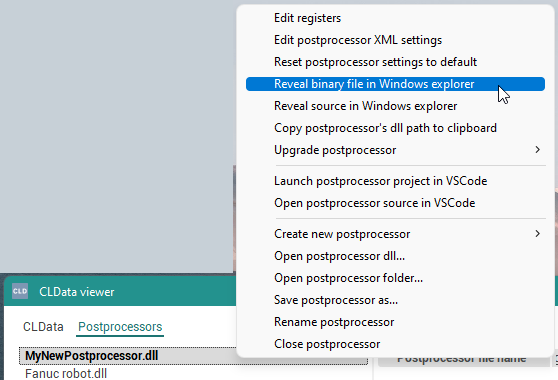

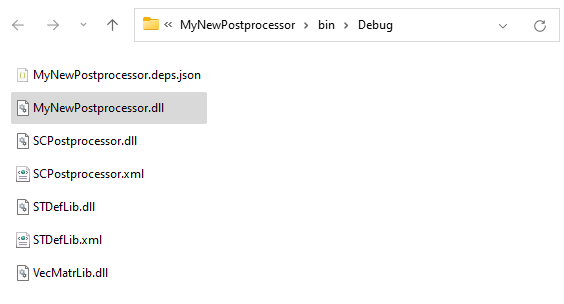
