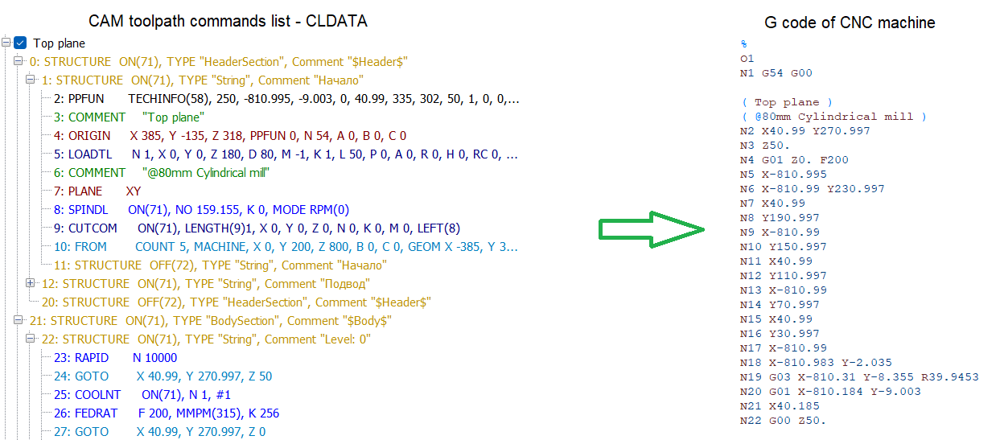
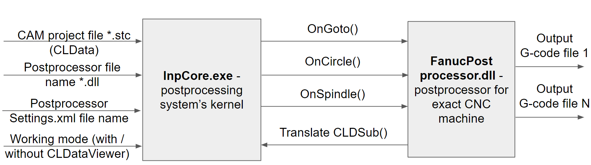

# Introduction

## What is a postprocessing system in general?

A **postprocessing system** is a program that converts a toolpath generated by the CAM system from a universal format (CLData) into output files understandable by a specific CNC machine.

[CLData (cutter location data)](../cldata/cldata.md) is a set of commands like tool loading, movements, spindle and coolant switch on/off, etc.

A postprocessing program gets it as an input and converts it to the format which is required by the exact CNC machine, for example a G-code text file.
There are a lot of CNC machines and each type of machine can use its own format of files. Therefore the postprocessing system should contain at least two parts.
- The first is the part **independent** from the exact type of machine. It must be able to read the input CLData and provide it for further convenient processing.
- The second part is the **adjustable part**. It should provide a flexible way to translate the universal commands into the specific output files.

## Main program modules of the system

From the point of view of **program modules**, it looks like the one shown below.

The first main starting module is an **InpCore.exe** utility. It's a console application which means that it has no user interface, it has only a console window. Inside this console window you can type some command line parameters like the name of the input CLData file (stc-project), the name of the postprocessor and some additional settings (output file name, program number etc.) and then run the process of translation. This utility reads the input CLData file and starts to call a special kind of subroutines — **command handlers** — which are individual for each command type. For example for the LoadTool CLData command it will call the subroutine with the OnLoadTool name, for the Spindle command — the OnSpindle subroutine, for the Goto command — the OnGoto subroutine etc. By default these command handlers are empty and do nothing. To be able to override this empty behavior we need to load the second part of the postprocessing system — the postprocessor itself.

The **postprocessor** is an additional dynamically loaded program module with the dll extension. The name can vary. For example **FanucPostprocessor.dll**. It can implement some of the command handlers which will override the empty behavior and will write to the output file specific instructions corresponding to the command for the exact CNC machine.
We can easily change the postprocessor to another one, for example HeidenhainPostprocessor.dll, to get the resulting G-code for another machine.
You can make your own postprocessor if you want to have your unique output file content.
